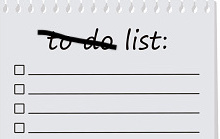

```{r setup, include=FALSE}
knitr::opts_chunk$set(echo = TRUE)
```

```{r echo = F, out.width="75%"}

```

*This post has been slightly modified from its original form on [woodpeckR](https://thewoodpeckr.wordpress.com/2019/09/13/initializing-an-empty-list/).*

### Problem

How do I initialize an empty list for use in a for-loop or function?

### Context

Sometimes I’m writing a for-loop (I know, I know, I [shouldn’t](https://privefl.github.io/blog/why-loops-are-slow-in-r/) [use](https://stackoverflow.com/questions/30240573/are-for-loops-evil-in-r) [for-loops](https://stackoverflow.com/questions/7142767/why-are-loops-slow-in-r) [in](https://uoftcoders.github.io/studyGroup/lessons/r/loops/HighPerformanceLoops.html) [R](https://www.r-bloggers.com/for-loops-and-how-to-avoid-them/), but sometimes it’s just easier. I’m a little less comfortable with apply functions than I’d like to be) and I know I’ll need to store the output in a list. Once in a while, the new list will be similar in form to an existing one, but more often, I just need to start from scratch, knowing only the number of elements I want to include.

This isn’t a totally alien thing to need to do––it’s pretty familiar if you’re used to initializing empty vectors before for-loops. There’s a whole other debate to be had about whether or not it’s acceptable to start with a truly empty vector and append to it on every iteration of the loop or whether you should always know the length beforehand, but I’ll just focus on the latter case for now.

Anyway, initializing a vector of a given length is easy enough; I usually do it like this:

```{r}
desired_length <- 10 # or whatever length you want
empty_vec <- rep(NA, desired_length)
```

I couldn’t immediately figure out how to replicate this for a list, though. The solution turns out to be relatively simple, but it’s just different enough that I can never seem to remember the syntax. This post is more for my records than anything, then.

### Solution

Initializing an empty list turns out to have an added benefit over my `rep(NA)` method for vectors; namely, the list ends up actually empty, not filled with NA’s. Confusingly, the function to use is `vector`, not `list`.

```{r}
desired_length <- 10 # or whatever length you want
empty_list <- vector(mode = "list", 
                     length = desired_length)

str(empty_list)
```

### Outcome

Voilà, an empty list. No restrictions on the data type or structure of the individual list elements. Specify the length easily. Useful for loops, primarily, but may have other applications I haven’t come across yet.

I learned something interesting recently, during the R working group I take part in through the Yale School of Forestry. See how, above, I initialized a list using the `vector()` function? Why is that?

Maybe this should have been obvious, but a list is actually a type of vector. The thing that I would typically call a vector (a series of elements, all of the same type), is more specifically an 'atomic vector'. A list, on the other hand, is just a vector that can contain more than one type of data.
