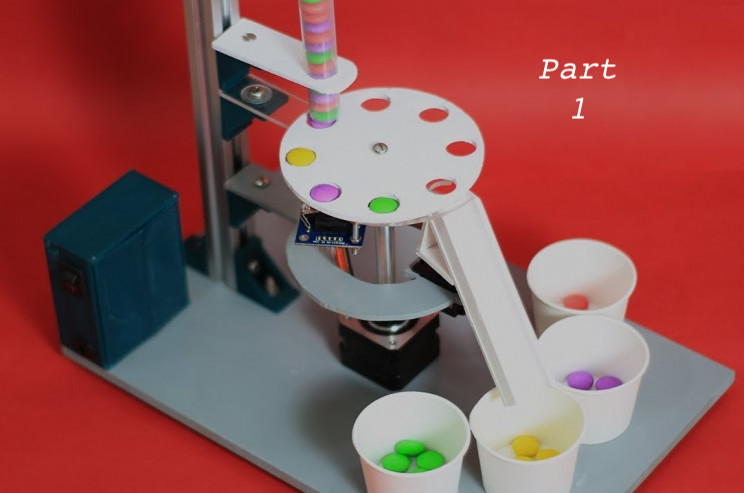

```{r setup, include=FALSE}
knitr::opts_chunk$set(echo = T)
```

```{r, echo = F, fig.cap = "Source: Interesting Engineering (https://interestingengineering.com/video/make-your-very-own-arduino-based-color-candy-sorting-machine)"}

```

*This post has been modified from its original form on [woodpeckR](https://thewoodpeckr.wordpress.com/2019/10/11/if-ifelse-had-more-ifs/).*

### Problem

The `ifelse()` function only allows for one “if” statement, and therefore two cases. You could add nested “if” statements, but that’s just a pain, especially if the 3+ conditions you want to use are all equivalent, conceptually. Is there a way to specify multiple conditions at the same time?

### Context

I was recently given some survey data to clean up. It looked something like this (but obviously much larger):

```{r}
dat <- data.frame(name = c("Kaija", "Ella", "Andis"),
                  test1 = c(FALSE, TRUE, TRUE),
                  test2 = c(FALSE, FALSE, TRUE))
dat
```

I needed to classify people in this data set based on whether they had passed or failed certain tests.

I wanted to separate the people into three groups:

**People who passed both tests:** Group A

**People who passed one test:** Group B

**People who passed neither test:** Group C

I thought about using a nested `ifelse()` statement, and I certainly could have done that. But that approach didn’t make sense to me. The tests are equivalent and not given in any order; I simply want to sort the people into three equal groups. Any nesting of “if” statements would seem to imply a hierarchy that doesn’t really exist in the data. Not to mention that I don't usually like nesting functions--I find it confusing and hard to read. 

### Solution

Once again, `dplyr` to the rescue! I’m becoming more and more of a tidyverse fan with each passing day. 

Turns out, `dplyr` has a function for exactly this purpose: `case_when()`. It’s also known as “a general vectorised if,” but I like to think of it as “if ifelse() had more if’s.” 

Here’s the syntax:

```{r}
library(dplyr) # load dplyr

dat <- dat %>% # using the dplyr/magrittr pipe
  mutate(grp = case_when(test1 & test2 ~ "A", # both tests: group A
                         xor(test1, test2) ~ "B", # one test: group B
                         !test1 & !test2 ~ "C" # neither test: group C
  ))

# Show the result:
dat
```

Let me translate the above into English:

After loading the package, I reassign `dat`, my data frame, to a modified version of the old `dat`. Then (`%>%`), I use the `dplyr::mutate` function to add a new column called `grp`. The contents of the column will be defined by the `case_when()` function.

`case_when()`, in this example, took three conditions. The condition is on the left side of the ~, and the resulting group assignment (in my case, A, B, or C) is on the right. 

I used logical operators for my conditions. The newest one to me was the `xor()` function, which is an *exclusive or*: only one of the conditions in the parentheses can be `TRUE`, not both. 

### Outcome

Easily make conditional assignments within a data frame. This function is a little less succinct than `ifelse()`, so I’m probably not going to use it for applications with only two cases, where `ifelse()` would work fine. But for three or more cases, it can’t be beat. Notice that I could have added any number of conditions to my `case_when() statement`, with no other caveats.

I love this function, and I think we should all be using it.

*NOTE: `case_when()` has some tricky behavior when it comes to cases you don't explicitly assign to an outcome. That is to say, the `else` part of this vectorized `ifelse` function is a little confusing. I discuss the `else` more in the next installment of this post.*