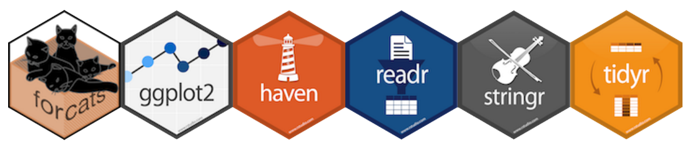
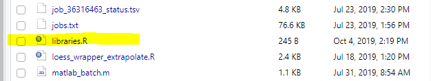
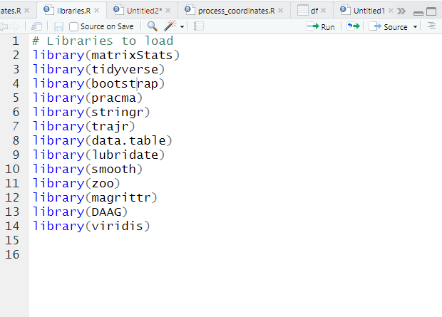
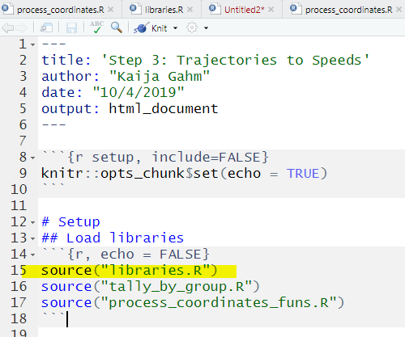

```{r setup, include=FALSE}
knitr::opts_chunk$set(echo = TRUE)
knitr::opts_chunk$set(tidy.opts=list(width.cutoff=70), tidy=F)
```

```{r echo = F, out.width = "130%", fig.cap="Image from [towards data science](https://towardsdatascience.com/a-comprehensive-list-of-handy-r-packages-e85dad294b3d)"}

```

*This post has been slightly modified from its original form on [woodpeckR](https://thewoodpeckr.wordpress.com/2019/10/12/loading-packages-efficiently/).*

### Problem

Especially in a project with many different scripts, it can be challenging to keep track of all the packages you need to load. It’s also easy to lose track of whether or not you’ve incorporated package loading into the script itself until you switch to a new computer or restart R and all of a sudden, your packages need to be re-loaded.

### Context

When I was first starting out in R, I learned quickly to load packages all together at the top of a script, not along the way as I needed them. But it took a while, until I started using R Projects, before I decided to centralize package loading above the script level. I was sick of having to deal with loading the right packages at the right times, so I decided to just streamline the whole thing.

### Solution

Make a separate R script, called “libraries.R” or “packages.R” or something. Keep it consistent. Mine is always called “libraries,” and I keep it in my project folder.

```{r echo = F, out.width = "150%"}

```

The script looks something like this (individual packages may vary, of course):

```{r echo = F, out.width = "150%"}

```

Then, at the top of each analysis script, I can simply source the libraries script, and all the libraries I need load automatically.

```{r echo = F, out.width = "150%"}

```

### Outcome
I can easily load libraries in the context of a single R Project, keep track of which ones are loaded, and not have to worry about making my scripts look messy with a whole chunk of `library()` commands at the top of each one. It’s also straightforward to pop open the “libraries” script whenever I want to add a new package or delete one.