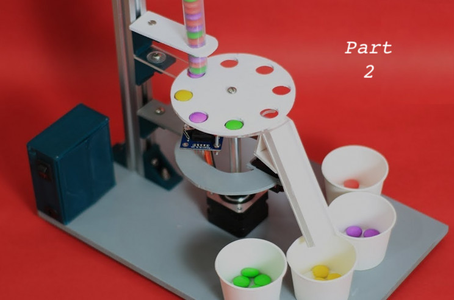

```{r setup, include=FALSE}
knitr::opts_chunk$set(echo = T)
```

```{r, echo = F, fig.cap = "Source: Interesting Engineering (https://interestingengineering.com/video/make-your-very-own-arduino-based-color-candy-sorting-machine)"}

```

*This post has been modified from its original form on [woodpeckR](https://thewoodpeckr.wordpress.com/2019/11/22/if-ifelse-had-more-ifs-and-an-else/).*

### Problem

Last month, I was super excited to discover the `case_when()` function in `dplyr`. But when I showed my blog post to a friend, he pointed out a problem: there seemed to be no way to specify a “background” case, like the “else” in ifelse(). 

```{r, echo = F, fig.cap = "Michael isn't satisfied with my description of case_when()."}
knitr::include_graphics("michaelMessage.png")
```

In the previous post, I gave an example with three outcomes based on test results. The implication was that there would be roughly equal numbers of people in each group. But what if the vast majority of people failed both tests, and we really just wanted to filter out the ones who didn’t?

### Context

Let's say I'm analyzing morphometric data for the penguins in the [Palmer Penguins dataset](https://allisonhorst.github.io/palmerpenguins/articles/intro.html). I conduct a principal components analysis.

```{r}
# Load the penguins data
library(palmerpenguins)
library(dplyr) # for pipe and case_when and mutate etc.
library(tibble) # for rownames_to_column
library(ggplot2) # for plotting

# Conduct Principal Components Analysis (PCA)
pca <- prcomp(~bill_length_mm + bill_depth_mm + 
                flipper_length_mm + body_mass_g, data = penguins)

# Label pca score rows to prepare for join with penguins.
components <- pca$x %>% 
  as.data.frame() %>%
  rownames_to_column("id")

# Join pca scores to penguins
penguins <- penguins %>%
  rownames_to_column("id") %>% 
  left_join(components, by = "id")
```

```{r}
# Take a peek at the data:
penguins %>%
  as.data.frame() %>%
  head() # now the PC scores are joined onto the penguins data, so I can use it in plotting.
```

After running the PCA, I make a plot of the 2nd and 3rd principal components that looks like this: 
```{r echo = F}
# Score plot with two PC's, colored by species
penguins %>%
  ggplot(aes(x = PC2, y = PC3, color = species))+
  geom_point(size = 2)+
  scale_color_viridis_d(option = "B")
```

Before continuing my analysis, I wanted to take a closer look at a few points that look like they might be outliers. Specifically, I'm interested in the Adelie point that has a PC2 value greater than 20, and the Chinstrap point that has a PC3 value less than -15. I'm also *slightly* worried about the two points that have a PC2 value below -15, but they aren't quite as far out, so I want to classify them separately.

To figure out which penguins to look at in the data, I will have to pull out rows based on their scores on the PC2 and PC3 axes.

### Solution

I decide to add a column called `investigate` to my data, set to either 'investigate', 'maybe' or 'no' depending on whether the observation in question needs to be checked.

This is a great use for my new friend `case_when()`! I'll approach it like this:

```{r}
penguins <- penguins %>%
  mutate(investigate = case_when(PC2 > 20 | PC3 < -15 ~ "investigate",
                                 PC2 < -15 ~ "maybe",
                                 TRUE ~ "no"))
```

What’s up with that weird `TRUE ~ "no"` line at the end of the `case_when()` statement? Basically, the `TRUE` is the equivalent of an `else`. It translates, roughly, to "assign anything that’s left to 'no.'"

#### Why 'TRUE', not 'else'?
I don't love the choice of TRUE here--I think the syntax is pretty confusing, and it's something I had to memorize long before I understood the logic behind it.

Basically, `case_when()` works by checking each of your 'cases' (conditions, if-statements) in order. For each row of the data frame, it checks the first case, and applies the resulting assignment if the row meets that case. If the row does *not* meet the first case, the function moves on to the second case, then the third, and on and on until it finds a case that evaluates to `TRUE` for that row.

So, when you want to write an "else" condition, you write `TRUE` as a catchall. `TRUE` will always evaluate to `TRUE`, so all rows that are left over after failing the first however many conditions will all "pass" that last condition and will be assigned to your desired "else" value. 

Because of this, order matters! If I had started off with the TRUE ~ "ok" statement and then specified the other conditions, my code wouldn’t have worked: everything would just get assigned to “no”.

#### The dark side of the `TRUE` condition

You might be wondering what would happen if we omitted the `TRUE` condition. In [part 1 of my case_when() explanation](/if-ifelse-had-more-ifs.html)


