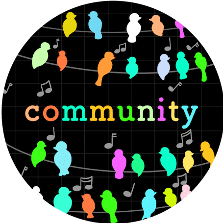
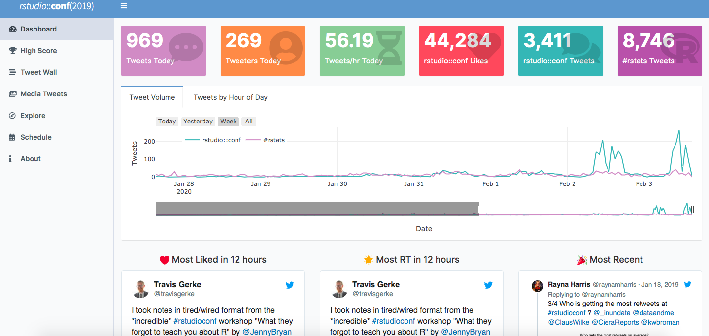
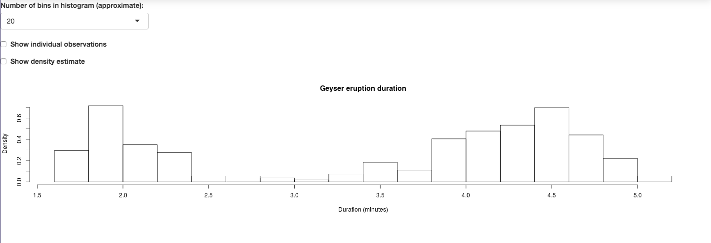
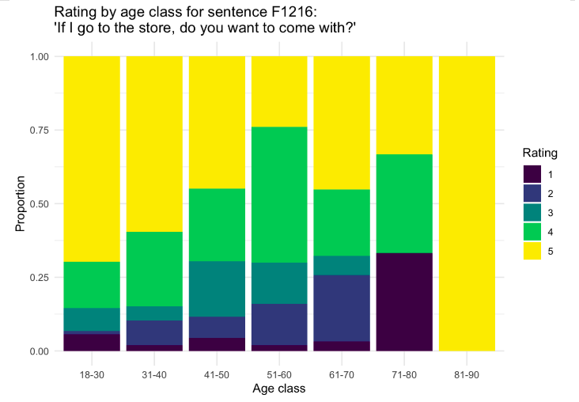
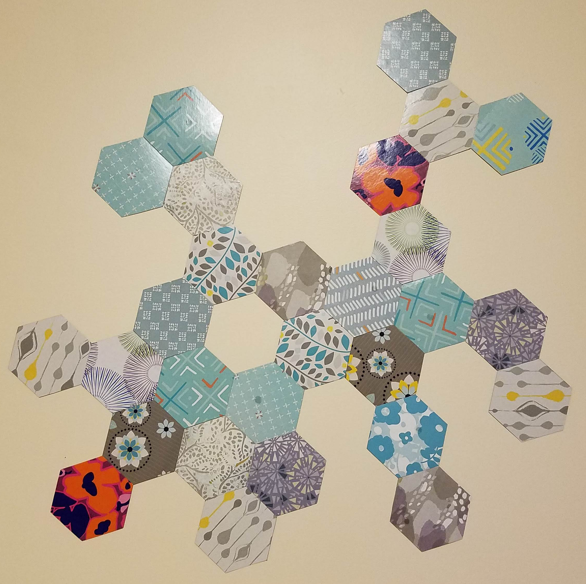

```{r setup, include=FALSE}
knitr::opts_chunk$set(echo = TRUE)
knitr::opts_chunk$set(tidy.opts=list(width.cutoff=70), tidy=F)
```

```{r echo = F}
knitr::include_graphics("rstudioconf2020.png")
```

*This post has been slightly modified from its original form on [woodpeckR](https://thewoodpeckr.wordpress.com/2020/02/03/some-lessons-from-rstudioconf/).*

When I started in R a few years ago, I never thought I would have any place at a *coding conference for computer people*. But thanks to some help from my lab and my university, last week I flew out to sunny San Francisco for the 2020 `rstudio::conf`, and I had a blast. Here are some things I learned and some avenues I'm excited to explore in the future.

### 1. The R community is awesome.

```{r echo = F, fig.cap="This art is by RStudio artist-in-residence Allison Horst. She does amazing illustrations! You can find her work on her [GitHub page](https://github.com/allisonhorst/stats-illustrations)."}

```

I was pretty nervous to attend this conference. I've never really considered myself a computer person, and I learned R pretty much accidentally through my work in biology. In my experience, people who do a lot of computer programming tend to use a lot of intimidating jargon, and I was scared I'd flounder.

I was surprised at how genuinely welcome I felt. At meals and talks, I sat down next to random people and asked what they did or how they knew R. I met people with so many diverse interests! Among others:

*• A linguist now working for a nonprofit • A neuroscience PhD now working for Facebook • Several young professors teaching data science at their schools • A woman who flew from Brazil (!!) to attend the conference • Someone just getting to know R • Two young people who interned at RStudio, despite not being experts in R • An RStudio bigwig (swoon!) • A professor working on genomic data • A researcher at the Smithsonian • An aquatic ecologist who uses R for work • So many people! You get the gist. •*

And they were all happy to talk to me!

### 2. So much happens on Twitter.

I joined Twitter on a whim this fall, and it has been awesome. I learned about this conference through Twitter. I've found some internships through Twitter. And by following the [#rstats](https://twitter.com/hashtag/rstats?src=hashtag_click) hashtag and some key people in the R community, I've learned all sorts of tips and tricks about the kinds of things you can do with Twitter.

Apart from that, lots of people were live-tweeting the rstudio::conf, and I tried my hand at that, too! A highlight was when the one and only [Hadley Wickham](http://hadley.nz/) liked [one of my tweets](https://twitter.com/kaija_bean/status/1222661161717420033).

### 3. I need to start making Shiny apps.
As I said in my tweet (the one that Hadley liked!), this conference convinced me that I really should start building apps with R Shiny as soon as possible.

Why haven't I done this already?

The main reason is that the word "app" strikes fear into my heart. Surely I can't develop an app??

Shiny apps are *web apps*, which is a little less intimidating, somehow. The basic gist of Shiny apps is that they are **ways to explore your data interactively.** That's it. Some Shiny apps can get pretty complicated. For example, [here's](https://gadenbuie.shinyapps.io/tweet-conf-dash/) a cool dashboard for visualizing tweets about the 2019 rstudio::conf. As you can see, it's pretty fancy.

```{r echo = F}

```

But Shiny apps can also be pretty simple, like [this one](https://shiny.rstudio.com/gallery/faithful.html), which shows a simple histogram of the duration of eruptions of the Old Faithful geyser:

```{r echo = F}

```

This app just lets the user change the number of histogram bins, include a density curve, and show the individual observations on the x axis. Pretty simple, but still so much better than a static visualization! I really have no excuse not to make something like this.

In particular, I can't wait to build an app for the [Yale Grammatical Diversity Project (YGDP)](https://ygdp.yale.edu/). I'm currently working with the YGDP to help organize their database of linguistic survey data. I've already created some reports in RMarkdown to help visualize the data (you can see an example [here](https://github.com/michaelchang64/ygdpDB/blob/master/outputs/construction_reports/report_sample_comewith.pdf)). But wouldn't this be so much better if it were interactive??

```{r echo = F, out.width = "150%"}

```

### 4. Bonus: fun with hex stickers

I finally got to experience the hype about hexagon stickers for R packages. They are so pretty and fun, and they fit together so nicely! I picked up a whole bunch:

```{r echo = F, out.width = "75%"}
knitr::include_graphics("hexStickers.jpg")
```

And, funnily enough, I've been playing with hexagons as wall decorations for a while now, before I even knew about hex stickers...

```{r echo = F, out.width = "75%"}

```

...so obviously, the possibilities now are truly endless. Hexagons on hexagons? A hex collage on the wall and one on my computer? Wow.
