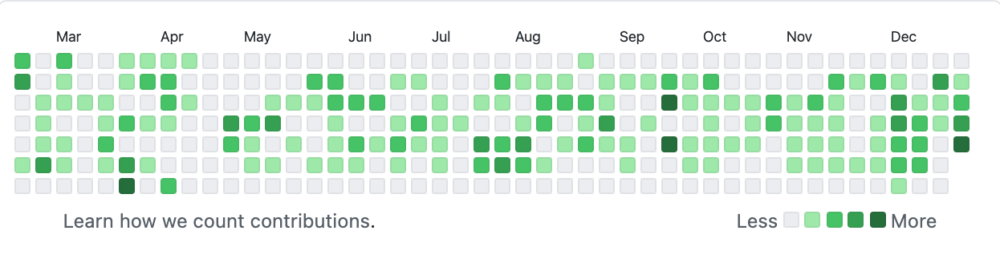
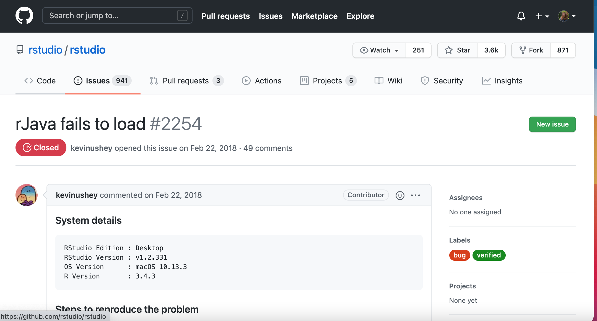

```{r setup, include=FALSE}
knitr::opts_chunk$set(echo = TRUE)
```

```{r, echo = F, fig.cap = "My 2020 GitHub contributions"}

```

## Introduction
### What this post is:
An explainer for some of the less intuitive features on the GitHub website. A road map for navigating through someone else's GitHub repository. What do all the terms mean? What are issues and pull requests and a README? What are all the different tabs and pages? Once you've arrived at the main GitHub page for a repository, how do you find your way around and make sense of what you're seeing?

### What this post is NOT:
A step-by-step guide to using GitHub for your own projects. A lot of great resources already exist for this! If you're an R user, I would particularly suggest checking out Jenny Bryan's [Happy Git With R](https://happygitwithr.com/).

Other guides on how to use GitHub:
[GitHub Guides: Hello World](https://guides.github.com/activities/hello-world/)

[An Intro to Git and GitHub for Beginners](https://product.hubspot.com/blog/git-and-github-tutorial-for-beginners)

[How the Heck Do I Use GitHub?](https://lifehacker.com/how-the-heck-do-i-use-github-5983680)

### This post is for you if:
- You don't think of yourself as a developer, and you don't have a super clear idea of what that word even means.

- You write some code, but mostly for your own analyses/projects, and you haven't really tried sharing it.

- You mostly use other people's code as fully-formed packages and apps, but maybe you've dabbled a bit in using less-polished code from people's GitHub pages and gotten stuck trying to figure out how to run it. 

- People have told you you should be putting your code on GitHub, but you've poked around and don't even understand what you're looking at.

- You don't have much computer science (CS) background, so a lot of the terms that get thrown around on GitHub are unfamiliar to you.

- You got stuck using a package, and while googling the error message, you found your way to a page that looks like this. You want to learn more about the website where you found your answer.
```{r, echo = F, fig.cap = "'rJava fails to load' is the 6th most commented issue on the rstudio GitHub page."}

```

Github is marketed as being for developers
- evidence from the webpage

The website's structure is built around what's best for **developers**, people who are actively writing, saving, and publishing code/software/apps/programs.


## Tour of a repository page
include a labeled diagram here, breaking it down into sections.

### They're commit messages, not file descriptions
  - seems like they should be file descriptions, but they're not
  - what is a commit message
  - example of what it looks like when you click on one
  
### Scary file extensions
  - dotfiles
  - common scary file extensions
  - you can ignore a lot of these!
  
#### R package structure: one common case
  - break down some of the basic files/folders
  - point them to a couple tutorials on how to make an R package
  - badges???
  
### What is a README?
  - Yes, you actually should start by reading this
  - .md just means markdown, don't worry about it
  - Typical components
    - contributors
    - how to use the code
    - maybe a vignette
    - brief description
    - contribution guidelines
    
### Using the code yourself
  - cloning vs forking
  - how to clone into a new RStudio project with version control

## Issue Tracker
### Type 1: Giant repo, lost people
- people asking for help 
  - better suited for stackOverflow or RStudio Community, though you might sometimes get help on GitHub too.

### Type 2: Repo, actual bug
- example of giant repo where many people report the bug and it gets fixed (maybe rJava?)
- example of smaller repo where there's dialogue between you and the person (hereR, me and munterfinger)

### Type 3: Notes to self, use within own project
- Cary
- YGDP Dashboard
  - sometimes a random person contributes!

## So you've made an account
### Your home page
  - can make a profile page with your own named repo
  - Repositories
  - Biographical information, if you want
  - Contributions and activity
  
### Your dashboard
  - Repositories (repos by other people don't show up!)
  - Recent activity
  - Following people
  - Notifications
  


