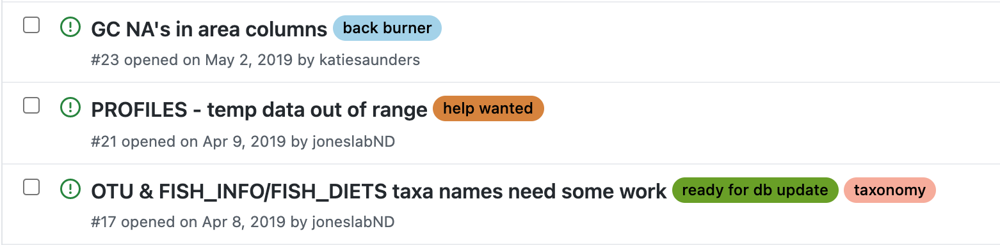

```{r setup, include=FALSE}
knitr::opts_chunk$set(echo = TRUE, eval = F)
```

```{r, echo = F, fig.cap = "A few of the issues I'm currently working on"}

```

Going to follow this tutorial: https://blog.exploratory.io/analyzing-issue-data-with-github-rest-api-63945017dedc

First, I'll need to load some packages.
```{r message = F}
library(httr) # for the qpi query
library(tidyverse) # for data wrangling
library(jsonlite) # for working with the json file we pull from github
library(rvest) # for scraping
```

This is made easier for me by the fact that all the issues are under one repository.

Get the issues from the db repo:
```{r}
res <- GET("https://api.github.com/repos/MFEh2o/db/issues", 
           query = list(state = "all", per_page = 100, page = 1))
dat <- content(res, type = "text")
iss <- fromJSON(dat, flatten = TRUE) %>%
  as.data.frame()
```

Get all pages. I can see by looking at the issues page that I have 51 open issues and 90 closed. That's a total of 141. Each API query will return 100 records, so I only need to run it twice. So this code will still be valid in the future, let's do three times. 
```{r}
pages <- list()
for(i in 1:3){
  res <- GET("https://api.github.com/repos/MFEh2o/db/issues", 
             query = list(state = "all", per_page = 100, page = i))
  jsondata <- content(res, type = "text")
  github_df <- fromJSON(jsondata, flatten = TRUE)
  pages[[i]] <- github_df
}
issues <- bind_rows(pages)
issues <- as.data.frame(issues)
```

Remove columns we don't need

Remove any column that's entirely NA
```{r}
names(issues) # 91 columns, yikes! 
not_all_na <- function(x) any(!is.na(x))
issues <- issues %>%
  select(where(not_all_na))
names(issues) # down to 89 columns. Still a lot.
```

I don't care about anything including a URL
```{r}
issues <- issues %>%
  select(!contains("url"))
names(issues) # down to 44. That's much better. 
```

Let's look for other ways to remove columns to make this data more manageable
```{r}
head(issues)
```

Don't need a lot of these "id" columns. Are there any "id" columns that I do want?
```{r}
issues %>%
  select(contains("id")) %>%
  head() # yeah, none of these look useful. I'll remove them.

issues <- issues %>%
  select(-contains("id"))
names(issues) # down to 31 columns. Getting better!

head(issues)
# definitely want to keep number and title
# ah, labels is a list-col. May have to expand that. Want to keep open.
# we don't really lock issues or assign people, but just to make sure, I'll check the unique values of those columns:

unique(issues$locked) # all false, okay
unique(issues$assignee.login) # oh I guess I do sometimes assign stuff
unique(issues$assignee.site_admin) # don't need this
unique(issues$assignee.type) # don't need this either

issues <- issues %>%
  select(-c("locked", "assignee.site_admin", "assignee.type"))

names(issues)

head(issues)

# Let's go ahead and lubridateify the various dates
issues <- issues %>%
  mutate(across(.cols = c("created_at", "updated_at", "closed_at"), lubridate::ymd_hms))

head(issues)

# Also don't need user.type or user.site_admin
issues <- issues %>%
  select(-user.site_admin, -user.type)

# For this current analysis, I don't want to deal with milestones, because even though I've started using them recently, I haven't used them consistently enough to be able to deal with them here.
issues <- issues %>%
  select(-contains("milestone"))

names(issues) # okay this is much better!

# Separate the labels into a separate df and expand them
labels <- issues %>%
  select(number, labels) %>%
  unnest(cols = c(labels)) %>%
  select(-c(id, node_id, url, description)) # okay, now I have a separate dataset with the various labels, in case I want that later.

# Remove labels from the main issues dataset
issues <- issues %>%
  select(-labels)

# Separate the issue body from the main issues dataset so it doesn't get in our way
body <- issues %>%
  select(number, body)

issues <- issues %>%
  select(-body)

names(issues)

issues <- issues %>%
  rename("creator" = "user.login",
         "assignee" = "assignee.login")

issues <- issues %>%
  select(-assignees)
```

This doesn't include information about who closed the issue, which is important, so I'm going to try to scrape that with rvest.
```{r}
els <- read_html("https://github.com/MFEh2o/db/issues/142")

els %>%
  html_nodes("div") %>%
  html_text() %>%
  str_extract("\\sclosed\\sthis\\s") # this doesn't work--shouldn't appear more than once on this page.

# This doesn't work because it's a javascript page, not plain html, so it's not suitable for scraping with rvest.
```
Going to try some code from [here](https://datascienceplus.com/scraping-javascript-rendered-web-content-using-r/)
```{r eval = F}
# We have to install and load a package called V8
# first I had to install v8 in terminal with brew install v8
library(V8)

# URL with js-rendered content to be scraped
link <- 'https://github.com/MFEh2o/db/issues/142'

#Read the html page content and extract all javascript codes that are inside a list
js <- read_html(link) %>% html_nodes('li') %>% html_text()
# Create a new v8 context
ct <- v8()
#parse the html content from the js output and print it as text
read_html(ct$eval(gsub('document.write','',emailjs))) %>% 
  html_text()
```

```{r eval = F}
link <- "https://github.com/MFEh2o/db/issues/142"

els <- read_html(link) %>%
  html_text()

els <- els %>%
  str_remove_all(., "\n") %>%
  str_replace_all(., "\\s+", " ") # this works!

# Remove everything before "jump to bottom"

els <- els %>%
  str_remove(".*(?=Jump\\sto\\bottom\\s)")
```

Okay, this looks like it's going to work. Let's examine the parts that we can extract from each issue using the standard language that GitHub uses.
- Need a list of users who could have contributed to each issue? Maybe.
- "commented"
- "edited"
- "added the ___ label" (we already have a list of current labels, so don't need to extract that)
- "self-assigned this"
- "added ___ and removed ___ labels" # this won't work because multiple labels are mashed together. Maybe with the addition of formatting?
- "added this to the ___ milestone"
- ~"closed this"~
- ~"mentioned this"~

- potentially put these all into one data frame with a "type" column

The problem is that some of these words will need to be preceded by a user's id to work.

Can we get a list of everyone who has contributed to an issue on a github repo? 
Not without authenticating. Okay, I'm going to proceed with regex for now.
```{r}
peopleLink <- "https://github.com/orgs/MFEh2o/people"
ppl <- read_html(peopleLink) %>%
  html_text()
```

Another test of the regex, with a bigger issue:
```{r}
bigLink <- "https://github.com/MFEh2o/db/issues/104"

txt <- read_html(bigLink) %>%
  html_text() %>%
  str_replace_all(., "\n", " ") %>%
  str_replace_all(., "\\s+", " ") # okay now everything is spaced out nicely.

# Function to scrape text
scrape <- function(link){
  txt <- read_html(link) %>%
    html_text() %>%
    str_replace_all(., "\n", " ") %>%
    str_replace_all(., "\\s+", " ")
  
  return(txt)
}

# Get commenters and dates
getComments <- function(txt){
  comments <- txt %>%
    str_extract_all(., "[\\w]+\\scommented\\s[\\w]{3,4}\\s[0-9]{1,2}\\,\\s[0-9]{4}") %>%
    unlist() %>%
    as.data.frame() %>%
    rename("col" = ".") %>%
    mutate(user = word(col, 1, 1, sep = "\\s"),
           date = lubridate::mdy(word(col, 3, 5, sep = "\\s"))) %>%
    select(-col)
  
  return(comments)
}

getComments(txt)

# Get closed
getClosed <- function(txt){
  closed <- txt %>%
    str_extract_all(., "[\\w]+\\sclosed\\sthis\\s[\\w]{3,4}\\s[0-9]{1,2}\\,\\s[0-9]{4}") %>%
    unlist() %>%
    as.data.frame() %>%
    rename("col" = ".") %>%
    mutate(user = word(col, 1, 1, sep = "\\s"),
           date = lubridate::mdy(word(col, 4, 6, sep = "\\s"))) %>%
    select(-col)
  
  return(closed)
}

getClosed(txt)

# Get mentioned
getMentioned <- function(txt){
  mentioned <- txt %>%
    str_extract_all(., "[\\w]+\\smentioned\\sthis\\sissue\\s[\\w]{3,4}\\s[0-9]{1,2}\\,\\s[0-9]{4}[^\\#]+\\#[0-9]{1,4}") %>%
    unlist() %>%
    as.data.frame() %>%
    rename("col" = ".") %>%
    mutate(user = word(col, 1, 1, sep = "\\s"),
           date = lubridate::mdy(word(col, 5, 7, sep = "\\s")),
           iss = str_extract(col, "(?<=\\#)[0-9]+")) %>%
    select(-col)
  
  return(mentioned)
}

getMentioned(txt)

# milestones
getMilestones <- function(txt){
  milestones <- txt %>%
    str_extract_all(., "[\\w]+\\sadded\\sthis\\sto\\sthe\\s.*\\smilestone\\s[\\w]{3,4}\\s[0-9]{1,2}\\,\\s[0-9]{4}") %>%
    unlist() %>%
    as.data.frame() %>%
    rename("col" = ".") %>%
    mutate(user = word(col, 1, 1, sep = "\\s"),
           date = lubridate::mdy(word(col, -3, -1, sep = "\\s")),
           milestone = str_extract(col, "(?<=the\\s).*(?=\\smilestone)")) %>%
    select(-col)
  
  return(milestones)
}
getMilestones(txt)
```

That's the low-hanging fruit. Now I can package that all together:
```{r}
getInfo <- function(txt){
  co <- getComments(txt)
  cl <- getClosed(txt)
  me <- getMentioned(txt)
  mi <- getMilestones(txt)
  
  out <- list("comments" = co, "closed" = cl, "mentioned" = me, "milestones" = mi)
  return(out)
}

getInfo(txt)
```

Now get info from every one of the issues:
```{r}
# get total number of issues
maxNum <- issues %>% pull(number) %>% max()

baseLink <- "https://github.com/MFEh2o/db/issues/"
links <- paste0(baseLink, 1:maxNum)

library(pbapply)
allText <- pblapply(links, scrape) # error in connection: will need to use try/catch.
```


