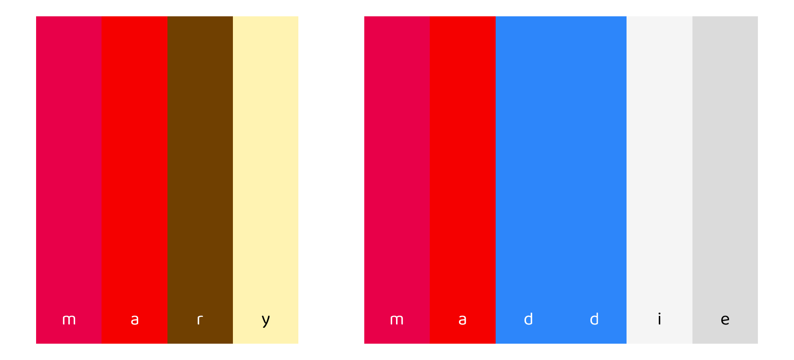
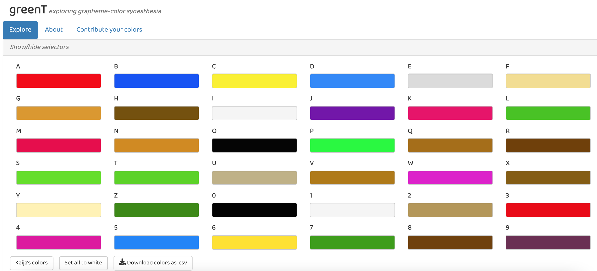
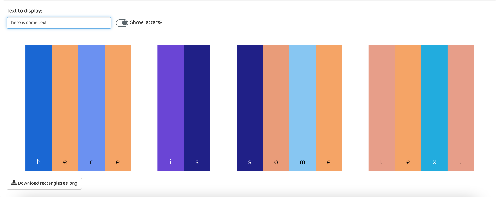
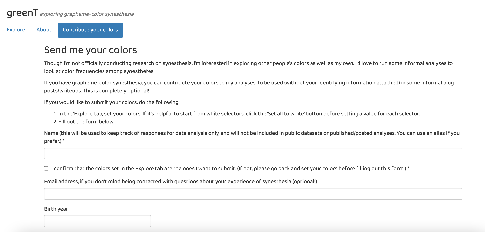
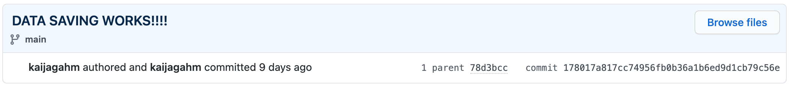

```{r setup, include=FALSE}
knitr::opts_chunk$set(echo = T)
library(blogdown)
library(tweetrmd)
```

```{r, echo = F, fig.cap = "The digits 0-9, according to my brain"}
knitr::include_graphics("numbers.png")
```

*This article has been adapted from my entry into the 2021 RStudio Shiny contest, posted on [RStudio Community](https://community.rstudio.com/t/greent-exploring-grapheme-color-synesthesia-shiny-contest-submission/104204).*

```{r, echo = F, fig.cap = "My alphabet"}
knitr::include_graphics("alphabet.png")
```

### Introduction

My name is Kaija, and I have what's known as grapheme-color synesthesia. It's a (completely benign!) phenomenon where I experience letters and numbers as having colors associated with them. I don't literally see colors floating in the air, but I've consistently associated a color with each letter and number for most of my life.

Having synesthesia doesn't affect my life much. It occasionally comes in handy for remembering credit card PINs and phone numbers, and sometimes I draw associations between completely unrelated words because they happen to have similar colors. But it's mostly just a fun little party trick.

Still, when I tell my friends about my synesthesia, they want to know what color their name is. And while I can certainly type out "magenta, red, brown, pale yellow" (Mary) or "magenta, red, blue, blue, whitish, gray" (Maddie), that can be hard to picture. And it's frustrating to have to consciously translate my mental impressions of color into words. 

```{r, echo = F, fig.cap = "Some example names: Mary and Maddie"}

```

I wanted a way to quickly represent any word or words in the colors I see it in. I did a bit of googling to see if anyone had come up with a synesthesia simulator. The closest thing I found was Bernadette Sheridan's website [synesthesia.me](https://synesthesia.me/), which did exactly what I wanted to do, but only for Bernadette's own colors! Cool, but not useful to me or to any other synesthetes (like my brother) who might want to show me their own colors.

So, I built [**this app**](https://kaijagahm.shinyapps.io/greenT/). I'm excited to add more features in the future, but for now, I'll explain the three main parts.

*The source code for the app is [here](https://github.com/kaijagahm/greenT).*

### A guided tour
#### Page: 'Explore'

At the top of the app's main page, you'll see 36 color selectors (developed using the colourpicker package), one for each letter and digit. When you load the app, the colors are chosen randomly, but you can change any or all of the colors by clicking on each selector yourself. If you find it easier to start from white selectors, click "Set all to white" and then choose colors one at a time.

```{r, echo = F, fig.cap = "The 'Explore' page"}

```

If you have synesthesia, you can set your own colors. If you don't, feel free to use the app to choose whatever colors look good to you. Or you can click the "Kaija's colors" button to see what color your name is in my head, similar to Bernadette's project. Once you're happy with the colors you've set, feel free to hide the selectors using the "Show/hide selectors" link at the top.

Next, you can enter text you'd like to translate into colors. The text will plot as rectangles, with the letters optionally superimposed in either white or black, whichever provides the best contrast to the color you've chosen. Use the toggle switch to remove the letters. Note that for simplicity, all text gets converted to lowercase, and all non-alphanumeric characters show up as white. 

```{r, echo = F, fig.cap = "Entering text to display"}

```

If you want to show your friends what colors their names are, download the plot you've created using the "Download rectangles as .png" button. If you're interested in analyzing your colors further, download the color values themselves, as both hex codes and RGB values, using the "Download colors as .csv" button.

```{r, echo = F, fig.cap = "Here's an example of the downloaded color data"}
knitr::include_graphics("downloadedData.png")
```

#### Page: 'About'

The **About** page gives a bit of backstory for the app, similar to what I've written here. It also links to a few more resources you might be interested in if you want to learn more about synesthesia. And most importantly, I use this page to thank [Jonathan Trattner](https://www.jdtrat.com/), [Dean Attali](https://deanattali.com/), and [Bernadette Sheridan](https://synesthesia.me/about) for their contributions to this app, in code or inspiration.

#### Page: 'Contribute'

I'm always on the hunt for projects, and I've thought for a while that I would love to analyze data on my own colors and those of other people. For example, past research has found that [there are some patterns](https://neurocritic.blogspot.com/2013/01/fisher-price-synesthesia.html) in which letters synesthetes associate with which colors. I'm also interested in intra-individual variation. For example, while my K is a very strong magenta color and always has been (it has never varied for as long as I can remember, and it doesn't change based on the letters around it), some of my letter-color associations are much weaker. E, which I've encoded in this app as gray, is really almost colorless or translucent. It tends to take on the colors of the letters around it. So I'd love to repeatedly collect my own color data and analyze it.

```{r, echo = F, fig.cap = "My own name in my colors"}
knitr::include_graphics("kaija.png")
```

If you want to contribute your data to my (independent, informal, unofficial!) research into this phenomenon, I encourage you to fill out the form on the Contribute page. Make sure to set your colors using the selectors on the Explore tab before filling out the rest of the form--when you click "Submit", the currently-selected colors will be recorded along with the demographic info you've entered.

```{r, echo = F, fig.cap = "The contribution form"}

```

Also: feel free to submit colors more than once, if yours are a bit variable like mine are! Just use the same name and (optionally) email address, so I can relate your responses to each other.

### Future enhancements

Here's what I'd like to add to this app in the future:

- Bookmarking, so you can save the colors you've entered and come back to them
- Ability to upload your previously-downloaded data (more robust version of bookmarking)
- A continuously-updating analysis page that shows statistics based on previously-submitted data (anonymized!)
- Opacity toggles or other more nuanced formatting tweaks for the colors
- A "colored text" mode that displays the letters themselves in color

### Get involved

If you're interested in contributing to the app, submit an issue or PR [on GitHub](https://github.com/kaijagahm/greenT), or [get in touch](https://kaijagahm.netlify.app/)! I'd love to collaborate with you.

### Thoughts on the process of building the app

Building this app was a joyful process because it made me acutely aware of how far I've come with Shiny in less than a year.

I had never built a Shiny app until July 28th, 2020, when I watched Garrett Grolemund's Shiny tutorial videos and started playing around with a simple app. By chance, the [Palmer penguins dataset](https://allisonhorst.github.io/palmerpenguins/) was up for [Tidy Tuesday](https://github.com/rfordatascience/tidytuesday) that week, so I made a [simple data explorer app](https://kaijagahm.shinyapps.io/ExplorePalmerPenguins/) for that dataset. I was surprised at how easy it was.

```{r echo = F}
tweetrmd::tweet_screenshot("https://twitter.com/kaija_bean/status/1288183052930289666")
```

I had started learning Shiny in order to build a much more complicated data explorer app for the Yale Grammatical Diversity Project. I really didn't know what I was getting myself into--I had pitched the idea to my boss at the YGDP with the clear caveat that I had never programmed in Shiny before, ever. But I was confident that I could figure it out. I had yet to encounter a skill in R that I couldn't crack if I put my mind and time to it.

```{r echo = F}
tweetrmd::tweet_screenshot("https://twitter.com/kaija_bean/status/1290393150100570119")
```

"Time" turned into around nine months of programming, debugging, and fiddling. It was a frustrating and at times lonely process, since I had no programmer colleagues to turn to for help and brainstorming. But I eventually produced an app I was proud of; you can read more about it [here](https://kaijagahm.netlify.app/projects/2021-02-05-ygdp-dashboard/) and see the finished app embedded at the bottom of that page or [here](https://ygdp.shinyapps.io/ygdpDashboard).

The YGDP dashboard reinforced for me that I could do anything in Shiny that I set my mind to, and **greenT** was a chance to put that into practice. With many fewer moving parts, **greenT** was a bit of a softball to myself. That's not to say that it was easy. Rather, when I did run up against a problem, I knew it could not possibly be as challenging as the problems I had already debugged for the YGDP app. I confidently laid out the app and linked up the components and had a working prototype in an afternoon. Then came many more afternoons of tidying and adding features, but that was the fun part.

```{r, echo = F, fig.cap = "A particularly satisfying commit--I got the contribution form to write user data to Google drive"}

```

I hope it doesn't sound like I'm bragging. I had, at this point, almost a year of 10+ hours a week of Shiny under my belt. But I also want to point out that I didn't really do this alone at all. I have been, as Steph Locke so eloquently put it, "community-taught".

```{r echo = F}
tweetrmd::tweet_screenshot("https://twitter.com/TheStephLocke/status/1214569802804662274?ref_src=twsrc%5Etfw")
```

Part of that is being able to jump into Shiny by watching beautifully thought-out videos like the Garrett Grolemund tutorial I referred to above. Part of that is benefiting from the packages that others before me have developed. For example, [Dean Attali](https://deanattali.com/) does great work in Shiny, and his code literally made this app possible: the color selectors on the main page come from his [`colourpicker`](https://deanattali.com/blog/colourpicker-package/) package, and the contribution form is taken almost verbatim from his [tutorial](https://deanattali.com/2015/06/14/mimicking-Google-form-shiny/) on mimicking a Google form with Shiny.

I had another advantage in developing greenT: [Jonathan Trattner](https://www.jdtrat.com/) collaborated with me during most of the app's development. Even though his time was limited by classes and exams, it was invaluable to be able to ping him on Slack or hop on a video call to discuss something I was stuck on.

### Behind the app

If you'd like to read more about the code behind the app, check out [Part 2](https://kaijagahm.netlify.app/posts/2021-05-12-greent-how-to/) of this blog post, where I go into detail on the contribution form, non-interactive Google Sheets authentication, building a dynamic ggplot, programmatically generating color selectors, setting the font, and more.