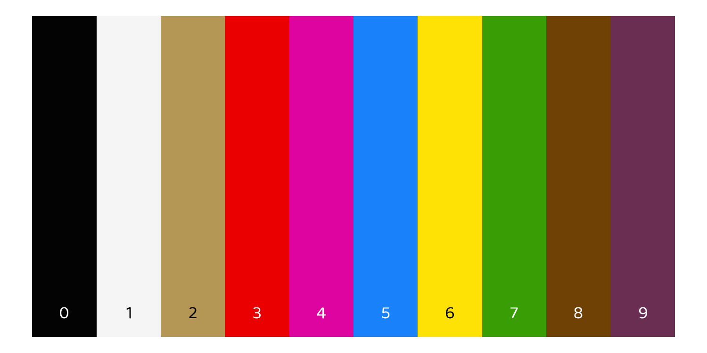
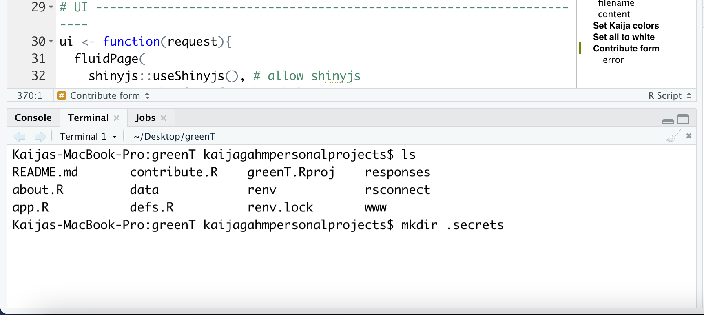

```{r setup, include = FALSE}
knitr::opts_chunk$set(echo = T)
```

```{r, echo = F, fig.cap = "The digits 0-9, according to my brain"}

```

The other day, I posted an app about grapheme-color synesthesia, called [**greenT**](https://kaijagahm.shinyapps.io/greenT/). This is part 2 of a blog post about the app. Part 1 gave an introduction to the who/what/why of the app, and provided a little guided tour through each page and feature. [You can read part 1 here](https://kaijagahm.netlify.app/posts/2021-05-09-greent/).

This post will go into more detail about some of the code in the app. If you're interested in Shiny and want to know how I made everything work, this is the post for you. I picked a few features that were the most interesting to me, and/or the ones that I had to do the most independent troubleshooting to figure out. If you have questions about the rest of the app, get in touch via email, Twitter, or GitHub and I'll do my best to respond!

Ok, here goes.

## How did I:

Here, I'll discuss some of the app's parts in more detail, in the spirit of providing ever-more resources for Shiny developers. I'm going to focus on things I struggled with, because most likely, if I didn't struggle, the answer is available on Google somewhere.

Of course, you're also welcome to look at my code, [on GitHub](https://github.com/kaijagahm/greenT). The main scripts are 'app.R' (the main app script) and 'defs.R' (which defines some supporting functions). Then 'about.R' and 'contribute.R' just have a lot of long text, to avoid cluttering up the main script with it.

### Change the font across the entire app?

Jonathan created a file called 'tea-style.css'. It lives inside the folder 'www/' in the main app directory. The file path written using the `here` package is `here::here("www", "tea-style.css")`.

#### Getting the font

Inside 'tea-style.css', I import the font I want to use, like this:

`@import url('https://fonts.Googleapis.com/css2?family=Baloo+2&display=swap');`

That URL comes from [Google Fonts](https://fonts.Google.com/), which is where I found Baloo 2, the font that I decided to use. I clicked on it to see the different styles (weights, italic, etc.) and selected the one that I liked by clicking "Select this style" on the right.

```{r, echo = F, fig.cap = "Choosing a style from the Baloo 2 font"}
knitr::include_graphics("baloo.png")
```

Clicking that + sign popped open a dialog on the right. I chose the 'import' option instead of `<link>`, and then copied the import code within the `<style>` tag.

```{r, echo = F, fig.cap = "Copying code to import Baloo"}
knitr::include_graphics("balooURL.png")
```

#### Applying the font

Then, in the same 'tea-style.css' file, I added this code:

```
* {
font-family: 'Baloo 2', sans-serif;
}
```

The * tells css to assign that font to *all* text in the app, not just a particular class of element. The 'sans-serif' after the name of the font tells the app to default to a generic sans-serif font if Baloo 2 were to be unavailable. And don't forget the semicolon at the end of the line!

### Make the title and subtitle have two different formats?

Gooood question. I don't really know html and css. In this case I kind of Googled around until I found something that worked. And I completely despaired of being able to get the title to be large, so I asked Jonathan, and he showed me where to put the font size. Here's the relevant code snippet, within the Shiny UI:

```{r eval = F}
# Title and subtitle, two different formats
titlePanel(div(HTML("<b style = 'font-size: 30px;'>greenT</b><em><small>
                    exploring grapheme-color synesthesia</em></small>")),
           # windowTitle controls what shows up on the browser tab
           windowTitle = "greenT")
```

### Plot the colored blocks?

Just some ggplot magic!

#### Making the plot

Here's the ggplot code that plots the rectangles. If you want to fully understand the data structure that goes into the plot, you'll have to take a look at the app and trace everything back: `rectangleDF()` is a reactive expression that depends on all the color inputs and the text that the user enters. 

I use `geom_rect` to make rectangles, defining their dimensions so that they plot right up against each other. I had to use `scale_fill_identity` so that the rectangles would be filled with the literal color values included in the input data frame, instead of ggplot's default behavior, which is to map colors to values based on an external color palette.

`theme_void()` gave me a totally blank background--no axis labels, no ticks, no nothing. I wanted the plot to read as "an image of colored rectangles", rather than as "a ggplot".

```{r eval = F}
# Plot color blocks -------------------------------------------------------
plotVals <- reactiveValues() # initialize a reactiveValues object to store the plot object
output$colorBlocks <- renderPlot({
  p <-  rectangleDF() %>%
    ggplot() +
    geom_rect(aes(xmin = xmin, xmax = xmax,
                  ymin = ymin, ymax = ymax, 
                  fill = hex))+ # fill w hex colors
    scale_fill_identity()+ # take the literal hex values as colors, instead of mapping other colors to them.
    theme_void() + # totally blank background
    {if(input$showLetters)geom_text(aes(x = xmin + 0.5, 
                                        y = ymin + 0.3, 
                                        label = grapheme,
                                        col = contrastColor),
                                    size = 10,
                                    family = "Baloo 2")}+
    scale_color_identity()
  plotVals$rectanglePlot <- p
  print(p)
})
```

#### Conditionally displaying letters

Then, I included a conditional layer: only add the letters if the interactive toggle switch is TRUE; otherwise remove the layers. I often find myself wanting to make conditional layers, especially in Shiny, and I can never remember the syntax on the first try. I refer back to Stack Overflow posts like [this one](https://stackoverflow.com/questions/55248191/if-condition-inside-ggplot?noredirect=1&lq=1). Again with the community! 

Note that I was having trouble getting the ggplot to show up until I assigned it to a variable, `p`, and then included the `print(p)` statement at the end. Not sure why, but this worked.

There are two other interesting pieces of code here that work together with other parts of the app:

### Change the color of the ggplot letters based on the rectangle color?

I took the same approach for the text color as for the rectangle background colors. I encoded the text color (either #FFFFFF/white or #OOOOOO/black) in the dynamically-created input data frame (a reactive expression) and then used `scale_color_identity()` to tell `ggplot` to use those literal hex values to color each letter, instead of mapping other colors onto them. You can see the `scale_color_identity()` code in the plot code snippet above.

The tricky part was dynamically assigning each letter to either white or black based on the chosen background color. I figured I shouldn't need to reinvent the wheel here. Surely web designers have already figured out how to do this. Once again, I Googled, and I found [this post](https://stackoverflow.com/questions/3942878/how-to-decide-font-color-in-white-or-black-depending-on-background-color), which gives a handy formula for calculating the best contrast color based on the rgb values of the background. The recommended threshold value in that post is 186; I fiddled around and ended up settling on 140 because, I don't know, it just looked better to me.

To calculate these colors, I had to convert my color hex codes into individual r, g, and b values, which I did using the `col2rgb()` function.

Here's the full code I used for those color computations. Incidentally, you'll notice that the reactive expression being calculated here is `rectangleDF()`, which becomes the input to the plot code I shared above.

```{r eval = F}
# Create df input for the ggplot ------------------------------------------
rectangleDF <- reactive({
  req(length(split()) > 0) # will only work when there is text entered in the box
  data.frame(grapheme = split(),
             ymin = 1,
             ymax = 5) %>%
    mutate(xmin = 1:nrow(.), xmax = 2:(nrow(.)+1)) %>%
    left_join(colorsDF(), by = "grapheme") %>%
    mutate(r = col2rgb(hex)[1,],
           g = col2rgb(hex)[2,],
           b = col2rgb(hex)[3,]) %>%
    mutate(contrastColor = case_when((r*0.299 + g*0.587 + b*0.114) > 
                                       140 ~ "#000000",
                                     TRUE ~ "#FFFFFF"))
})
```

(I thought about giving line numbers for the code, but I plan to keep editing this app, so the line numbers would keep changing. You can use ctrl+F in the app.R script, though)

### Save the rectangle plot as an image?

This part was surprisingly easy, actually! Shiny has a nice `downloadHandler()` functionality that has two parts: one where you define the content you want to download, and one where you define the (dynamically-created) file name. The syntax is a little weird, so I copied and pasted the code from the Shiny docs and then filled in my parts. 

I've reproduced the download code below. The `filename` function converts the user-entered text to lowercase and replaces all non-alphanumeric characters to underscores, so we get a nice file name consisting of underscore-separated words. Then I append a nicely formatted date.

Next, I need to define the object to be downloaded--in this case, the rectangle plot. 
Take a look back at the `ggplot` code I posted above. You might have been confused by this line, at the top: `plotVals <- reactiveValues()`; and this line, at the bottom: `plotVals$rectanglePlot <- p`. What we're doing there is defining a reactiveValues object that gets updated each time that the ggplot re-renders. 

Now, inside the `content` function in the downloadHandler, I `ggsave()` the currently-displayed plot (`plotVals$rectanglePlot`). 

```{r eval = F}
# Download rectangles plot as image ---------------------------------------
output$downloadPlot <- downloadHandler(
  filename = function(){
    paste0(str_replace_all(tolower(input$displayText),
                           "[^a-z0-9]", "_") %>% 
             str_replace_all(., "_{2,}", "_"), 
           "_",
           dateTimeFormat(),
           '.png')
  },
  
  content = function(file){
    req(plotVals$rectanglePlot)
    ggsave(file, plot = plotVals$rectanglePlot, 
           device = 'png', width = length(split())/2, 
           height = 5/2)
  })
```

### Make the contribution form?

I closely followed [Dean Attali's tutorial](https://deanattali.com/2015/06/14/mimicking-Google-form-shiny/), in most cases using his code directly. Of course, I wrote my own form questions. 

There are three main differences between my approach and Dean's.

1. While Dean collected responses that would be added to an existing data sheet, each as a new line, I wanted to save a whole data frame per response. For that reason, my `contributionData()` reactive expression does a bunch of data reformatting. In the following code, I bind together the color data that the user has previously entered (co-opting the `colorsForExport()` reactive expression that I created in order to allow the user to download the color data as a csv) and the responses that the user gave to the demographic questions in the form. 

   Of course, this relies on the user having previously entered their color data on the **Explore** page before filling out a form. I added a mandatory `checkboxInput` with text to this effect.

   I actually don't love this approach. I think it would be less confusing for the user to have a "mirror" of the **Explore** tab's color selectors show up on the **Contribute** page, so they could tweak their colors before saving the form. I don't know if it's possible to have a single input widget show up in multiple places in a Shiny app (so that changing it in one place will automatically also change it in the other places), and I suspect it's not. 

   So in order to make this work, I would have to program a whole new set of color selectors, and then add some logic that updates each selector in response to a change in its mirror, and vice versa. I'm sure this is possible, but I don't know how to do it off the top of my head, and I left it out for the sake of time.

2. I added some dynamic question options. I wanted respondents to be able to self-describe their gender identity. Also, for the question at the end about different types of synesthesia, I wanted respondents to be able to include types that I hadn't listed. I listed most of the major synesthesia types I could find based on my research, but you never know!

   This turned out to be pretty simple, using the `uiOutput`/`renderUI` [pair of functions](https://shiny.rstudio.com/tutorial/written-tutorial/lesson4/). Here's a snippet of code from the UI portion of the form:

```{r eval = F}
# (more form questions above)
radioButtons("gender", labelMandatory("What is your gender identity?"),
             choices = c("woman", "non-binary", 
                         "man", "prefer not to say", 
                         "prefer to self-describe (click to add text)"), 
             selected = character(0), width = "100%"),
uiOutput("genderSelfDescribe"), # here's the uiOutput that dynamically generates a new question if the respondent wants to self-describe their gender.
radioButtons("sex", labelMandatory("Sex assigned at birth:"),
             choices = c("female", "male", "intersex", 
                         "prefer not to say"), 
             selected = character(0), width = "100%"),
# (more form questions below)
```

   Sandwiched between the `gender` and `sex` questions, the line `uiOutput("genderSelfDescribe")` allows a dynamically-generated question to appear if the respondent selects "prefer to self-describe" in the `gender` question.

   Here's the code on the server side that makes this possible:

```{r eval = F}
# Contribute form -------------------------------------------------------
# Dynamic options
## self-describe gender
output$genderSelfDescribe <- renderUI({
  req(input$gender)
  if(!input$gender == "prefer to self-describe (click to add text)"){
    return(NULL)
  }else{
    textInput("genderSelfDescribe", 
              label = NULL, "")
  }
})
```

   And then of course, there's similar code to provide a dynamic option for the free-text synesthesia types question.

3. While Dean's tutorial describes saving responses using persistent data storage on the server where the Shiny app is hosted, he also points out that this isn't possible on [shinyapps.io](shinyapps.io). So I decided to use one of the other options that he outlines in [the follow-up to the original tutorial](https://deanattali.com/blog/shiny-persistent-data-storage/): storing the data on Google Drive uisng the `Googlesheets4` package.

### Save the contributed data to Google Drive?

It took me a while (lots of trial and error, and lots of Google searches that I can't reproduce) to figure out how to get the data saving to Google Drive to work. 

Basically, here's the challenge. In order to read and write to Google Drive, you have to "authenticate", i.e. "log in" to an account. That makes sense--of course it would be bad if I could make an app that could modify files in some random other person's account with impunity.

But, typically when we authenticate Google Drive (or anything else) from an R script, the package does a little "dance" with your web browser. You run the code command to authenticate, and then a browser window pops open and prompts you to enter your password. You do that, and then the code will run back in your RStudio window.

That setup works fine for interactive programming, but it doesn't work for a Shiny app. First of all, it would be super annoying for app users to have to deal with a separate browser popup just in order to be able to submit their forms. And more to the point, it wouldn't help anyway--because they'd have to log into *my* Google account! So that's not possible or desirable.

That means that in order to write data to Google Drive directly from my Shiny app, I'll have to use "non-interactive authentication" via a secret "token". 

Here's how I did that.

#### Setup

First, I had to authenticate interactively one time, in order to set things up. To do this, I first created a hidden directory inside my main Shiny project and called it ".secrets". To do this, I opened up the Terminal window inside RStudio. (You can also do this with the Terminal app, or the equivalent, on your computer--it doesn't have to be through RStudio.)

```{r, echo = F, fig.cap = "Making the .secrets directory"}

```
First, I checked to make sure I was in the root project directory by typing `ls` and checking what other files were there. Alternatively, you could print the working directory with `pwd`.

Once I determined that I was indeed in the root directory, I typed `mkdir .secrets`. The `.` before 'secrets' will make the directory hidden.

Next, *and this is important!* I hid '.secrets' from being tracked by git. It's a good idea to do this right at the beginning to make sure you don't forget. You definitely do not want your private access token to end up on GitHub for all the world to see!

If you have git running through RStudio, an easy way to do this is to go up to the **git** panel, click the gear icon, and then click "Ignore". This will open the .gitignore file. Now just add '.secrets' as a new line in the .gitignore file to ignore the entire contents of the secrets directory. If you're more comfortable using the terminal, you can of course open the .gitignore using `nano .gitignore` or similar.

```{r, echo = F, fig.cap = "Opening the .gitignore file"}
knitr::include_graphics("gitignore.png")
```

Okay, now we need to load the `googlesheets4` and `gargle` packages. `gargle` manages token authentication, and `googlesheets4` is what we'll use to write the data to Google Sheets. 

```{r eval = F}
library(googlesheets4) # we'll use this for writing to google sheets
library(gargle) # for authentication/tokens
```

Next, set some `options()`. You can do this part in the console--it only needs to be done once. You're just telling `gargle` where to save the token that you're about to generate.

```{r eval = F}
options(gargle_oauth_email = "kaija.gahm@aya.yale.edu", # the email I wanted to use for the app
        gargle_oauth_cache = ".secrets") # 
```

#### Get a token

In order to actually generate a token, type `gs4_auth()` in the console. This should open up a window in your browser that will prompt you to sign in to your Google account. If you, like me, have multiple Google accounts (I have **five** right now), double-check that you're signing into the same account that you specified in the `options()` call above. That's the account whose Drive you'll be writing to from your app.

Once you've authenticated, you should get a plain-looking screen that tells you the authentication is complete. You can close that window and go back to R now. (This is the auth "dance" I mentioned earlier).

Now, double-check that your token got added to your '.secrets/' directory. It should get put there automatically because of the options you set. If it didn't, try re-running the `options()` code above and re-trying the authentication.

I checked the contents of the '.secrets/' directory by using the Terminal window in RStudio to navigate into '.secrets/' and then list the files inside.

```{bash eval = F}
cd .secrets
ls
```

You should see something like `nfo674ndu6e8gh50p24q2nm8hk3a6e0k_kaija.gahm@aya.yale.edu` (obviously that's not my real token, but it has the same format--a string of numbers and letters, followed by an underscore and then your email address.)

#### Non-interactive authentication

Okay. Now you have a token. Phew! The next step is to set up non-interactive authentication. I did this by following [this vignette](https://cran.r-project.org/web/packages/gargle/vignettes/non-interactive-auth.html). It's really long. Don't panic! The section you want is **Project-level OAuth cache**.

You'll notice that the first part of this section gives instructions on how to do basically what we just did: create a ".secrets/" directory and use a one-time interactive authentication to store a token in it. Here, they use the `googledrive` package as an example. My example above used `googlesheets4` instead, but it's the same process.

```{r, echo = F, fig.cap = "My alphabet"}
knitr::include_graphics("projectLevelOAuth.png")
```

Now, follow the rest of the steps in this tutorial. They include adding this code at the top of your app, which you'll see at the top of my own app.R file.

```{r eval = F}
options(
  gargle_oauth_cache = ".secrets",
  gargle_oauth_email = TRUE
)
```

#### Notes and caveats

Note that there are other approaches to non-interactive authentication that use a Google service account. I tried to get this set up and didn't have any luck--or rather, I got it set up, but then the process of actually *accessing* the data in a Google service account is complicated and I gave up and followed this tutorial instead with my personal account. For a small, personal app like greenT, that's fine. If you want to implement something bigger or more sensitive, you should look into that approach. Maybe you'll succeed where I didn't. A warning: the Google API website is one of the most confusing sites I've ever tried to navigate, and I'm no Luddite.

One more note on saving the form data to Google Sheets. Ideally, I would want each respondent's data to be saved as its own sheet, and I'd want those sheets to be stored in a designated folder in my Google Drive. Unfortunately, and counter-intuitively, this turns out to be hard to do.

The `googledrive` package in R is designed for interacting with Google Drive file structures, while the `googlesheets4` package is built to deal with individual Google Sheets files, but not so much with their organization within Google Drive. If you're used to working with Google spreadsheets stored on Google Drive the normal way (i.e. through the web interface), it's jarring to have these processes separated. 

I spent a while trying to find the functionality in `googlesheets4` that would allow me to organize files. Finally, I came across [this issue](https://github.com/tidyverse/googlesheets4/issues/111) on the `googlesheets4` GitHub page, where Jenny Bryan explains the separation of functionality between these two packages. She subsequently wrote a [vignette](https://googlesheets4.tidyverse.org/articles/articles/drive-and-sheets.html) on working with the two packages together. I followed the vignette and had a whole nice workflow set up where the data got written to a google sheet that was then moved to a 'greenT/' directory I had pre-created on Google Drive. But because both packages had to make calls to the `googledrive` and `googlesheets4` API's, the whole thing was too slow, and the user had to wait an inordinately long time for their form response to submit.

I'm sure there's a way to speed this up, but I needed to have it working on a short timeline, so I ended up sticking with individual google sheets for each response, stored in my main Google Drive. Not ideal, but I added a 'greenT_' prefix to each file name so at least I'll be able to find them easily. (Note: the code snippet I'm reproducing here lives in 'defs.R' within my app.)

```{r eval = F}
# Function to save form data ----------------------------------------------
saveData <- function(data) {
  fileName <- sprintf("%s_%s_%s",
                      "greenT",
                      dateTimeFormat(),
                      digest::digest(data))
  
  # Create an empty spreadsheet
  ss <- gs4_create(name = fileName,
                   sheets = "data")
  
  # Put the data.frame in the spreadsheet and provide the sheet_id so it can be found
  sheet_write(data, ss, sheet = "data")
}
```

### Work efficiently with all 36 color selectors?

Since the app requires assigning a color to each letter (26) and digit (10), we have 36 color selectors to deal with, each with its own inputId. I called the letter selectors `input$a`, `input$b`, etc., and I called the number selectors `input$one`, `input$two` since there are annoying hoops to jump through if you want to make a number into a variable.

36 is a lot of individual variables to type out. Frustratingly, it's right on the cusp of what I'm willing to do manually--few enough that manual listing is possible, but enough that it's a serious pain, especially if you have to list them out more than once.

Ultimately, then, I opted to deal with the color selectors programmatically. It was a little tricky to figure out, in part because there are three really three different lists of selectors.

#### Making some vectors

1. The inputId's of the selectors. As I explained above, this is a combination of the letters of the alphabet (lowercase) with the spelled-out digits, "zero" through "nine".

2. The display names of the selectors. For some arbitrary reason I decided I wanted them to display as uppercase letters and digits. Not sure why I did that. In retrospect, since everything shows up as lowercase in the ggplot, maybe I should have gone with lowercase. But regardless: the display names end up being `c(A:Z, 0:9)`.

3. The characters that the selectors represent. This is important because I have to compile a data frame of all the selector input colors, to join to a data frame created from the text that the user entered. Since that text gets converted to lowercase, the selector inputs also have to be assigned lowercase letters in order to match up. So for this, we need yet another vector, `c(a:z, 0-9)`. This is also how I want the characters to print out in the downloadable csv data. Lowercase just seems more standard and appropriate in that case.

Yeah, as I'm typing this I'm realizing that I *really* should have just combined steps 2 and 3 and gone with lowercase display labels. Oops. *Note also: this ignores the possibility that someone might have different colors associated with uppercase and lowercase letters. That isn't true for me, but it is true for at least one of my testers. Maybe I'll add that functionality in the future!*

Anyway. I went ahead and defined these three vectors in my 'defs.R' script, like this:

```{r eval = F}
inputIds <- c(letters, c("zero", "one", "two", "three", "four", "five", 
                         "six", "seven", "eight", "nine"))
displayNames <- c(LETTERS, 0:9)
charactersOut <- tolower(displayNames)
```

Then, I could use those vectors to operate on all of my inputs at once, using functions like `lapply` and `map2`. 

For example, let's take a look at how I created the individual `colourInput` objects to display on the main page of the app.

#### Example: Creating the selectors

First, I defined a function, `colorInit()`:

```{r eval = F}
# Function to create inputs -----------------------------------------------
colorInit <- function(x = .x, y = .y){
  colourpicker::colourInput(x, y, value = randomColor(), showColour = "background")
}
```

The .x and .y are default inputs because I know I'll be using this function in a call to `map2()`. `value = randomColor()` initializes each selector with a random hex code when the app initially loads. And `showColour = "background"` shows the chosen color as the background of the selector, not as hex code text. 

Now, I can call this function in order to render the `colorInput`s in the UI. The `column()` code below had to be repeated 6 times (6 total columns) in the UI. There's probably a way to streamline even *that* part of things, but I didn't mind repeating myself 6 (rather than 36) times, and I didn't want to write another function.

```{r eval = F}
fluidRow(
  # ... (other columns)
  column(width = 2,
         purrr::map2(.x = horiz(inputIds)[7:12], 
                     .y = horiz(displayNames)[7:12], 
                     colorInit)
  )
  # ... (more columns)
) # 6 columns in total
```

So, let's take a look at this code. First, I've created a `fluidRow()` that will serve as the horizontal strip where all the color inputs are housed in the UI. Because I know I want to lay out the selectors in a 6x6 grid, I create 6 `column()` definitions, each with width 2 (a width of 12 means "take up the full page", so dividing that by 6 gives a width of 2 for each column).

Then, I use `map2()` to render the inputs. I define two arguments, `.x` and `.y`. (Ignore the `horiz()` function for now--I'll talk about that in a second.) `.x` is going to be the inputId's of the color selectors, so for that I can use `inputIds`, one of the three vectors I created in the previous step. `.y` is going to be the labels, or what actually gets displayed next to the selctors. So for that, I can use `displayNames`, the vector I created that includes capital letters and digits. Finally, `colorInit` is the `.f` argument (which I probably should have labeled as such--oops.) So, `map2()` passes `.x` and `.y` into that `colorInit()` function that I just defined, and for each element of the input vector, it creates a `colourInput()` object with inputId taken from the `.x` vector and label taken from the `.y` vector.

#### Arranging the letters horizontally

Cool, okay. So now let's talk about the `horiz()` function, and also those indices `[7:12]`. The input vectors I created are, naturally, in alphabetical order, from A-Z and then 0-9. But I'm creating my inputs in 6 columns. If I populated the columns in order of that vector (for example, using elements `[1:6]` for the first column; `[7:12]` for the second column), I'd end up with the alphabet going down the columns instead of across rows.

That's *fine*, I guess, but I find it more naturally to read left to right, top to bottom (instead of top to bottom, left to right). I want the top left selector to be `A`, and then the one directly to its right to be `B`, because I think that's what the user will expect.

So, I created a function called `horiz()`. Here it is:

```{r eval = F}
# Function to reorganize the inputs horizontally --------------------------
horiz <- function(vec = inputIds, nrow = 6, ncol = 6){
  mat <- matrix(vec, nrow = nrow, ncol = ncol, byrow = T)
  horizVec <- c(mat)
  return(horizVec)
}
```

`horiz()` takes my (alphabetically-ordered) vector as input. It then generates a matrix from that vector, with `byrow = T` (i.e. laying out the vector in rows, not in columns--the way I want it!). Next, it uses `c()` to collapse that matrix back down into a vector. Because R works on columns by default, the matrix will be collapsed column-wise, not row-wise. So the vector returned will be `c("a", "g", "m", "s", "y", "4", "b", "h", "n", "t")`... etc. etc.

So now, I can use the elements of *that* vector, 6 at a time, to populate and name the color selectors for each column.

In the case of the code snippet above that uses `map2()`, I'm making the second column, so I use elements `[7:12]` of each transformed vector. `horiz(inputIds)[7:12]` gives me `c("b", "h", "n", "t", "z", "5")`, and `horiz(displayNames)[7:12]` gives me `c("B", "H", "N", "T", "Z", "5")`.

You might be wondering why I went to all this trouble. Why not just make the selectors row-wise, instead of column-wise?

There definitely might be a good way to do this (please share it if you know how!) but I couldn't figure it out. It's not trivial to align things using CSS, and I think that's what I would have had to do in order to ensure equal spacing. I know R and I don't know CSS, so I ended up going with the R-centric solution. Besides, I got to feel clever writing functions and such. 

## Get involved

That's it for specific notes on the code for this app! If you're curious about the rest of the code, please check out the repository, which is publicly available [here](https://github.com/kaijagahm/greenT). If you have specific questions, you can email me, and I'll try to get back to you (but no promises). 

I also welcome contributions, if you're interested in making this app better! Go ahead and [file an issue](https://github.com/kaijagahm/greenT/issues) or [submit a pull request](https://github.com/kaijagahm/greenT/pulls) on GitHub. I'm going to be busy over the coming months and I'm not sure how much time I'll have to work on this, so I may not be actively responding to issues. But I welcome any and all contributions or ideas for the future.

If you haven't already checked out my first blog post about this app, you can read it [here](https://kaijagahm.netlify.app/posts/2021-05-09-greent/). And the app itself lives [here](https://kaijagahm.shinyapps.io/greenT/).

Thanks for reading.