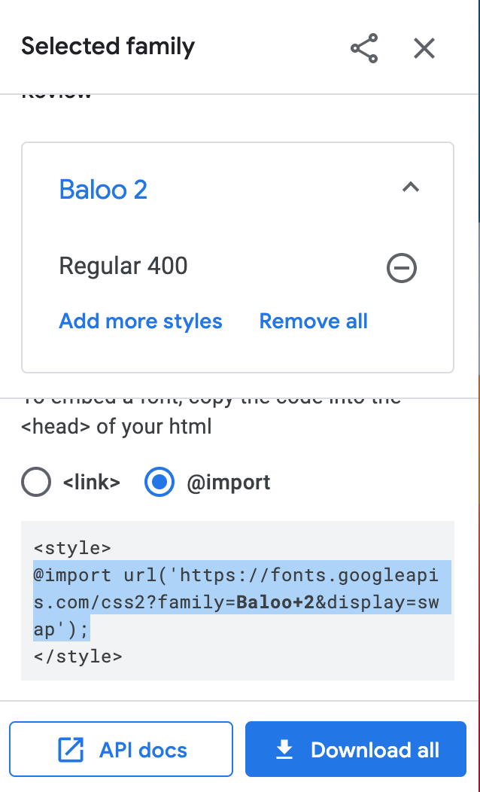

### How did I:

Here, I'll discuss some of the app's parts in more detail, in the spirit of providing ever-more resources for Shiny developers. I'm going to focus on things I struggled with, because most likely, if I didn't struggle, the answer is available on Google somewhere.

Of course, you're also welcome to look at my code, [on GitHub](https://github.com/kaijagahm/greenT). The main scripts are 'app.R' (the main app script) and 'defs.R' (which defines some supporting functions). Then 'about.R' and 'contribute.R' just have a lot of long text, to avoid cluttering up the main script with it.

#### Change the font across the entire app?

Jonathan created a file called 'tea-style.css'. It lives inside the folder 'www/' in the main app directory. The file path written using the `here` package is `here::here("www", "tea-style.css")`.

Inside 'tea-style.css', I import the font I want to use, like this:

`@import url('https://fonts.Googleapis.com/css2?family=Baloo+2&display=swap');`

That URL comes from [Google Fonts](https://fonts.Google.com/), which is where I found Baloo 2, the font that I decided to use. I clicked on it to see the different styles (weights, italic, etc.) and selected the one that I liked by clicking "Select this style" on the right.

```{r, echo = F, fig.cap = "Choosing a style from the Baloo 2 font"}
knitr::include_graphics("baloo.png")
```

Clicking that + sign popped open a dialog on the right. I chose the 'import' option instead of `<link>`, and then copied the import code within the `<style>` tag.

```{r, echo = F, fig.cap = "Copying code to import Baloo"}

```

Then, in the same 'tea-style.css' file, I added this code:

```
* {
font-family: 'Baloo 2', sans-serif;
}
```

The * tells css to assign that font to *all* text in the app, not just a particular class of element. The 'sans-serif' after the name of the font tells the app to default to a generic sans-serif font if Baloo 2 were to be unavailable. And don't forget the semicolon at the end of the line!

#### Make the title and subtitle have two different formats?

Gooood question. I don't really know html and css. In this case I kind of Googled around until I found something that worked. And I completely despaired of being able to get the title to be large, so I asked Jonathan, and he showed me where to put the font size. Here's the relevant code snippet, within the Shiny UI:

```{r eval = F}
# Title and subtitle, two different formats
titlePanel(div(HTML("<b style = 'font-size: 30px;'>greenT</b><em><small>
                    exploring grapheme-color synesthesia</em></small>")),
           # windowTitle controls what shows up on the browser tab
           windowTitle = "greenT")
```

#### Plot the colored blocks?

Just some ggplot magic!

Here's the ggplot code that plots the rectangles. If you want to fully understand the data structure that goes into the plot, you'll have to take a look at the app and trace everything back: `rectangleDF()` is a reactive expression that depends on all the color inputs and the text that the user enters. 

I use `geom_rect` to make rectangles, defining their dimensions so that they plot right up against each other. I had to use `scale_fill_identity` so that the rectangles would be filled with the literal color values included in the input data frame, instead of ggplot's default behavior, which is to map colors to values based on an external color palette.

`theme_void()` gave me a totally blank background--no axis labels, no ticks, no nothing. I wanted the plot to read as "an image of colored rectangles", rather than as "a ggplot".

Then, I included a conditional layer: only add the letters if the interactive toggle switch is TRUE; otherwise remove the layers. I often find myself wanting to make conditional layers, especially in Shiny, and I can never remember the syntax on the first try. I refer back to Stack Overflow posts like [this one](https://stackoverflow.com/questions/55248191/if-condition-inside-ggplot?noredirect=1&lq=1). Again with the community! 

```{r eval = F}
# Plot color blocks -------------------------------------------------------
plotVals <- reactiveValues() # initialize a reactiveValues object to store the plot object
output$colorBlocks <- renderPlot({
  p <-  rectangleDF() %>%
    ggplot() +
    geom_rect(aes(xmin = xmin, xmax = xmax,
                  ymin = ymin, ymax = ymax, 
                  fill = hex))+ # fill w hex colors
    scale_fill_identity()+ # take the literal hex values as colors, instead of mapping other colors to them.
    theme_void() + # totally blank background
    {if(input$showLetters)geom_text(aes(x = xmin + 0.5, 
                                        y = ymin + 0.3, 
                                        label = grapheme,
                                        col = contrastColor),
                                    size = 10,
                                    family = "Baloo 2")}+
    scale_color_identity()
  plotVals$rectanglePlot <- p
  print(p)
})
```

Note that I was having trouble getting the ggplot to show up until I assigned it to a variable, `p`, and then included the `print(p)` statement at the end. Not sure why, but this worked.

There are two other interesting pieces of code here that work together with other parts of the app:

#### Change the color of the ggplot letters based on the rectangle color?

I took the same approach for the text color as for the rectangle background colors. I encoded the text color (either #FFFFFF/white or #OOOOOO/black) in the dynamically-created input data frame (a reactive expression) and then used `scale_color_identity()` to tell `ggplot` to use those literal hex values to color each letter, instead of mapping other colors onto them. You can see the `scale_color_identity()` code in the plot code snippet above.

The tricky part was dynamically assigning each letter to either white or black based on the chosen background color. I figured I shouldn't need to reinvent the wheel here. Surely web designers have already figured out how to do this. Once again, I Googled, and I found [this post](https://stackoverflow.com/questions/3942878/how-to-decide-font-color-in-white-or-black-depending-on-background-color), which gives a handy formula for calculating the best contrast color based on the rgb values of the background. The recommended threshold value in that post is 186; I fiddled around and ended up settling on 140 because, I don't know, it just looked better to me.

To calculate these colors, I had to convert my color hex codes into individual r, g, and b values, which I did using the `col2rgb()` function.

Here's the full code I used for those color computations. Incidentally, you'll notice that the reactive expression being calculated here is `rectangleDF()`, which becomes the input to the plot code I shared above.

```{r eval = F}
# Create df input for the ggplot ------------------------------------------
rectangleDF <- reactive({
  req(length(split()) > 0) # will only work when there is text entered in the box
  data.frame(grapheme = split(),
             ymin = 1,
             ymax = 5) %>%
    mutate(xmin = 1:nrow(.), xmax = 2:(nrow(.)+1)) %>%
    left_join(colorsDF(), by = "grapheme") %>%
    mutate(r = col2rgb(hex)[1,],
           g = col2rgb(hex)[2,],
           b = col2rgb(hex)[3,]) %>%
    mutate(contrastColor = case_when((r*0.299 + g*0.587 + b*0.114) > 
                                       140 ~ "#000000",
                                     TRUE ~ "#FFFFFF"))
})
```


(I thought about giving line numbers for the code, but I plan to keep editing this app, so the line numbers would keep changing. You can use ctrl+F in the app.R script, though)

#### Save the rectangle plot as an image?

This part was surprisingly easy, actually! Shiny has a nice `downloadHandler()` functionality that has two parts: one where you define the content you want to download, and one where you define the (dynamically-created) file name. The syntax is a little weird, so I copied and pasted the code from the Shiny docs and then filled in my parts. 

I've reproduced the download code below. The `filename` function converts the user-entered text to lowercase and replaces all non-alphanumeric characters to underscores, so we get a nice file name consisting of underscore-separated words. Then I append a nicely formatted date.

Next, I need to define the object to be downloaded--in this case, the rectangle plot. 
Take a look back at the `ggplot` code I posted above. You might have been confused by this line, at the top: `plotVals <- reactiveValues()`; and this line, at the bottom: `plotVals$rectanglePlot <- p`. What we're doing there is defining a reactiveValues object that gets updated each time that the ggplot re-renders. 

Now, inside the `content` function in the downloadHandler, I `ggsave()` the currently-displayed plot (`plotVals$rectanglePlot`). 

```{r eval = F}
# Download rectangles plot as image ---------------------------------------
output$downloadPlot <- downloadHandler(
  filename = function(){
    paste0(str_replace_all(tolower(input$displayText),
                           "[^a-z0-9]", "_") %>% 
             str_replace_all(., "_{2,}", "_"), 
           "_",
           dateTimeFormat(),
           '.png')
  },
  
  content = function(file){
    req(plotVals$rectanglePlot)
    ggsave(file, plot = plotVals$rectanglePlot, 
           device = 'png', width = length(split())/2, 
           height = 5/2)
  })
```

#### Make the contribution form?

I closely followed [Dean Attali's tutorial](https://deanattali.com/2015/06/14/mimicking-Google-form-shiny/), in most cases using his code directly. Of course, I wrote my own form questions. 

There are three main differences between my approach and Dean's.

1. While Dean collected responses that would be added to an existing data sheet, each as a new line, I wanted to save a whole data frame per response. For that reason, my `contributionData()` reactive expression does a bunch of data reformatting. In the following code, I bind together the color data that the user has previously entered (co-opting the `colorsForExport()` reactive expression that I created in order to allow the user to download the color data as a csv) and the responses that the user gave to the demographic questions in the form. 

Of course, this relies on the user having previously entered their color data on the **Explore** page before filling out a form. I added a mandatory `checkboxInput` with text to this effect.

I actually don't love this approach. I think it would be less confusing for the user to have a "mirror" of the **Explore** tab's color selectors show up on the **Contribute** page, so they could tweak their colors before saving the form. I don't know if it's possible to have a single input widget show up in multiple places in a Shiny app (so that changing it in one place will automatically also change it in the other places), and I suspect it's not. 

So in order to make this work, I would have to program a whole new set of color selectors, and then add some logic that updates each selector in response to a change in its mirror, and vice versa. I'm sure this is possible, but I don't know how to do it off the top of my head, and I left it out for the sake of time.

2. I added some dynamic question options. I wanted respondents to be able to self-describe their gender identity. Also, for the question at the end about different types of synesthesia, I wanted respondents to be able to include types that I hadn't listed. I listed most of the major synesthesia types I could find based on my research, but you never know!

This turned out to be pretty simple, using the `uiOutput`/`renderUI` [pair of functions](https://shiny.rstudio.com/tutorial/written-tutorial/lesson4/). Here's a snippet of code from the UI portion of the form:

```{r eval = F}
# (more form questions above)
radioButtons("gender", labelMandatory("What is your gender identity?"),
             choices = c("woman", "non-binary", 
                         "man", "prefer not to say", 
                         "prefer to self-describe (click to add text)"), 
             selected = character(0), width = "100%"),
uiOutput("genderSelfDescribe"), # here's the uiOutput that dynamically generates a new question if the respondent wants to self-describe their gender.
radioButtons("sex", labelMandatory("Sex assigned at birth:"),
             choices = c("female", "male", "intersex", 
                         "prefer not to say"), 
             selected = character(0), width = "100%"),
# (more form questions below)
```

Sandwiched between the `gender` and `sex` questions, the line `uiOutput("genderSelfDescribe")` allows a dynamically-generated question to appear if the respondent selects "prefer to self-describe" in the `gender` question.

Here's the code on the server side that makes this possible:

```{r eval = F}
# Contribute form -------------------------------------------------------
# Dynamic options
## self-describe gender
output$genderSelfDescribe <- renderUI({
  req(input$gender)
  if(!input$gender == "prefer to self-describe (click to add text)"){
    return(NULL)
  }else{
    textInput("genderSelfDescribe", 
              label = NULL, "")
  }
})
```

And then of course, there's similar code to provide a dynamic option for the free-text synesthesia types question.

3. While Dean's tutorial describes saving responses using persistent data storage on the server where the Shiny app is hosted, he also points out that this isn't possible on [shinyapps.io](shinyapps.io). So I decided to use one of the other options that he outlines in [the follow-up to the original tutorial](https://deanattali.com/blog/shiny-persistent-data-storage/): storing the data on Google Drive uisng the `Googlesheets4` package.

#### Save the contributed data to Google drive?

It took me a while (lots of trial and error, and lots of Google searches that I can't reproduce) to figure out how to get the data saving to Google Drive to work. 

Basically, here's the challenge. In order to read and write to Google Drive, you have to "authenticate", i.e. "log in" to an account. That makes sense--of course it would be bad if I could make an app that could modify files in some random other person's account with impunity.

But, typically when we authenticate Google Drive (or anything else) from an R script, the package does a little "dance" with your web browser. You run the code command to authenticate, and then a browser window pops open and prompts you to enter your password. You do that, and then the code will run back in your RStudio window.

That setup works fine for interactive programming, but it doesn't work for a Shiny app. First of all, it would be super annoying for app users to have to deal with a separate browser popup just in order to be able to submit their forms. And more to the point, it wouldn't help anyway--because they'd have to log into *my* Google account! So that's not possible or desirable.

That means that in order to write data to Google Drive directly from my Shiny app, I'll have to use "non-interactive authentication" via a secret "token". 

Here's how I did that.

First, I had to authenticate interactively one time, in order to set things up. To do this, I first created a hidden directory inside my main Shiny project and called it ".secrets". To do this, I opened up the Terminal window inside RStudio. (You can also do this with the Terminal app, or the equivalent, on your computer--it doesn't have to be through RStudio.)

```{r, echo = F, fig.cap = "Making the .secrets directory"}
knitr::include_graphics("makeSecrets.png")
```
First, I checked to make sure I was in the root project directory by typing `ls` and checking what other files were there. Alternatively, you could print the working directory with `pwd`.

Once I determined that I was indeed in the root directory, I typed `mkdir .secrets`. The `.` before 'secrets' will make the directory hidden.

Next, *and this is important!* I hid '.secrets' from being tracked by git. It's a good idea to do this right at the beginning to make sure you don't forget. You definitely do not want your private access token to end up on GitHub for all the world to see!

If you have git running through RStudio, an easy way to do this is to go up to the **git** panel, click the gear icon, and then click "Ignore". This will open the .gitignore file. Now just add '.secrets' as a new line in the .gitignore file to ignore the entire contents of the secrets directory. If you're more comfortable using the terminal, you can of course open the .gitignore using `nano .gitignore` or similar.

```{r, echo = F, fig.cap = "Opening the .gitignore file"}

```

Okay, now we need to load the `googlesheets4` and `gargle` packages. `gargle` manages token authentication, and `googlesheets4` is what we'll use to write 

```{r eval = F}
library(googlesheets4) # we'll use this for writing to google sheets
library(gargle) # for authentication/tokens
options(gargle_oauth_email = "kaija.gahm@aya.yale.edu", # the email I wanted to use for the app
        gargle_oauth_cache = ".secrets") # 
```

- used [this vignette](https://cran.r-project.org/web/packages/gargle/vignettes/non-interactive-auth.html): specifically, the 'Project-level OAuth cache' section
- how I created a key for my Google account
- used my personal Google account, not a service account, because I couldn't figure out how to get that working.

#### Dynamic form options
- renderUI with if/else

#### Work efficiently with all 36 color selectors?
- had these manually originally
- 36 is a small enough number that you *can* do them manually, but large enough that it's a pain. Plus, it's just neater to do it programmatically.
- function to reorganize the inputs into a matrix of rows instead of columns, because that's how we read