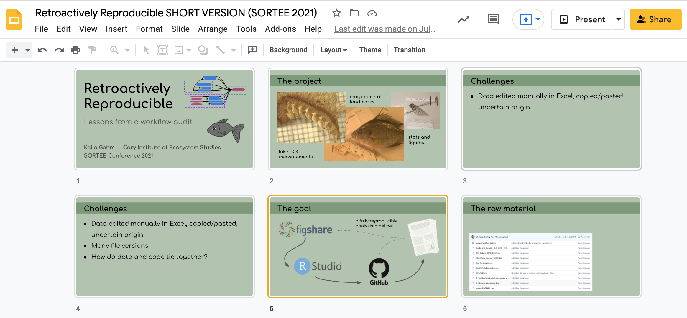
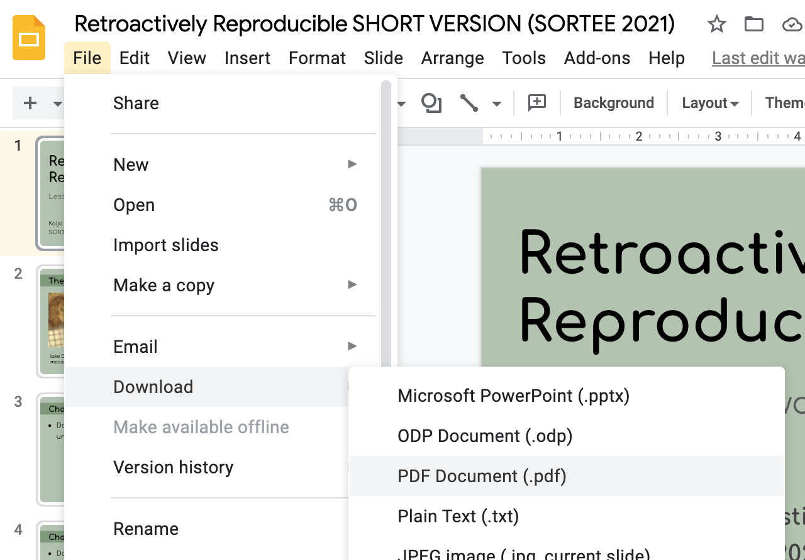
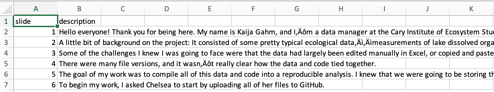
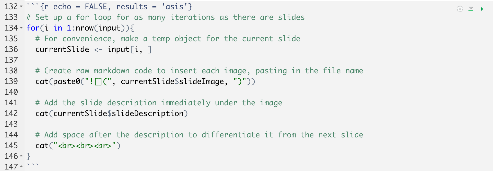

```{r setup, include=FALSE}
knitr::opts_chunk$set(echo = FALSE)
```

## Motivation

In July 2021, I gave a talk at the inaugural [SORTEE](https://sortee.org/) conference, describing my experience auditing colleague's workflow to improve reproducibility. 

Slides from the talk, along with a video recording, are available on the SORTEE [OSF page](https://osf.io/xa4uj/). But in my experience looking for help and ideas on the internet, it's often easier to skim a text-based blog post than to watch an entire video.

It's become very common to post slides after giving a talk, and I think that's fantastic. Here are some examples: 

[Ella Kaye](https://ellakaye.rbind.io/talks.html) | [Maëlle Salmon](https://masalmon.eu/talks/) | [Alison Hill](https://www.apreshill.com/talk/)

The problem is, my slides are often pretty minimal. I try to communicate my points mainly through images and diagrams. If you weren't there for the talk, I don't think you'd get a lot out of looking at my slides by themselves. So when it came time to post my talk and its slides, I wanted some way to convert it into a blog post, without totally reinventing the wheel.


My goal was to present each slide, followed by a block of text, essentially transcribing what I said during the presentation. I thought that would be easy. It turned out to be... not too hard, but a bit tricky.

**Here, I'll outline the process that I used to convert my slides into a blog post.** You can read the final post [here](https://kaijagahm.netlify.app/projects/2021-07-13-retroactivelyreproducible/). I hope you find this helpful. If you've done a similar thing, feel free to comment with any tips and tricks or lessons learned!

## What you'll need

This post refers to the process for converting slides to a scrollable RMarkdown document, like [this](https://kaijagahm.netlify.app/projects/2021-07-13-retroactivelyreproducible/) post. 

You will need two basic components:

### 1. A slide deck

While I dream of one day becoming proficient in [xaringan](https://bookdown.org/yihui/rmarkdown/xaringan.html), for now I make my presentations in Google Slides, which integrates pretty well into my institution's Google-based storage system.

So, after creating my talk, I had a nice slide deck saved as a Google Slides presentation. Yours might be a Powerpoint, a pdf, or some other type of presentation. I won't speak to the particularities of each type of slide deck, but the important thing is that you need to be able to **convert your slides to a pdf document, one slide per page**. If you can do that, this process will work.



### 2. Slide-by-slide transcriptions or captions

To display your slides as a scrollable page, with each slide followed by some text, you'll of course need the text for each slide.

**For this process, I'm assuming that you already know the text you'd like to associate with each slide, up front.**

Why? Well, of course you could insert slides one by one into RMarkdown and then type out the text in the document after each one. But that's laborious and slow, and it kind of defeats the point of automating the process. 

Instead, I'm assuming that you already have the text written. Examples:
- You already had to write down and provide talk **transcripts** for the venue where you presented your talk, and you have them saved somewhere.
- You want to take some time to click through each slide and write about it.
- You've written **presenter notes** in Google Slides/Powerpoint/Keynote/whatever and want to present the notes along with the slides.

## Step by step

Okay, armed with your slides and transcripts or text, let's do this.

### 1. Create an RMarkdown document

If you're publishing your post in Distill, you might want to use [`distill::create_post()`](https://rdrr.io/cran/distill/man/create_post.html).

Otherwise, just create a regular old RMarkdown document.

Make sure to take note of where your RMarkdown document lives. You're going to need to store the materials (slides and captions) in a folder somewhere logical--either in your post folder for Distill, or maybe in a subfolder of your [RStudio Project](https://support.rstudio.com/hc/en-us/articles/200526207-Using-Projects). (Consider [pairing this with the `here` package](https://malco.io/2018/11/05/why-should-i-use-the-here-package-when-i-m-already-using-projects/)--it helps get around the weirdness with working directories in RMarkdown.)

### 2. Convert slides to images

I got stuck when it came to extracting each slide from Google Slides as an image. Unfortunately, there's no good way to download Google Slides as individual images. The thought of taking individual screenshots of slides made me want to abandon the whole project.

Instead, I started by saving the slides to a PDF document. In Google Slides, you can choose **File > Download > PDF Document (.pdf)**



Next, I needed to convert the PDF to a series of images so I could insert them one by one into the RMarkdown document.

I did this using [smallpdf](https://smallpdf.com/pdf-to-jpg) to convert the multi-page PDF to a series of JPG images. (Smallpdf has free features if you create an account or log in using e.g. Google, or there's a free trial for some of their paid features. Converting a pdf to jpg images seems to be a free feature--I had no problem doing it using my Google account.)

The images will be saved by default with file names like `0001.jpg`, in order. Put all of the images into a folder and save it as a subdirectory of your post/project folder, or wherever makes sense in your Project directory. **Make sure they're in their own folder (no other files), and all in the same place**.

### 3. Compile your transcription data

Now, let's get your captions or transcripts in a format that will be easy to use. Eventually, we'll want a CSV or text file with **each slide's caption in its own row**. 

You can create this file however you want. I made a new document in Google Sheets and copied and pasted my slide transcripts into successive rows from the document in which I had written them.

I also added an index column for good measure, to keep track of the slide numbers. I wanted to be able to cross-reference the slide image file names with the captions later on, to make sure I'd assigned the right caption to each slide.

I exported the finished sheet as a csv, so it looked something like this:

```{r}

```

A quick note about **line breaks** and **text formatting**:

Because we're passing in the caption data from an external spreadsheet, there are limitations to how much text formatting we can apply to them. It would be easier to be able to edit each caption in RMarkdown, with all the formatting possibilities that affords, but doing that makes automation impossible. So I kept my formatting pretty simple.

If you do want to add formatting, you can use [html formatting tags](https://www.w3schools.com/html/html_formatting.asp) to make your text bold, italic, etc. or to insert line breaks.

For some reason, `\n` doesn't work to create a line break in the slide captions. But the html tag `<br>` does, so I used `<br>` pretty liberally to break up long, multi-paragraph slide captions. 
### 4. Format input data for the for loop

We're going to be programmatically inserting each slide, with its caption, into the RMarkdown document. I used a for loop to do this. 

You're going to need two inputs for the for loop: a vector of **slide image file paths** and a vector of **slide captions**. I chose to combine the two into a single data frame, although you don't strictly have to do this.

```{r eval = F, echo = T}
# Read in the csv of slide captions
descriptionData <- read.csv("retroactivelyReproducible_slideCaptions.csv")

# Create a vector of slide image names by listing the image file paths
fileNames <- list.files(path ="slideImages", 
                        full.names = T) # full file paths

# Create a data frame combining the file paths and captions
input <- data.frame(slideDescription = descriptionData$description,
                    slideImage = fileNames)
```

### 5. Make the for loop

Next, I used a for loop to combine the data into a dynamically-generated portion of the RMarkdown document. The code I used is adapted from [this StackOverflow post](https://stackoverflow.com/questions/51268623/insert-images-using-knitrinclude-graphics-in-a-for-loop).

```{r eval = F, echo = T}
# Set up a for loop for as many iterations as there are slides
for(i in 1:nrow(input)){
  # For convenience, make a temp object for the current slide
  currentSlide <- input[i, ] 
  
  # Create raw markdown code to insert each image, pasting in the file name
  cat(paste0(""))
  
  # Add the slide description immediately under the image
  cat(currentSlide$slideDescription)
  
  # Add space after the description to differentiate it from the next slide
  cat("<br><br><br>")
}
```

**Note:** For the code chunk containing this for loop, make sure to set the chunk option `results = 'asis'`. It's important to do this because we're dynamically generating a raw markdown string to insert the images, so we need the results to be evaluated as if they had been typed into RMarkdown by hand. If you don't set `results = 'asis'`, then the results will show up as RMarkdown chunk output and none of the formatting will come through.

Also, set `echo = FALSE` so that the code itself doesn't show up.

So, the final code chunk should look something like this:

```{r echo = F}

```

### 6. Knit the document

Be sure to test out this code a few times by knitting the document to make sure it looks good! Adjust the line spacing and other formatting as necessary. I knitted my markdown to html because I was putting it on a Distill site; I'm not sure how well this process would work for a knitted Word or PDF document.

**Note:** Sometimes, the formatting for dynamically-generated markdown like this won't show up correctly in the html preview of your knitted RMarkdown document. Make sure to open the page in a browser window to see how the final product will actually look.

## Adding a video of your talk

I was excited that the above process worked for turning a slide deck into a scrollable blog post. But I also wanted to embed the video recording of my talk in the same post so people could access that medium if they preferred.

A lot has been written about how to embed videos in RMarkdown outputs, but some of the approaches I found didn't work for me. I don't quite understand why code that worked for other people failed for me, but here's what did work:

### Options for video storage

You can either store your video locally and embed it similarly to how you'd embed a photo, like [this](https://stackoverflow.com/questions/43840742/how-to-embed-local-video-in-r-markdown). This works best if the file is pretty small, especially if your RMarkdown (like mine) is backed up to a GitHub repository.

My video was over 100MB, so GitHub wasn't an easy option. I started looking into alternatives.

The easiest thing turned out to be to upload the video to YouTube and leave it as "unlisted" (publicly accessible, but not findable in a search--you can only see it if you have access to the direct video link).

This approach does require that you have a YouTube account, but you can sign up for free through Google. I think YouTube also has some restrictions for how long/how big your videos can be, and what formats are acceptable. Mine was 10 minutes and didn't need to be high definition, and it was saved as .mp4, so this worked well for me.

Instructions on how to upload a video to YouTube [here](https://www.wix.com/blog/2019/02/how-to-upload-video-youtube-guide/).

Next, find the video's embed link ([instructions](https://support.google.com/youtube/answer/171780?hl=en)). Copy that link to your clipboard; you'll use it in the next code chunk.

### Embed the video

I embedded the video as an iframe in html. The code looked like this, and it can just go in the main body of your RMarkdown document (doesn't have to be in a code chunk):

```
<iframe width="560" height="450" src="https://www.youtube.com/embed/cJq2kp114Mg" 
title="Your Title Here" frameborder="0" allow="accelerometer; 
autoplay; clipboard-write; encrypted-media; gyroscope; 
picture-in-picture" allowfullscreen></iframe>
```

Substitute your own video link for the one above, of course. 

Tweak the dimensions of your video until it looks right. 560 by 450 isn't anything special, it's just what ended up looking decent for my video.

There you have it! Again, [here](https://kaijagahm.netlify.app/projects/2021-07-13-retroactivelyreproducible/) is the post as it appears in its final form. 

The full code I used to create the post is on my [GitHub](https://github.com/kaijagahm/kaija_bean/blob/main/_projects/2021-07-13-retroactivelyReproducible/retroactivelyReproducible.Rmd).

**Thanks for reading!**