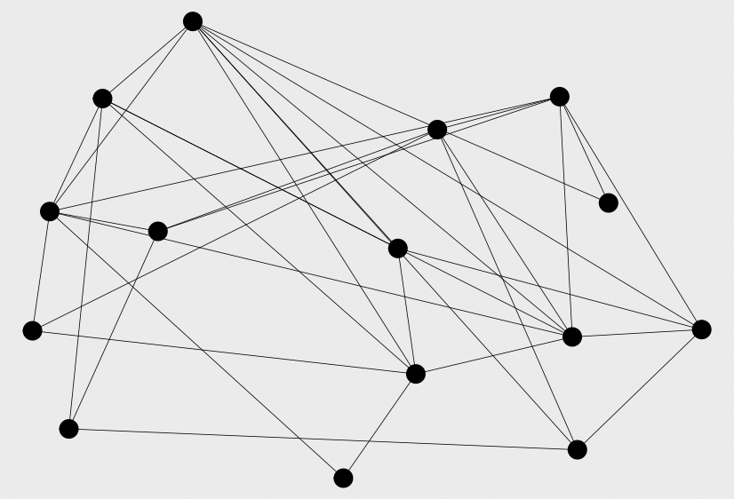
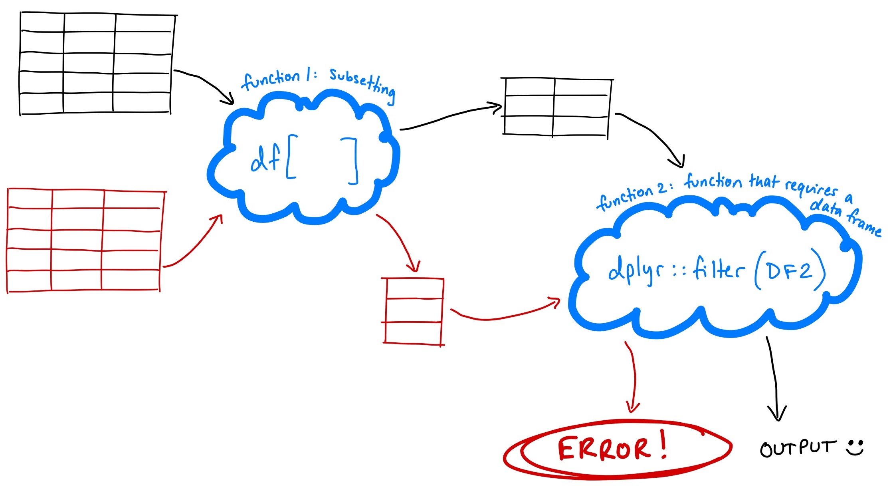

```{r setup, include=FALSE}
knitr::opts_chunk$set(echo = TRUE)
```

```{r, echo = F, fig.cap = "Turns out that when you're making networks, sometimes base R is the way to go."}

```

### Background

I'm a big tidyverse fan. The tidy approach fits well with how I think about things, and I find it more readable than base R. I learned base first, but because I don't use it all the time, there are a lot of tricks that I never really got under my belt.

But recently, I've been working on modeling some social networks, and most of my model code is written in base R. In part, this is because I've been drawing inspiration from some of [Damien Farine's code](https://onlinelibrary.wiley.com/doi/abs/10.1111/1365-2656.13140), which happens to be written mostly in base.

(*Side note: There are many great packages for working with networks, and `tidygraph` gives a tidyverse framework for network analysis. I love tidygraph! But this particular piece of code that I'm writing is happier in base R.*)

Through reading this code, I've picked up a couple useful tricks for working with matrices and data frames. They're basic, in the sense that they involve functions I use all the time. But sometimes even the most common functions have cool extra arguments that are worth highlighting.

I'm going to talk about three tricks here:

**1. `drop = FALSE` (in square-bracket data frame indexing)**

**2. `arr.ind = TRUE` (when using `which()` on a matrix/array)**

**3. Indexing a matrix using a matrix/data frame containing coordinate pairs**

#### 1. `drop = FALSE`

##### Context

So, even the most ardently pro-tidyverse among us are probably familiar with square-bracket indexing for data frames. Let's use the `mtcars` dataset as an example.

```{r}
head(mtcars)
```

We can use square brackets to index `mtcars`, subsetting particular rows and columns. For example, let's say I wanted to get the third row, and columns 1 through 4.

```{r}
subset <- mtcars[3, 1:4]
subset
```
When we subset a data frame, we get another data frame.

```{r}
class(mtcars)
class(subset)
```

But if you think back to your first ever R lesson, you might remember that data frames are made up of vectors. Specifically, each *column* of a data frame is a vector.

So, what happens when the subsetting that we're doing returns only a single column of the data frame?

```{r}
justOneColumn <- mtcars[,1]

class(mtcars)
class(justOneColumn)
```

##### Problem

When we pull out just a single column of the data frame, the resulting subset isn't a data frame anymore. It's a vector--in this case, a numeric vector.

Okay, but why should we care? Being able to pull out a vector is really useful... most of the time. It starts to be a problem if you're writing a function, or a script that will be used over and over on different inputs. If part of your function subsets a data frame and passes that subset into another function, that second function might *require* its input to be a data frame (as opposed to a vector).

```{r, echo = F, fig.cap = "The second function fails when it doesn't get the right input type"}

```

One way to tackle a problem like this is to incorporate robust unit checks into your functions (I recommend the package [`checkmate`](https://mllg.github.io/checkmate/) for this--it's very easy to use!) You can make sure the downstream function fails if its input isn't a data frame.

##### Solution

But you can prevent this problem before it occurs by incorporating the `drop = FALSE` argument into your subsetting. 

When you use square brackets to subset an array (or data frame, or matrix), the default is `drop = TRUE`. This means that if your subsetting results in an array that can be represented with fewer dimensions than the original, any extra dimensions will be dropped.

# XXX need to re-write this, using a matrix, not a data frame. Data frame is a special case of a matrix, because when you subset just one ROW of a data frame, you don't get a vector. You only get a vector if you subset one COLUMN. For a matrix, taking either dimension will give a vector.

