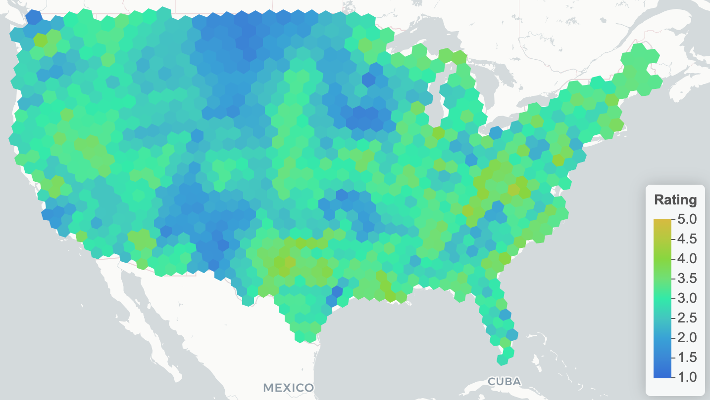
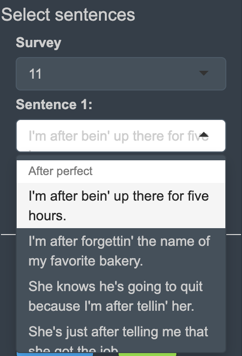

<!--  -->

### Studying language across the US
The Yale Grammatical Diversity Project (YGDP) has been collecting survey data about syntax diversity in U.S. English for over five years.

You can read about the YGDP's work [here](https://ygdp.yale.edu), but in a nutshell:

- We put out surveys online to learn about people's dialects across the United States

- We ask survey participants to judge whether test sentences, such as "Here's you a piece of pizza", seem acceptable **in casual conversation**. 

- We're not interested in "proper" or "correct" English--we want to know how people actually talk in real life across the country.

- (If you want to learn about the survey and data analysis methods in great detail, check out the `r xfun::embed_file(text = "comprehensive mapbook", 'woodEtAl_20_Mapbook-of-Sy.pdf')` that we published earlier this year.)

In the past, there has been a lot of research into regional language diversity, but a lot of it has focused on **lexical** (words, vocabulary) diversity. A great example of that is the [New York Times dialect quiz](https://www.nytimes.com/interactive/2014/upshot/dialect-quiz-map.html), which asks questions like "What do you call it when rain falls while the sun is shining?", with answers ranging from "sunshower" to "the wolf is giving birth".

The YGDP focuses more on **syntactic** ("grammatical"; related to *syntax*) diversity. So, they want to know how people *put sentences together*, not necessarily which words they use.

The [Scots Syntax Atlas](https://scotssyntaxatlas.ac.uk/) has done some great work along these lines in Scotland. The YGDP's methods are a little different, but they're asking the same types of questions about grammatical variation.

I'm actually not a linguist, so I'm not going to explain the research in detail. To learn more about the YGDP's research, you can check out [their website](https://ygdp.yale.edu/). Head over to the grammatical [phenomena](https://ygdp.yale.edu/phenomena-by-category) pages to learn more about constructions like "All the further", "Done my homework", and "Come with".

### Data work
In 2019, I started working with the YGDP to pull together and organize their survey data. One of our primary goals was to make our findings easily accessible and explorable for anyone who might be interested.

I had heard about R Shiny, but I had never created a Shiny app. In the spring of 2020, I talked to Jim Wood, one of the YGDP's supervisors, about the possibility of developing a Shiny app to display the YGDP's findings in a colorful, interactive way. Jim was excited about the idea, even though I had been very clear that I'd be starting absolutely from scratch and learning Shiny along the way.

From June through December 2020, I dove in headfirst. I created a couple simple Shiny apps as practice, but then I set about developing a pretty complicated Shiny dashboard. I've always found that the best way to learn a new tool is to plunge in and use it, learning as you go. Learning Shiny was the ultimate baptism by fire. I think I started trying to create hierarchical `selectInput`s by about day 2, when I was still far from understanding the fundamentals of Shiny's inputs and outputs. Next came the dashboard layout, which I achieved using `shinydashboard` and eventually `shinydashboardPlus`. I learned to insert a map using `leaflet`, another package I had never dabbled in.

<!-- {#hierarchicalSelect .class height=50% width=50%} -->

<!--  -->

The dashboard is still evolving, but here is the current version. I'm immensely proud of how far I've come with Shiny, and I'm really excited about how this dashboard will allow the YGDP, and the general public, to explore the linguistic survey data in great detail.

<iframe src="https://kaijagahm.shinyapps.io/ygdpDashboard/" class="l-screen-inset shaded" height="650px" border="none"></iframe>

If you have questions about this work, please feel free to get in touch. If you want to suggest an improvement or change to the dashboard, or to report a bug or file a pull request, head over to the [github page](https://github.com/kaijagahm/ygdpDashboard) for the project. I'll be leaving the project shortly, so I'm not sure how actively the dashboard will be maintained, but suggestions are certainly welcome.
