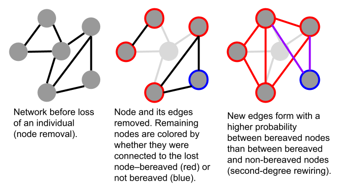

```{r setup, include=FALSE}
knitr::opts_chunk$set(echo = TRUE)
```

Packages needed for this code:

```{r include = TRUE}
library(tidyverse) # for data wrangling
library(vultureUtils) # https://github.com/kaijagahm/vultureUtils (custom funs for vulture data)
library(downloadthis) # for the download link to the poster pdf
library(ggraph) # for making networks
library(fitdistrplus) # for fitting beta distributions
library(igraph) # for network calculations
```

## Introduction and Links

This is an overview of my modeling process so far for the vulture multiple mortality project. If you want to see the poster, download it here:

```{css echo = FALSE, big-download-button}
.button_large {
  font-size: 24px;
}

img {
    max-width: 100%;
    max-height: 100%;
}
```

```{r echo = FALSE, download-poster}
download_file(
  path = "ABS2022Poster.pdf",
  output_name = "Gahm_Poster_ABS2022.pdf",
  button_label = "Download the poster",
  button_type = "danger",
  has_icon = TRUE,
  icon = "fa fa-save",
  self_contained = FALSE,
  class = "button_large"
)
```

The code for the project so far can be found on [GitHub](https://github.com/kaijagahm/toyModel).

Please feel free to contact me by email, on Twitter, etc. if you have any questions or suggestions! Contact links are on the home page of this site.

*To learn more about the griffon vulture system (and specifically, about the differences between behavioral situations like roosting, feeding, and flying), check out Nitika Sharma's talk on Wednesday, July 20th: "Social situations differ in their contribution to population-level social structure in griffon vultures," at 4:30 pm in Gondola ("Every cloud has a silver lining: Applied Behavior and Conservation").*

## Research Questions

*How long does it take for a social network to recover its structure after the loss of several connected individuals?*

*How does recovery differ between social situations?*

## Background

Eurasian griffon vultures (*Gyps fulvus*) are obligate scavengers [@ruxton2004] and social foragers [@harel2017].

Poisoned carcasses can kill many vultures quickly as they assemble to eat in groups. Poisoning is a major threat to griffon vultures. It is the leading cause of death in the griffon vulture population in Israel [@anglister2022], and also threatens vulture species across the world [@ives2022a].


Social network analysis of GPS-tagged griffon vultures in Israel lets us study their population social structure. Past work by Nitika Sharma and Noa Pinter-Wollman shows that social networks differ between situations (co-flight, co-feeding, and co-roosting) [@sharma2022b].

[![From : Social networks across multiple situations. A hypothetical example of social interactions among vultures in different social situations: co-flying in blue, nocturnal ground interactions, (i.e., co-roosting) in green, and diurnal ground interactions (e.g., co-feeding) in yellow. Solid lines within each social situation indicate interactions within the social situation and black-dotted lines between social situations connect occurrences of the same individual. Dashed orange lines connect individuals to food sites to show how spatial proximity can be used to infer social interactions, for example when co-feeding. An aggregate network at the top, in gray, combines all interactions from the different social situations.](figs/networkDiagram.png)](https://www.authorea.com/doi/full/10.22541/au.165107196.66953827/v1)

## Data: A Vulture Co-Feeding Network

The data that I'm basing this model on comes from a GPS-tagged population of griffon vultures in Israel. The species is locally critically endangered [@efrat2020a] and is managed by the Israel Nature and Parks Authority (INPA), which runs supplemental feeding stations throughout the country [@spiegel2013]. Israel's griffon vultures live mainly in the Negev and Judean deserts in the south. There is a small population in northeastern Israel and a declining population in the northwest. For this analysis, I restricted the data to the southern population, which is relatively well-mixed and somewhat separated from the northern populations.

As part of a collaborative NSF-BSF project between Orr Spiegel and Noa Pinter-Wollman, nearly 100 vultures have been fitted with GPS transmitters over the past two years. These tags provide location information at 10-minute intervals, with data automatically transmitted to and stored on Movebank. As of 2022, approximately 70% of the griffon population in Israel is tagged. This high coverage of the population means that the majority of a tagged individual's social interactions are with other tagged individuals, allowing us to study social interactions with greater certainty than is possible in many studies of free-ranging animals.

### Preliminary Data Filtering

In addition to restricting the data to only the southern population, I did the following:

-   *Geography* \| I used a rough geographic mask to include only individuals that spent at least 30% of their GPS-tracked days in Israel, and then to include only locations inside of Israel.

-   *Behavioral* *Situation* \| I included only diurnal ground interactions. To do this, I restricted the data to GPS points taken when the bird was moving at a speed of *\< 5 m/s* (a proxy for walking/hopping/standing, versus flying). Because vultures mostly land during the day when they are feeding, I refer to the network created from this data, loosely, as a "co-feeding network." A more accurate term would be an "network of diurnal ground interactions".

### Selecting a Focal Time Period

I wanted to choose a time period to study during which as many tagged individuals as possible were present for the duration of the period. I started by exploring my data.

```{r code_folding = TRUE}
# Load data, previously downloaded from Movebank and filtered as described above.
load("data/southernEdges_20200101_20220430.Rda")
load("data/southernPoints_20200101_20220430.Rda")

## Create a time series graph to see which individuals are present at which times.
timeseries <- southernPoints_20200101_20220430 %>%
  sf::st_drop_geometry() %>%
  dplyr::select(trackId, dateOnly) %>%
  dplyr::distinct()

# I want to order the individual vultures in the plot by number of data points we have for them.
order <- timeseries %>%
  group_by(trackId) %>%
  summarize(n = n()) %>%
  arrange(n) %>%
  pull(trackId)

# Make a plot:
timeseries %>%
  mutate(trackId = factor(trackId, levels = order)) %>% # apply the ordering
  ggplot(aes(x = dateOnly, y = trackId))+
  geom_point(size = 0.5)+
  theme_minimal()+
  ylab("Vulture")+
  xlab("Date")+
  theme(axis.text.y = element_text(size = 4)) # teeny tiny vulture IDs because I just want to get the overall picture for now.
```

Ok, based on this, it looks like we want to restrict the dates to the window between 2020-10-01 and 2021-09-01.

```{r code_folding = TRUE}
# See what it looks like if we restrict the dates to 2020-10-01 through 2021-09-01
startDate <- "2020-10-01"
endDate <- "2021-09-01"
timeseries %>%
  filter(dateOnly > lubridate::ymd(startDate) & dateOnly < lubridate::ymd(endDate)) %>%
  mutate(trackId = factor(trackId, levels = order)) %>%
  ggplot(aes(x = dateOnly, y = trackId))+
  geom_point(size = 0.5)+
  theme_minimal()+
  ylab("Vulture")+
  xlab("Date")+
  theme(axis.text.y = element_text(size = 7))
```

Finally, I excluded a few individuals that were observed only at one end of this range. I included only individuals observed both before and after 2021-02-01 in the final data set.

```{r code_folding = TRUE}
# Exclude a few individuals that were observed only at one end of this range, arbitrarily using February 2021 as the cutoff point
toKeep <- timeseries %>%
  group_by(trackId) %>%
  summarize(min = min(dateOnly),
            max = max(dateOnly)) %>%
  filter(min < lubridate::ymd("2021-02-01") & max > lubridate::ymd("2021-02-01")) %>%
  pull(trackId)

# Get usable edges, removing the individuals that don't fall within those constraints, and removing bad dates.
toUse <- southernEdges_20200101_20220430 %>%
  filter(ID1 %in% toKeep | ID2 %in% toKeep,
         minTimestamp > lubridate::ymd(startDate),
         maxTimestamp < lubridate::ymd(endDate))
save(toUse, file = "data/toUse.Rda")
```

After doing a sensitivity analysis on this data to explore different time windows, I opted to create networks aggregated over spans of 5 days. I wanted to capture as much detail as possible in the networks while accounting for the fact that vultures don't feed every day, so networks created for each day ended up being extremely sparse, sometimes including only one or two birds per network.

Here is an animation showing the 5-day networks, during the period 2020-10-01 - 2021-09-01

```{r, animation.hook="gifski", dev='png', interval = 0.2, code_folding = TRUE}
# Create networks with 5-day increments, using a custom network creation function. The function code is in the vultureUtils package, which you can find at https://github.com/kaijagahm/vultureUtils.
realGraphs <- vultureUtils::makeGraphs(edges = toUse, interval = "5 days", 
                         dateTimeStart = "2020-10-01 00:00:00",
                         dateTimeEnd = "2021-09-01 11:59:00",
                         weighted = FALSE, allVertices = TRUE)$graphs

# Create some random coordinates to use, which will be kept consistent throughout the animation:
coords <- data.frame(name = names(igraph::V(realGraphs[[1]])),
                     x = rnorm(n = length(igraph::V(realGraphs[[1]]))),
                     y = rnorm(n = length(igraph::V(realGraphs[[1]]))))

# Create the animation
for(i in 1:length(realGraphs)){
  p <- tidygraph::as_tbl_graph(realGraphs[[i]], nodes = coords$name) %>%
    ggraph(layout = "manual", x = coords$x, y = coords$y)+
    geom_edge_link()+
    geom_node_point(size = 4, aes(col = name))+
    theme_graph()+
    scale_color_viridis_d()+
    theme(legend.position = "none")+
    ggtitle(paste("5-day co-feeding network starting on", 
                  names(realGraphs)[i]))
  print(p)
}
```

## Modeling Approach

To investigate this question, I am building an *agent-based network model*. In my model, nodes in the network represent vultures, and edges represent their interactions. For now, the network is *unweighted* and *undirected*. Each edge is either present (the two individuals did interact in this time step) or absent (the two individuals did not interact in this time step).

### Baseline Network Dynamics

Before I can use the model to ask questions about what will happen to the vultures' social structure when nodes are removed, I have to build some baseline network dynamics that roughly approximate what happens in the real data.

I decided to use a discrete-time model. In each time step, edges are added or lost depending on their history in the *previous two time steps*.

To do this, I assign each edge a history: either *00* (the edge did not exist in either of the previous two time steps), *11* (the edge existed in both of the previous two time steps), *01* (the edge existed only in the most recent time step), or *10* (the edge existed in the second most recent time step but not in the most recent one).


Next, I used the observed co-feeding network data to compute probability distributions for the four probabilities: `add00` (the probability of adding an edge with history *00)*; `add10` (the probability of adding an edge with history *10*); `lose01` (the probability of losing an edge with history *01*); and `lose11` (the probability of losing an edge with history *11*). For each time step in the observed networks, I determined the history of each edge and its fate.

```{r code_folding =  TRUE}
probs <- vultureUtils::computeProbs(graphList = realGraphs) # again, using a function from vultureUtils to compute these probabilities. See https://github.com/kaijagahm/vultureUtils for the code.

# Remove NA probabilities
probs <- probs %>%
  dplyr::filter(!is.nan(prob),
                !is.na(prob)) %>%
  # To be able to fit beta distributions, we have to move the probabilities slightly away from 0 and 1.
  dplyr::mutate(prob = (prob - min(prob) + 0.001) / (max(prob) - min(prob) + 0.002))

# Fit a beta distribution to each of the four probabilities.
fit_add00 <- fitdist(probs %>% 
                       filter(type == "add00") %>% 
                       pull(prob), 
                     "beta")

fit_add10 <- fitdist(probs %>% 
                       filter(type == "add10") %>% 
                       pull(prob), 
                     "beta")

fit_lose01 <- fitdist(probs %>% 
                        filter(type == "lose01") %>% 
                        pull(prob), 
                      "beta")

fit_lose11 <- fitdist(probs %>% 
                        filter(type == "lose11") %>% 
                        pull(prob), 
                      "beta")

# Plot the density curves with the beta distributions over them
add00Plot <- probs %>%
  filter(type == "add00") %>%
  ggplot(aes(x = prob))+
  geom_histogram(fill = "lightgrey", col = "darkgrey")+
  theme_minimal()+
  ylab("")+
  xlab("")+
  stat_function(fun = function(x) dbeta(x, fit_add00$estimate[1], fit_add00$estimate[2]), 
                color = "blue",
                size = 1)+
  ggtitle("P(add | 00)")

add10Plot <- probs %>%
  filter(type == "add10") %>%
  ggplot(aes(x = prob))+
  geom_histogram(fill = "lightgrey", col = "darkgrey")+
  theme_minimal()+
  ylab("")+
  xlab("")+
  stat_function(fun = function(x) dbeta(x, fit_add10$estimate[1], fit_add10$estimate[2]), 
                color = "blue",
                size = 1)+
 ggtitle("P(add | 10)")

lose11Plot <- probs %>%
  filter(type == "lose11") %>%
  ggplot(aes(x = prob))+
  geom_histogram(fill = "lightgrey", col = "darkgrey")+
  theme_minimal()+
  ylab("")+
  xlab("")+
  stat_function(fun = function(x) dbeta(x, fit_lose11$estimate[1], fit_lose11$estimate[2]), 
                color = "blue",
                size = 1)+
  ggtitle("P(lose | 11)")

lose01Plot <- probs %>%
  filter(type == "lose01") %>%
  ggplot(aes(x = prob))+
  geom_histogram(fill = "lightgrey", col = "darkgrey")+
  theme_minimal()+
  ylab("")+
  xlab("")+
  stat_function(fun = function(x) dbeta(x, fit_lose01$estimate[1], fit_lose01$estimate[2]), 
                color = "blue",
                size = 1)+
  ggtitle("P(lose | 01)")

grid <- cowplot::plot_grid(add00Plot, add10Plot, lose01Plot, lose11Plot, nrow = 1, ncol = 4)
```

```{r include = FALSE, fig.cap = "Probability distributions, from observed feeding network data, for loss/gain of edges given their state 0/1 in the previous two time stamps."}
grid
```

I incorporated these distributions into the baseline model dynamics. So, when an edge has history 00, the probability it will be added is drawn from the beta distribution on the far left. I followed the same process for the other edge histories.

#### Validation

I compared the baseline model dynamics to the observed GPS network data, using the 5-day co-feeding networks between 2020-10-01 and 2021-09-01. To do this, I used the model to generate some baseline networks. Because my observed data included `r length(igraph::V(realGraphs[[1]]))` individuals and `r length(realGraphs)` time steps, I created modeled networks with those numbers of nodes and time steps, respectively.

```{r code_folding = TRUE}
# Load the model function and its supporting functions
source("supportingFunctions.R")
source("modelFunction_rewiring.R")

# Get parameters from the observed networks
nIndivs <- length(igraph::V(realGraphs[[1]]))
nTimesteps <- length(realGraphs)

# Run the model
modelGraphs <- runModel(N = nIndivs, 
                        burn.in = nTimesteps, # same number of time steps as in the real/observed networks
                        doRemoval = FALSE) %>% # just running the baseline dynamics, not doing a removal yet.
  lapply(., function(x){
    # Create igraph objects!
    igraph::graph_from_adjacency_matrix(x, mode = "undirected")
  })
```

```{r include = FALSE}
# Double check that we have the same dimensions throughout
unique(unlist(lapply(modelGraphs, length))) == unique(unlist(lapply(realGraphs, length)))
# Good, both are the same.
```

##### 1) Degree Distributions

In a network, the "degree" of a node is the number of other nodes it is connected to.

```{r code_folding = TRUE}
# Obtain degree information
fn <- function(x){
  igraph::degree(x) %>%
    as.data.frame()
}

# For the observed network:
degrees_real <- lapply(realGraphs, fn) %>% 
  setNames(., NULL) %>%
  data.table::rbindlist(idcol = "timestep") %>% 
  mutate(type = "real")

# For the model network:
degrees_model <- lapply(modelGraphs, fn) %>%
  setNames(., NULL) %>%
  data.table::rbindlist(idcol = "timestep") %>%
  mutate(type = "model")

# Single data frame for plotting:
degrees <- bind_rows(degrees_real, degrees_model) %>%
  rename("degree" = ".")

# Visualize degree distributions
degrees %>%
  mutate(timestep = as.factor(timestep)) %>%
  mutate(type = case_when(type == "model" ~ "Model",
                          type == "real" ~ "Observed")) %>%
  ggplot(aes(x = degree, col = timestep))+
  geom_density()+
  facet_wrap(~type)+
  theme_minimal()+
  theme(legend.position = "none")
```

##### 2) Degree Over Time

How does the network's degree distribution change over the course of the baseline network simulation?

```{r code_folding = TRUE, message = FALSE}
degreePlot <- degrees %>%
  mutate(type = case_when(type == "model" ~ "Model",
                          type == "real" ~ "Observed")) %>%
  ggplot(aes(x = timestep, y = degree))+
  geom_point(alpha = 0.2) +
  geom_smooth()+
  facet_wrap(~type)+
  theme_minimal()+
  theme(legend.position = "none")+
  ylab("Degree")+
  xlab("Timestep")+
  theme(axis.text = element_text(size = 16),
        axis.title = element_text(size = 18, face = "bold"))

degreePlot
```

We seem to have a lot more disconnected individuals (individuals with degree 0) in the observed networks than in the modeled networks.

Removing the individuals with degree 0 gives us a slightly better match:

```{r code_folding = TRUE}
degrees %>%
  mutate(type = case_when(type == "model" ~ "Model",
                          type == "real" ~ "Observed")) %>%
  filter(degree > 0) %>%
  ggplot(aes(x = timestep, y = degree))+
  geom_point(alpha = 0.2) +
  geom_smooth()+
  facet_wrap(~type)+
  theme_minimal()+
  theme(legend.position = "none")
```

...but the distributions still don't look quite the same.

##### 3) Network Animation Comparison

Here is an animation showing the 5-day modeled networks, during the period 2020-10-01 - 2021-09-01

```{r, animation.hook="gifski", dev='png', interval = 0.2, echo = FALSE}
for(i in 1:length(modelGraphs)){
  p <- tidygraph::as_tbl_graph(modelGraphs[[i]], nodes = coords$name) %>%
    ggraph(layout = "manual", x = coords$x, y = coords$y)+
    geom_edge_link()+
    geom_node_point(size = 4, aes(col = coords$name))+
    theme_graph()+
    scale_color_viridis_d()+
    theme(legend.position = "none")
  print(p)
}
```

Compare it to the observed network animation we saw before:

```{r, animation.hook="gifski", dev='png', interval = 0.2, code_folding = TRUE}
# Create networks with 5-day increments, using a custom network creation function. The function code is in the vultureUtils package, which you can find at https://github.com/kaijagahm/vultureUtils.
realGraphs <- vultureUtils::makeGraphs(edges = toUse, interval = "5 days", 
                         dateTimeStart = "2020-10-01 00:00:00",
                         dateTimeEnd = "2021-09-01 11:59:00",
                         weighted = FALSE, allVertices = TRUE)$graphs

# Create some random coordinates to use, which will be kept consistent throughout the animation:
coords <- data.frame(name = names(igraph::V(realGraphs[[1]])),
                     x = rnorm(n = length(igraph::V(realGraphs[[1]]))),
                     y = rnorm(n = length(igraph::V(realGraphs[[1]]))))

# Create the animation
for(i in 1:length(realGraphs)){
  p <- tidygraph::as_tbl_graph(realGraphs[[i]], nodes = coords$name) %>%
    ggraph(layout = "manual", x = coords$x, y = coords$y)+
    geom_edge_link()+
    geom_node_point(size = 4, aes(col = name))+
    theme_graph()+
    scale_color_viridis_d()+
    theme(legend.position = "none")
  print(p)
}
```

We can clearly see that there is a difference between the observed and modeled networks. The modeled networks are much more uniform and denser than the observed networks. This confirms my findings from looking at the degree distributions.

My conclusion from this is that my baseline model doesn't accurately capture some of the fundamental biology that's going on in the vulture system. I suspect that I need to tweak the assumptions of the model a little bit.

However, I decided that the model captures the network dynamics *well enough* for now--I'm going to move forward with modeling node loss and rewiring. Then I can come back and tweak the baseline dynamics later on.

### Node Removal and Rewiring

Losses of individuals from the population are irregular enough that it is not straightforward to figure out how the vulture social structure behaves following a loss. Therefore, for my initial model, I decided to implement a "second-degree rewiring" model [@farine2021]. Under this model, when a node is lost, there is a higher probability of an edge forming between two individuals that were both connected to the lost individual than between two individuals that were not both connected to the lost individual.

To make it easier to talk about this process, I have decided to refer to nodes either as *bereaved* or *non-bereaved*. A *bereaved* node is one that was directly connected to the lost node. A *non-bereaved* node is one that was not directly connected to the lost node.



The idea of second-degree rewiring, by its nature, already takes into account one previous time step. We have to ask whether the nodes were or were not connected to the lost node in the previous time step (bereaved vs. not). We also have to ask whether there is the potential for a new edge to form---i.e. did that edge already exist in the previous time step? When forming new edges, we only need to deal with edges that did not previously exist.

To match the baseline network dynamics, I wanted to incorporate another time step of history: two steps before the focal node is lost. So, for each potential edge, I multiplied its probability of being formed by a constant 1.2 if the edge existed in the previous time step. If it didn't exist in the previous time step, I did not modify the probability. Then I restricted probabilities to the range [0, 1] and used those proabilities to determine whether the edge formed or not.

#### Validation

It is harder to compare network behavior following the loss of a node to the real data, because real instances of loss are often not clear-cut. Loss of a vulture from our dataset can also have many underlying causes.

-   GPS tag fell off or stopped working. I would perceive a loss, but the bird would continue its behavior and interactions unobserved.

-   The individual flew out of the study area, maybe to return later, maybe not. I have so far restricted this analysis to an area that roughly encompasses Israel. It is possible for griffons to make longer forays, though this is not common [@nathan2012].

-   The individual died. This is the case that I'm most interested in studying. But even here, the cause of death could affect post-mortality network dynamics. For example, other vultures might react differently to expected deaths than to sudden ones [@shizuka2020].

As a preliminary investigation, I decided to lump all lost nodes together regardless of the cause, just to *begin* exploring the real dynamics of node loss in this system.

I made a timeline plot of the individuals in the population during the time frame that I was studying, to determine which individuals were lost during that time window.

```{r code_folding = TRUE}
# For each individual, get nEdges and the end date
indivsSummary <- toUse %>%
  mutate(pair = paste(ID1, ID2)) %>%
  pivot_longer(cols = c("ID1", "ID2"), values_to = "trackId") %>% # pivot to long so we can sort by individual, but still only listing the edges in one direction.
  group_by(trackId) %>%
  summarize(nEdges = n(),
            firstDate = min(lubridate::date(minTimestamp), na.rm = FALSE),
            lastDate = max(lubridate::date(maxTimestamp), na.rm = FALSE))

# Plot the durations as segments
timeline <- indivsSummary %>%
  ggplot()+
  geom_segment(aes(x = firstDate, xend = lastDate, y = trackId, yend = trackId))+
  geom_point(aes(x = firstDate, y = trackId), color = "skyblue", size=2 )+
  geom_point(aes(x = lastDate, y = trackId), color = "firebrick", size=2 )+
  theme_minimal()+
  xlab("Date")+
  ylab("Vulture")+
  theme(panel.grid.major.y = element_blank(),
        panel.grid.minor.y = element_blank(),
        axis.title.y = element_text(size = 18, face = "bold"),
        axis.title.x = element_text(size = 18, face = "bold"),
        axis.text.x = element_text(size = 16))

timeline
```

This plot showed me that during the target time period, eight individuals were lost considerably before the end of the time period (not counting T25b, which was not lost long enough before the end of the time period to examine the network dynamics following the loss). Of these eight individuals, I excluded J30w, which was lost mere days after appearing for the first time. This left me with seven individuals whose losses I could examine: T85w, J36w, A09w, A04w, A76w, A13w, and T77w.

For each of these lost individuals, I obtained information about its first and last date present in the dataset. Then I created a subset of the networks, containing only the time steps immediately before and after the loss.

For this examination, I used networks aggregated over 9 day windows instead of 5 day windows. Because the observed networks are incredibly sparse (as I discovered when I compared them to the modeled networks), in most cases the bereaved nodes formed no edges at all in the 5 days following the loss of the focal individual---because most nodes formed no edges at all. I wasn't able to get meaningful comparisons between the edge-formation rates of bereaved and non-bereaved nodes with a 5 day window.

I do recognize that using a 9 day window means that my findings here are not directly applicable to the modeled networks constructed with a 5 day window. But my findings here are no more than suggestive anyway, since I have so few individuals. I am treating this as a purely exploratory phase of examining the data. Once I have modified the base model to more closely approximate the real data, I will look into changing the time windows used.

So, first, I took network subsets immediately before and after the loss of each individual. Then, I used these subsets to compute, for bereaved and non-bereaved individuals, the probability of gaining and losing edges with other bereaved and non-bereaved individuals. I also took into account the history of the edges in the second-to-last time step containing the about-to-be-lost individual, to see whether edge history affected the likelihood of gaining/losing an edge following the loss of a node.

```{r code_folding = TRUE, message = FALSE}
removedIndivs <- indivsSummary %>%
  filter(trackId %in% c("T85w", "J36w", "A09w", "A04w", "A76w", "A13w", "T77w"))

# Get network subsets for each individual: immediately before and after the loss.
ninedays <- vultureUtils::makeGraphs(edges = toUse, interval = "9 days", 
                         dateTimeStart = "2020-10-01 00:00:00",
                         dateTimeEnd = "2021-09-01 11:59:00",
                         weighted = FALSE, allVertices = TRUE)$graphs
ninedays_reduced <- lapply(ninedays, function(x){
  delete.vertices(x, degree(x) < 1)
})
earlyDates <- lubridate::ymd(names(ninedays_reduced)) # looking at reduced networks to only include nodes involved in edges.
networkSubsets <- vector(mode = "list", length = nrow(removedIndivs))
for(i in 1:length(networkSubsets)){
  removed <- removedIndivs$trackId[i]
  
  lastSlice <- lapply(ninedays_reduced, function(x){
    removed %in% names(V(x))
  }) %>%
    unlist() %>%
    which() %>%
    max()
  
  networkSubsets[[i]] <- ninedays[(lastSlice-1):(lastSlice+1)] # subsetting from ninedays, not ninedays_reduced, here, because we want to have all the vertices.
}

# Define a function to examine the networks before and after the loss and compute the proportions of edges formed/lost between individuals, taking into account their history and bereavement status.
examineLoss <- function(dat, removed){
  whichRemoved <- which(names(V(dat[[1]])) == removed)
  
  # Convert networks to adjacency matrices
  adjMatrices <- lapply(dat, function(x){
    igraph::get.adjacency(x) %>%
      as.matrix()
  })
  
  # Get names of bereaved and non-bereaved nodes
  edges <- adjMatrices[[1]][whichRemoved,]
  bereaved <- names(which(edges == 1))
  non.bereaved <- names(which(edges == 0))
  
  # Make an edge list
  el <- expand.grid(names(edges), names(edges)) %>%
    mutate(across(.cols = c(Var1, Var2), as.character)) %>%
    filter(Var1 != removed,
           Var2 != removed) %>%
    mutate(prev = ifelse(get.edge.ids(graph = dat[[1]], vp = c(Var1, Var2), directed = FALSE) > 0, 1, 0),
           cur = ifelse(get.edge.ids(graph = dat[[2]], vp = c(Var1, Var2), directed = FALSE) > 0, 1, 0),
           after = ifelse(get.edge.ids(graph = dat[[3]], vp = c(Var1, Var2), directed = FALSE) > 0, 1, 0),
           category = case_when(Var1 %in% bereaved & Var2 %in% bereaved ~ "bb",
                                (Var1 %in% bereaved & Var2 %in% non.bereaved) | 
                                  (Var2 %in% bereaved & Var1 %in% non.bereaved) ~ "bn",
                                Var1 %in% non.bereaved & Var2 %in% non.bereaved ~ "nn",
                                TRUE ~ NA_character_))
  
  # Are bb edges more likely to form than nb or nn edges?
  pForm <- el %>%
    filter(cur == 0) %>%
    group_by(category) %>%
    summarize(nPotential = n(),
              nFormed = sum(after == 1),
              pForm = nFormed/nPotential)
  
  # Are bb edges less likely to disappear than nb or nn edges?
  pDisappear <- el %>%
    filter(cur == 1) %>%
    group_by(category) %>%
    summarize(n = n(),
              nDisappeared = sum(after == 0),
              pDisappear = nDisappeared/n)
  
  # Are bb edges with a history more likely to form than bb edges without a history?
  pFormHistory <- el %>%
    filter(cur == 0) %>%
    group_by(category, prev) %>%
    summarize(nPotential = n(),
              nFormed = sum(after == 1),
              pForm = nFormed/nPotential)
  
  # Are bb edges with a history less likely to be lost than bb edges without a history?
  pDisappearHistory <- el %>%
    filter(cur == 1) %>%
    group_by(category, prev) %>%
    summarize(nPotential = n(),
              nDisappeared = sum(after == 0),
              pDisappear = nDisappeared/nPotential)
  
  return(list("pForm" = pForm, "pDisappear" = pDisappear, "pFormHistory" = pFormHistory, "pDisappearHistory"= pDisappearHistory, "el" = el))
}

# Apply the function to the network subsets:
lossInfo_ninedays <- map2(.x = networkSubsets, .y = removedIndivs$trackId, .f = function(.x, .y){
  examineLoss(dat = .x, removed = .y)
})
```

I used the information that I collected to answer some questions about how real networks behave when a node is lost.

1. Do vulture social networks exhibit second-degree rewiring? In other words: is an edge between two bereaved individuals (B-B) more likely to form than an edge between two non-bereaved individuals (N-N) or between a bereaved and a non-bereaved individual (B-N / N-B)? (Note: Because these are undirected networks, I am using B-N and N-B interchangeably here).

```{r code_folding = TRUE}
pForms_9 <- lapply(lossInfo_ninedays, function(x) x$pForm) %>%
  setNames(., nm = removedIndivs$trackId) %>%
  data.table::rbindlist(idcol = "lostIndiv")

formBereaved <- pForms_9 %>%
  mutate(category = case_when(category == "bb" ~ "B-B",
                              category == "bn" ~ "B-N",
                              category == "nn" ~ "N-N")) %>%
  mutate(category = factor(category, levels = c("B-B", "B-N", "N-N"))) %>%
  ggplot(aes(x = category, y = pForm, fill = category))+
  geom_boxplot()+
  theme_minimal()+
  scale_fill_manual(values = c("red", "purple", "blue"))+
  ylab("P(add)")+
  xlab("Bereaved")+
  theme(legend.position = "none",
        axis.text = element_text(size = 18),
        axis.title = element_text(size = 20, face = "bold"))
formBereaved
```
Interesting! At least in *these seven cases*, second-degree rewiring does not seem to be occurring. If anything, there might be a *lower* probability of forming a B-B edge than a N-B or N-N edge. Keep in mind, though, that these differences are *not* statistically significant, and they are probably not biological significant either, given the absolutely tiny sample size here. But I am definitely going to explore further!

2. When vultures lose an individual they previously interacted with, do they more strongly maintain their existing ties, especially when those other ties also experienced a loss? In other words, are B-B edges less likely to disappear than N-B or N-N edges?

```{r code_folding = TRUE}
pDisappears_9 <- lapply(lossInfo_ninedays, function(x) x$pDisappear) %>%
  setNames(., nm = removedIndivs$trackId) %>%
  data.table::rbindlist(idcol = "lostIndiv")

pDisappears_9 %>%
  mutate(category = case_when(category == "bb" ~ "B-B",
                              category == "bn" ~ "B-N",
                              category == "nn" ~ "N-N")) %>%
  mutate(category = factor(category, levels = c("B-B", "B-N", "N-N"))) %>%
  ggplot(aes(x = category, y = pDisappear, fill = category))+
  geom_boxplot()+
  theme_minimal()+
  scale_fill_manual(values = c("red", "purple", "blue"))+
  ylab("P(lose)")+
  xlab("Bereaved")+
  theme(legend.position = "none",
        axis.text = element_text(size = 18),
        axis.title = element_text(size = 20, face = "bold"))
```
There seems to be absolutely no difference in the likelihood of losing an edge between B-B, B-N, and N-N edges.

Okay, so second-degree rewiring might not be occurring here! I've incorporated it into my model, but this preliminary examination of my data tells me that before I get too far into modeling the consequences of *multiple-individual* loss in my model, I need to get a better handle on how the loss of a *single* individual affects the rest of the network. This probably means I'll need to examine much more data, over a larger time span, to tease out any patterns.

3. Are vultures more likely to interact with individuals they have previously interacted with? In other words, does history (in the previous time step) make a difference to the likelihood of edges forming?

```{r code_folding = TRUE}
pFormHistories_9 <- lapply(lossInfo_ninedays, function(x) x$pFormHistory) %>%
  setNames(., nm = removedIndivs$trackId) %>%
  data.table::rbindlist(idcol = "lostIndiv")

formHistory <- pFormHistories_9 %>%
  mutate(category = case_when(category == "bb" ~ "B-B",
                              category == "bn" ~ "B-N",
                              category == "nn" ~ "N-N")) %>%
  mutate(category = factor(category, levels = c("B-B", "B-N", "N-N"))) %>%
  ggplot(aes(x = factor(prev), y = pForm))+
  geom_boxplot(aes(fill = factor(prev)))+
  scale_fill_manual(values = c("grey", "white"))+
  facet_wrap(~category)+
  theme_minimal()+
  ylab("P(add)")+
  xlab("Edge history")+
  theme(legend.position = "none",
        axis.text = element_text(size = 18),
        axis.title = element_text(size = 20, face = "bold"),
        strip.text.x = element_text(size = 18))
formHistory
```
Here, the behavior of the network actually does align with my expectations! Edges seem to be more likely to form following a loss if they previously existed before the loss. (Note: this is only focusing on edges that did *not* exist during the lost individual's last present time step. I didn't count edges that were present in all three time steps, since that wouldn't constitute an "addition". In other words, I counted only edges with history *010*).

4. Are vultures' interaction ties more durable the longer they exist? In other words, does history make a difference to the likelihood of edges to disappear?

```{r code_folding = TRUE}
pDisappearHistories_9 <- lapply(lossInfo_ninedays, function(x) x$pDisappearHistory) %>%
  setNames(., nm = removedIndivs$trackId) %>%
  data.table::rbindlist(idcol = "lostIndiv")

pDisappearHistories_9 %>%
  mutate(category = case_when(category == "bb" ~ "B-B",
                              category == "bn" ~ "B-N",
                              category == "nn" ~ "N-N")) %>%
  mutate(category = factor(category, levels = c("B-B", "B-N", "N-N"))) %>%
  ggplot(aes(x = factor(prev), y = pDisappear))+
  geom_boxplot(aes(fill = factor(prev)))+
  scale_fill_manual(values = c("grey", "white"))+
  facet_wrap(~category)+
  theme_minimal()+
  ylab("P(lose)")+
  xlab("Edge history")+
  theme(legend.position = "none",
        axis.text = element_text(size = 18),
        axis.title = element_text(size = 20, face = "bold"),
        strip.text.x = element_text(size = 18))
```

There's no apparent pattern to whether edge history affects the likelihood of an edge disappearing. More investigation is in order here as well, I think.

*Once again, remember that the graphs above are based on a sample size of SEVEN individual losses! They are just suggestions of patterns or lack thereof. I might find totally different patterns when I add more data.*

## Next Steps

So, what's next? The work presented here is preliminary. I have just dipped my toe into creating an agent-based model, which I will hopefully be able to use in the future to test specific hypotheses about how social structure reacts to the loss of one, or many, individuals. But I have a long way to go.

Here are the next things that I'm going to try as I continue to work on this model.

1. Examine all of my GPS data more deeply to suss out how vulture social networks respond to the loss of a single individual. I'd like to re-do the analyses from the previous section, including more than just 7 individuals. This is challenging because I do not have relatively complete network data for all time periods. But I plan to assess a narrower range of measures, focused solely on the target individual and the connections that it makes with other tagged individuals, across the entire time span of my data.

Doing this will, I hope, allow me to draw stronger conclusions about rewiring behavior in the vulture social networks. Then, I will be able to re-work my model to re-wire itself according to how the social networks really operate.

2. Refine the baseline model behavior to better capture real vulture biology. As I demonstrated, my baseline model does a *fairly* good job at capturing the baseline fluctuations in degree distribution over time. But my modeled networks are still denser and more uniform than the observed social networks. I will consider what mechanisms to add to my model to improve its reflection of vulture behavior.

3. Building on (1), expand the model to allow the loss of *more than one* node at a time. This is critically important, since I am interested in how vulture social networks respond to multiple-mortality events. Unfortunately, I do not have enough data on real multiple-mortality events to explore this question empirically. After determining how the network rewires after the loss of a single individual, I will have to figure out how to define rewiring for multiple individuals.

4. Run the model with multiple-node loss. Examine the recovery time and resilience with different numbers of lost nodes, or with different levels of connection between the lost nodes.

5. Compare recovery time/resilience in different behavioral situations (flying, roosting) as well as overall aggregate network. So far, all of the data I have worked with has been co-feeding data (diurnal ground interactions). I am interested in how post-mortality network dynamics differ between social situations, because differentiating between social situations raises the possibility that some situations could be more resilient than others. This in turn has implications for conservation and management of vultures, as well as broader implications for our understanding of the complexities of social behavior.

Thank you for your interest! If you'd like to talk more about this project, feel free to get in touch with me using any of the methods linked on my home page.