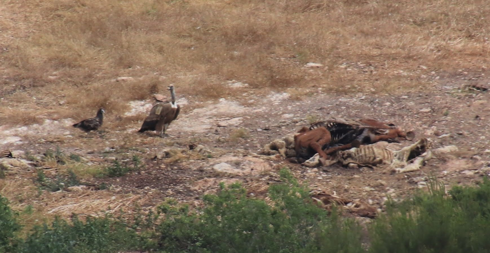

```{r setup, include=FALSE}
knitr::opts_chunk$set(echo = TRUE)
```

Packages needed for this code:

```{r include = TRUE}
library(tidyverse) # for data wrangling
library(vultureUtils) # https://github.com/kaijagahm/vultureUtils (custom funs for vulture data)
library(downloadthis) # for the download link to the poster pdf
library(ggraph) # for making networks
library(fitdistrplus) # for fitting beta distributions
library(igraph) # for network calculations
```

## Introduction and Links

This is an overview of my modeling process so far for the vulture multiple mortality project. If you want to see the poster, download it here:

```{css echo = FALSE, big-download-button}
.button_large {
  font-size: 24px;
}

img {
    max-width: 100%;
    max-height: 100%;
}
```

```{r echo = FALSE, download-poster}
download_file(
  path = "ABS2022Poster.pdf",
  output_name = "Gahm_Poster_ABS2022.pdf",
  button_label = "Download the poster",
  button_type = "danger",
  has_icon = TRUE,
  icon = "fa fa-save",
  self_contained = FALSE,
  class = "button_large"
)
```

The code for the project so far can be found on [GitHub](https://github.com/kaijagahm/toyModel).

Please feel free to contact me by email, on Twitter, etc. if you have any questions or suggestions! Contact links are on the home page of this site.

## Research Questions

**How long does it take for a social network to recover its structure after the loss of several connected individuals?**

**How does recovery differ between social situations?**

## Background

Eurasian griffon vultures (*Gyps fulvus*) are obligate scavengers [@ruxton2004] and social foragers [@harel2017].

Poisoned carcasses can kill many vultures quickly as they assemble to eat in groups. Poisoning is a major threat to griffon vultures. It is the leading cause of death in the griffon vulture population in Israel [@anglister2022], and also threatens vulture species across the world [@ives2022a].



Social network analysis of GPS-tagged griffon vultures in Israel lets us study their population social structure. Past work by Nitika Sharma and Noa Pinter-Wollman shows that social networks differ between situations (co-flight, co-feeding, and co-roosting) [@sharma2022b].

[![From [@sharma2022b]: Social networks across multiple situations. A hypothetical example of social interactions among vultures in different social situations: co-flying in blue, nocturnal ground interactions, (i.e., co-roosting) in green, and diurnal ground interactions (e.g., co-feeding) in yellow. Solid lines within each social situation indicate interactions within the social situation and black-dotted lines between social situations connect occurrences of the same individual. Dashed orange lines connect individuals to food sites to show how spatial proximity can be used to infer social interactions, for example when co-feeding. An aggregate network at the top, in gray, combines all interactions from the different social situations.](figs/networkDiagram.png)](https://www.authorea.com/doi/full/10.22541/au.165107196.66953827/v1)

## Data: A Vulture Co-Feeding Network

The data that I'm basing this model on comes from a GPS-tagged population of griffon vultures in Israel. The species is locally critically endangered [@efrat2020a] and is managed by the Israel Nature and Parks Authority (INPA), which runs supplemental feeding stations throughout the country [@spiegel2013]. Israel's griffon vultures live mainly in the Negev and Judean deserts in the south. There is a small population in northeastern Israel and a declining population in the northwest. For this analysis, I restricted the data to the southern population, which is relatively well-mixed and somewhat separated from the northern populations.

As part of a collaborative NSF-BSF project between Orr Spiegel and Noa Pinter-Wollman, nearly 100 vultures have been fitted with GPS transmitters over the past two years. These tags provide location information at 10-minute intervals, with data automatically transmitted to and stored on Movebank. As of 2022, approximately 70% of the griffon population in Israel is tagged. This high coverage of the population means that the majority of a tagged individual's social interactions are with other tagged individuals, allowing us to study social interactions with greater certainty than is possible in many studies of free-ranging animals.

### Preliminary Data Filtering

In addition to restricting the data to only the southern population, I did the following:

-   **Geography** \| I used a rough geographic mask to include only individuals that spent at least 30% of their GPS-tracked days in Israel, and then to include only locations inside of Israel.

-   **Behavioral** **Situation** \| I included only diurnal ground interactions. To do this, I restricted the data to GPS points taken when the bird was moving at a speed of **\< 5 m/s** (a proxy for walking/hopping/standing, versus flying). Because vultures mostly land during the day when they are feeding, I refer to the network created from this data, loosely, as a "co-feeding network." A more accurate term would be an "network of diurnal ground interactions".

### Selecting a Focal Time Period

I wanted to choose a time period to study during which as many tagged individuals as possible were present for the duration of the period. I started by exploring my data.

```{r code_folding = TRUE}
# Load data, previously downloaded from Movebank and filtered as described above.
load("data/southernEdges_20200101_20220430.Rda")
load("data/southernPoints_20200101_20220430.Rda")

## Create a time series graph to see which individuals are present at which times.
timeseries <- southernPoints_20200101_20220430 %>%
  sf::st_drop_geometry() %>%
  dplyr::select(trackId, dateOnly) %>%
  dplyr::distinct()

# I want to order the individual vultures in the plot by number of data points we have for them.
order <- timeseries %>%
  group_by(trackId) %>%
  summarize(n = n()) %>%
  arrange(n) %>%
  pull(trackId)

# Make a plot:
timeseries %>%
  mutate(trackId = factor(trackId, levels = order)) %>% # apply the ordering
  ggplot(aes(x = dateOnly, y = trackId))+
  geom_point(size = 0.5)+
  theme_minimal()+
  ylab("Vulture")+
  xlab("Date")+
  theme(axis.text.y = element_text(size = 4)) # teeny tiny vulture IDs because I just want to get the overall picture for now.
```

Ok, based on this, it looks like we want to restrict the dates to the window between 2020-10-01 and 2021-09-01.

```{r code_folding = TRUE}
# See what it looks like if we restrict the dates to 2020-10-01 through 2021-09-01
startDate <- "2020-10-01"
endDate <- "2021-09-01"
timeseries %>%
  filter(dateOnly > lubridate::ymd(startDate) & dateOnly < lubridate::ymd(endDate)) %>%
  mutate(trackId = factor(trackId, levels = order)) %>%
  ggplot(aes(x = dateOnly, y = trackId))+
  geom_point(size = 0.5)+
  theme_minimal()+
  ylab("Vulture")+
  xlab("Date")+
  theme(axis.text.y = element_text(size = 7))
```

Finally, I excluded a few individuals that were observed only at one end of this range. I included only individuals observed both before and after 2021-02-01 in the final data set.

```{r code_folding = TRUE}
# Exclude a few individuals that were observed only at one end of this range, arbitrarily using February 2021 as the cutoff point
toKeep <- timeseries %>%
  group_by(trackId) %>%
  summarize(min = min(dateOnly),
            max = max(dateOnly)) %>%
  filter(min < lubridate::ymd("2021-02-01") & max > lubridate::ymd("2021-02-01")) %>%
  pull(trackId)

# Get usable edges, removing the individuals that don't fall within those constraints, and removing bad dates.
toUse <- southernEdges_20200101_20220430 %>%
  filter(ID1 %in% toKeep | ID2 %in% toKeep,
         minTimestamp > lubridate::ymd(startDate),
         maxTimestamp < lubridate::ymd(endDate))
save(toUse, file = "data/toUse.Rda")
```

After doing a sensitivity analysis on this data to explore different time windows, I opted to create networks aggregated over spans of 5 days. I wanted to capture as much detail as possible in the networks while accounting for the fact that vultures don't feed every day, so networks created for each day ended up being extremely sparse, sometimes including only one or two birds per network.

Here is an animation showing the 5-day networks, during the period

```{r, animation.hook="gifski", dev='png', interval = 0.2, code_folding = TRUE}
# Create networks with 5-day increments, using a custom network creation function. The function code is in the vultureUtils package, which you can find at https://github.com/kaijagahm/vultureUtils.
realGraphs <- vultureUtils::makeGraphs(edges = toUse, interval = "5 days", 
                         dateTimeStart = "2020-10-01 00:00:00",
                         dateTimeEnd = "2021-09-01 11:59:00",
                         weighted = FALSE, allVertices = TRUE)$graphs

# Create some random coordinates to use, which will be kept consistent throughout the animation:
coords <- data.frame(name = names(igraph::V(realGraphs[[1]])),
                     x = rnorm(n = length(igraph::V(realGraphs[[1]]))),
                     y = rnorm(n = length(igraph::V(realGraphs[[1]]))))

# Create the animation
for(i in 1:length(realGraphs)){
  p <- tidygraph::as_tbl_graph(realGraphs[[i]], nodes = coords$name) %>%
    ggraph(layout = "manual", x = coords$x, y = coords$y)+
    geom_edge_link()+
    geom_node_point(size = 4, aes(col = name))+
    theme_graph()+
    scale_color_viridis_d()+
    theme(legend.position = "none")+
    ggtitle(paste("5-day co-feeding network starting on", 
                  names(realGraphs)[i]))
  print(p)
}
```

## Modeling Approach

To investigate this question, I am building an **agent-based network model**. In my model, nodes in the network represent vultures, and edges represent their interactions. For now, the network is **unweighted** and **undirected**. Each edge is either present (the two individuals did interact in this time step) or absent (the two individuals did not interact in this time step).

### Baseline Network Dynamics

Before I can use the model to ask questions about what will happen to the vultures' social structure when nodes are removed, I have to build some baseline network dynamics that roughly approximate what happens in the real data.

I decided to use a discrete-time model. In each time step, edges are added or lost depending on their history in the **previous two time steps**.

To do this, I assign each edge a history: either **00** (the edge did not exist in either of the previous two time steps), **11** (the edge existed in both of the previous two time steps), **01** (the edge existed only in the most recent time step), or **10** (the edge existed in the second most recent time step but not in the most recent one).


Next, I used the observed co-feeding network data to compute probability distributions for the four probabilities: `add00` (the probability of adding an edge with history **00)**; `add10` (the probability of adding an edge with history **10**); `lose01` (the probability of losing an edge with history **01**); and `lose11` (the probability of losing an edge with history **11**). For each time step in the observed networks, I determined the history of each edge and its fate.

```{r code_folding =  TRUE}
probs <- vultureUtils::computeProbs(graphList = realGraphs) # again, using a function from vultureUtils to compute these probabilities. See https://github.com/kaijagahm/vultureUtils for the code.

# Remove NA probabilities
probs <- probs %>%
  dplyr::filter(!is.nan(prob),
                !is.na(prob)) %>%
  # To be able to fit beta distributions, we have to move the probabilities slightly away from 0 and 1.
  dplyr::mutate(prob = (prob - min(prob) + 0.001) / (max(prob) - min(prob) + 0.002))

# Fit a beta distribution to each of the four probabilities.
fit_add00 <- fitdist(probs %>% 
                       filter(type == "add00") %>% 
                       pull(prob), 
                     "beta")

fit_add10 <- fitdist(probs %>% 
                       filter(type == "add10") %>% 
                       pull(prob), 
                     "beta")

fit_lose01 <- fitdist(probs %>% 
                        filter(type == "lose01") %>% 
                        pull(prob), 
                      "beta")

fit_lose11 <- fitdist(probs %>% 
                        filter(type == "lose11") %>% 
                        pull(prob), 
                      "beta")

# Plot the density curves with the beta distributions over them
add00Plot <- probs %>%
  filter(type == "add00") %>%
  ggplot(aes(x = prob))+
  geom_histogram(fill = "lightgrey", col = "darkgrey")+
  theme_minimal()+
  ylab("")+
  xlab("")+
  stat_function(fun = function(x) dbeta(x, fit_add00$estimate[1], fit_add00$estimate[2]), 
                color = "blue",
                size = 1)+
  ggtitle("P(add | 00)")

add10Plot <- probs %>%
  filter(type == "add10") %>%
  ggplot(aes(x = prob))+
  geom_histogram(fill = "lightgrey", col = "darkgrey")+
  theme_minimal()+
  ylab("")+
  xlab("")+
  stat_function(fun = function(x) dbeta(x, fit_add10$estimate[1], fit_add10$estimate[2]), 
                color = "blue",
                size = 1)+
 ggtitle("P(add | 10)")

lose11Plot <- probs %>%
  filter(type == "lose11") %>%
  ggplot(aes(x = prob))+
  geom_histogram(fill = "lightgrey", col = "darkgrey")+
  theme_minimal()+
  ylab("")+
  xlab("")+
  stat_function(fun = function(x) dbeta(x, fit_lose11$estimate[1], fit_lose11$estimate[2]), 
                color = "blue",
                size = 1)+
  ggtitle("P(lose | 11)")

lose01Plot <- probs %>%
  filter(type == "lose01") %>%
  ggplot(aes(x = prob))+
  geom_histogram(fill = "lightgrey", col = "darkgrey")+
  theme_minimal()+
  ylab("")+
  xlab("")+
  stat_function(fun = function(x) dbeta(x, fit_lose01$estimate[1], fit_lose01$estimate[2]), 
                color = "blue",
                size = 1)+
  ggtitle("P(lose | 01)")

grid <- cowplot::plot_grid(add00Plot, add10Plot, lose01Plot, lose11Plot, nrow = 1, ncol = 4)
```

```{r include = FALSE, fig.cap = "Probability distributions, from observed feeding network data, for loss/gain of edges given their state 0/1 in the previous two time stamps."}
grid
```

I incorporated these distributions into the baseline model dynamics. So, when an edge has history 00, the probability it will be added is drawn from the beta distribution on the far left. I followed the same process for the other edge histories.

#### Validation

I compared the baseline model dynamics to the observed GPS network data, using the 5-day co-feeding networks between 2020-10-01 and 2021-09-01. To do this, I used the model to generate some baseline networks. Because my observed data included `r length(igraph::V(realGraphs[[1]]))` individuals and `r length(realGraphs)` time steps, I created modeled networks with those numbers of nodes and time steps, respectively.

```{r code_folding = TRUE}
# Load the model function and its supporting functions
source("supportingFunctions.R")
source("modelFunction_rewiring.R")

# Get parameters from the observed networks
nIndivs <- length(igraph::V(realGraphs[[1]]))
nTimesteps <- length(realGraphs)

# Run the model
modelGraphs <- runModel(N = nIndivs, 
                        burn.in = nTimesteps, # same number of time steps as in the real/observed networks
                        doRemoval = FALSE) %>% # just running the baseline dynamics, not doing a removal yet.
  lapply(., function(x){
    # Create igraph objects!
    igraph::graph_from_adjacency_matrix(x, mode = "undirected")
  })
```

```{r include = FALSE}
# Double check that we have the same dimensions throughout
unique(unlist(lapply(modelGraphs, length))) == unique(unlist(lapply(realGraphs, length)))
# Good, both are the same.
```

##### 1) Degree Distributions

In a network, the "degree" of a node is the number of other nodes it is connected to.

```{r code_folding = TRUE}
# Obtain degree information
fn <- function(x){
  igraph::degree(x) %>%
    as.data.frame()
}

# For the observed network:
degrees_real <- lapply(realGraphs, fn) %>% 
  setNames(., NULL) %>%
  data.table::rbindlist(idcol = "timestep") %>% 
  mutate(type = "real")

# For the model network:
degrees_model <- lapply(modelGraphs, fn) %>%
  setNames(., NULL) %>%
  data.table::rbindlist(idcol = "timestep") %>%
  mutate(type = "model")

# Single data frame for plotting:
degrees <- bind_rows(degrees_real, degrees_model) %>%
  rename("degree" = ".")

# Visualize degree distributions
degrees %>%
  mutate(timestep = as.factor(timestep)) %>%
  ggplot(aes(x = degree, col = timestep))+
  geom_density()+
  facet_wrap(~type)+
  theme_minimal()+
  theme(legend.position = "none")
```

##### 2) Degree Over Time

```{r code_folding = TRUE}
degreePlot <- degrees %>%
  ggplot(aes(x = timestep, y = degree))+
  geom_point(alpha = 0.2) +
  geom_smooth()+
  facet_wrap(~type)+
  theme_minimal()+
  theme(legend.position = "none")+
  ylab("Degree")+
  xlab("Timestep")+
  theme(axis.text = element_text(size = 16),
        axis.title = element_text(size = 18, face = "bold"),
        strip.text.x = element_blank())
```

We seem to have a lot more disconnected individuals (individuals with degree 0) in the observed networks than in the modeled networks.

Removing the individuals with degree 0 gives us a slightly better match:

```{r code_folding = TRUE}
degrees %>%
  filter(degree > 0) %>%
  ggplot(aes(x = timestep, y = degree))+
  geom_point(alpha = 0.2) +
  geom_smooth()+
  facet_wrap(~type)+
  theme_minimal()+
  theme(legend.position = "none")
```


### Node Removal and Rewiring

Losses of individuals from the population are irregular enough that it is not straightforward to figure out how the vulture social structure behaves following a loss. Therefore, for my intiial model, I 


