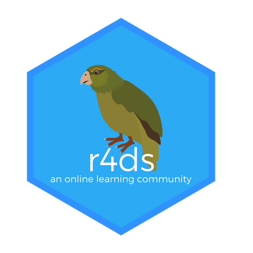
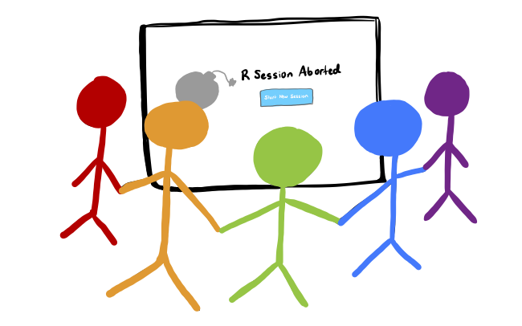
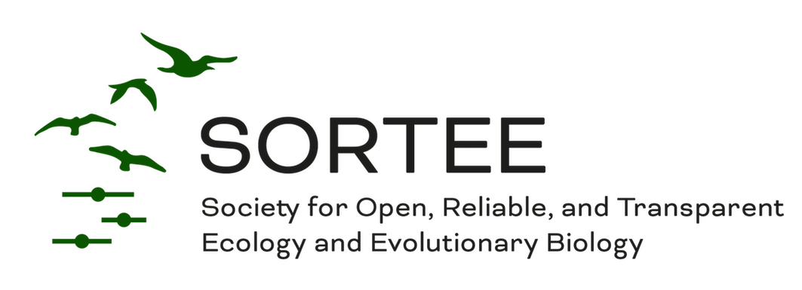

```{r setup, include=FALSE}
knitr::opts_chunk$set(echo = FALSE)
```

I've been "[community taught](https://twitter.com/TheStephLocke/status/1214569802804662274)" in R and coding. My [blog](https://kaijagahm.netlify.app/blog.html) is one attempt to give back by writing resources that others might find useful. But I also contribute to the R, coding, and EEB communities through other channels.

### R4DS Slack Workspace

{width="40%"}

**Mentor** | October 2021 - Present

As a mentor, I hold office hours on Wednesdays from 4pm-5pm PST, where I answer people's questions about R. In my responses, I do my best to foster a welcoming environment, talk people through how to create minimal reproducible examples, and use motivating language. It's important to me to contribute to the welcoming R community that I encountered when I first started learning.

Join the Slack workspace [here](r4ds.io/join).

---

### UCLA EEB Hacky Hours

{width="75%"}

**Organizing Committee** | January 2022 - Present

**Contributor** | September - December 2021

Each week, a group of UCLA grad students, mostly from the EEB department, gathers to discuss coding challenges, provide a supportive workspace, and teach each other new tricks. I'm part of the organizing team at Hacky Hours, so I mentor students who show up to the co-working space and help organize mini-workshops for the participants.

---

### The Carpentries


**Certified Instructor** | June 2021 - Present

I became a certified Carpentries Instructor in summer 2021. I taught a modified Data Carpentry workshop at the [2021 SORTEE conference](https://docs.google.com/spreadsheets/d/1VS14jKmCFJoiHFXMZ74qLA-IvwU_A9rn1SSNVGVkdMk/edit), which focused on using Git/GitHub through RStudio.

Currently, I'm working with some of my UCLA Hacky Hours co-organizers to put together [a Software Carpentry workshop](https://ucla-hacky-hours.github.io/2022-04-09-uclaeeb/) for our department in April.

---

### SORTEE (Society for Open, Reliable, and Transparent Ecology & Evolutionary Biology)



**Board of Directors** | January 2022 - Present

**Membership Committee** | November 2020 - December 2021

On the Board of Directors, I've been involved in getting our membership database up and running, as well as guiding the organization into its second year of existence. On the Membership Committee, I'm in charge of getting to know our current members and recruiting others.

More info about SORTEE [here](https://www.sortee.org/).

---

### RStudio Community


**Contributor** | July 2020 - Present

When I got started with R, I found RStudio Community to be a much more welcoming forum for asking questions than StackOverflow. When I have the time, I contribute to answering questions in RStudio Community, as thanks for all the help I've received there. [Here](https://community.rstudio.com/u/kaijabean/activity) is my activity on the site.
