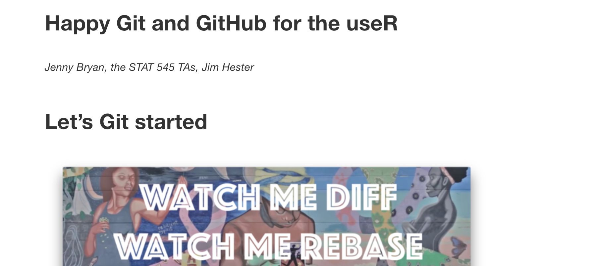
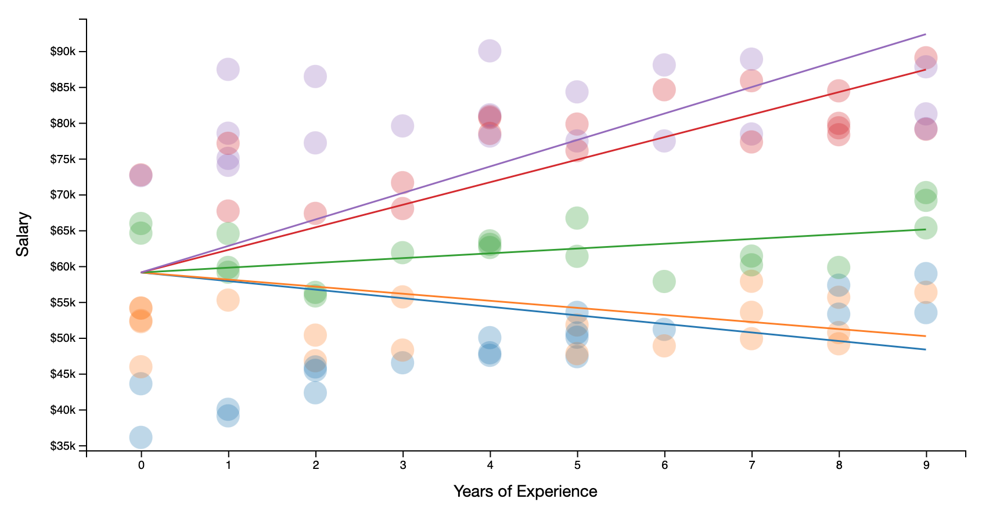
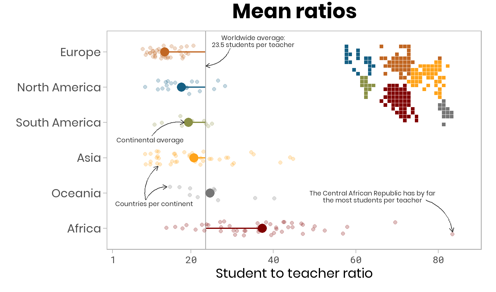
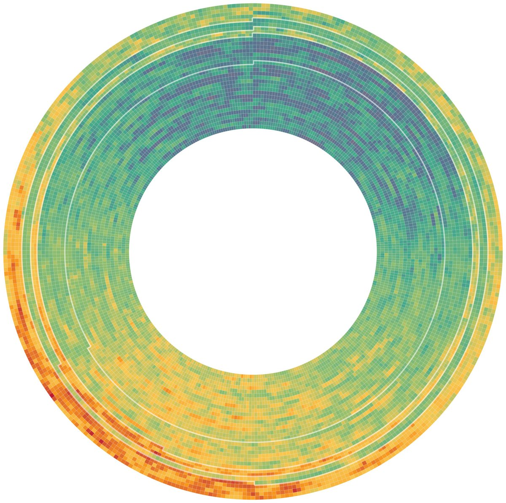
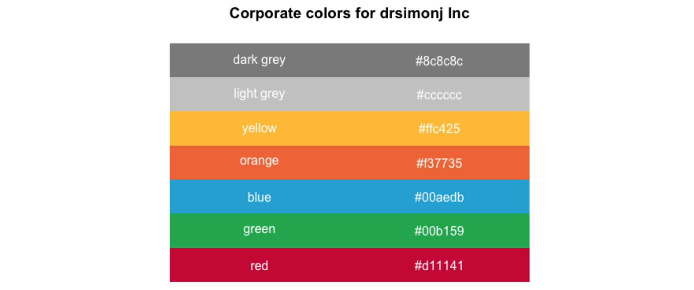
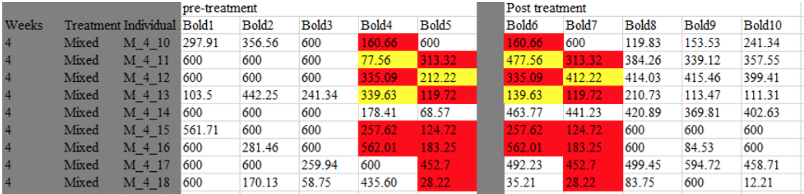
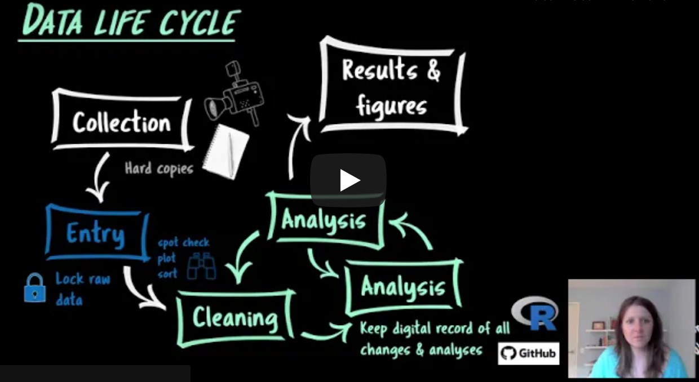
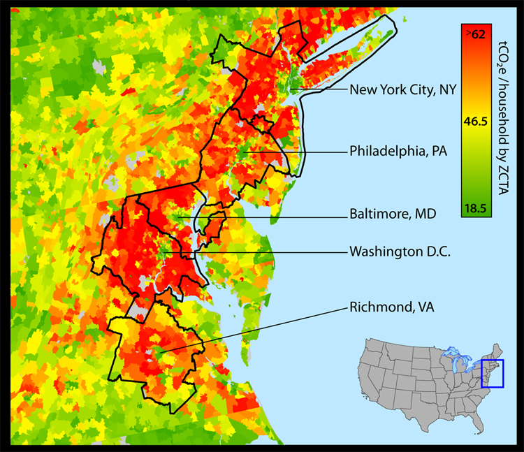
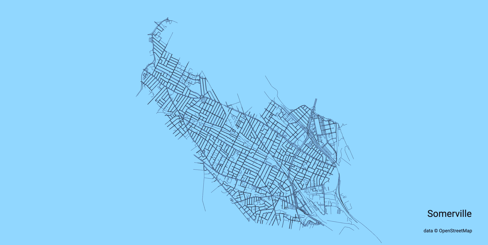

```{r setup, include=FALSE}
knitr::opts_chunk$set(echo = FALSE)
```

This is basically my Twitter bookmarks section in a more permanent and accessible format.

## R and Data Science

{width="75%"}

[RStudio Community](https://community.rstudio.com/) is, on the whole, a much more friendly and helpful place to ask R-related questions than e.g. StackOverflow or some other online forums.

---

{width=85%}

[Happy Git with R](https://happygitwithr.com/) by Jenny Bryan, Jim Hester, and the STAT 545 TA's. This is the authoritative guide to using Git with R, and I think I open it every single time I need to use Git.

---

{width=50%}

[The Distillery](https://jhelvy.github.io/distillery/), a showcase of websites built with Distill (including this one!) Created by John Helveston.

---

{width=75%}

[Guide to `stat_` layers](https://yjunechoe.github.io/posts/2020-09-26-demystifying-stat-layers-ggplot2/) in ggplot by June Choe

---

{width=80%}

[An introduction to hierarchical modeling](http://mfviz.com/hierarchical-models/) (aka mixed models)--scrolling viz by Michael Freeman that does a great job explaining variance partitioning.

---

## Data Visualization

{width=100%}

[A `ggplot2` Tutorial for Beautiful Plotting in R](https://www.cedricscherer.com/2019/08/05/a-ggplot2-tutorial-for-beautiful-plotting-in-r) by Cédric Scherer

---

{width=75%}

[The Evolution of a ggplot](https://www.cedricscherer.com/2019/05/17/the-evolution-of-a-ggplot-ep.-1/#polish), also by Cédric Scherer

---

{width=50%}

[Some very cool weather charts](https://twitter.com/taraskaduk/status/1372611431468826632) by Taras Kaduk

---

{width=75%}

[Creating color palettes](https://drsimonj.svbtle.com/creating-corporate-colour-palettes-for-ggplot2) for ggplot, by Simon Jackson

---

## Reproducibility and Open Science

{width=100%}

Jenny Bryan's legendary article on keeping a [project-oriented workflow](https://www.tidyverse.org/blog/2017/12/workflow-vs-script/): I go back to this all. the. time.

---

{width=75%}

[SORTEE](sortee.org) (Society for open, reliable, and transparent ecology & evolutionary biology) is a new-ish society working on reproducibility/open science in the EEB field.

---

{width=100%}

[What to do when you don't trust your data anymore](https://laskowskilab.faculty.ucdavis.edu/2020/01/29/retractions/) by Kate Laskowski, discussing the Pruitt retraction situation. 

See also [17 Months](http://ecoevoevoeco.blogspot.com/2021/05/17-months.html) by Daniel Bolnick, examining the whole process of auditing the Pruitt papers after the work was finished.

---

{width=75%}

Also by Kate Laskowski: [Keeping a Paper Trail: Data Management Skills for Reproducible Science](https://laskowskilab.faculty.ucdavis.edu/2020/08/03/keeping-a-paper-trail-data-management-skills-for-reproducible-science/)

---

## Miscellaneous Cool Things on the Internet

{width=75%}

[Ask a Manager](https://www.askamanager.org/) is fun reading, and helps me internalize ideas about what a healthy workplace looks like.

---

{width=70%}

[Map of carbon footprint by location](https://twitter.com/zoningwonk/status/1385260880909193218), debunking the idea that living in a rural area is more eco-friendly.

---

{width=85%}

[Interactive city road map-making tool](https://anvaka.github.io/city-roads/) by Andrei Kashcha
