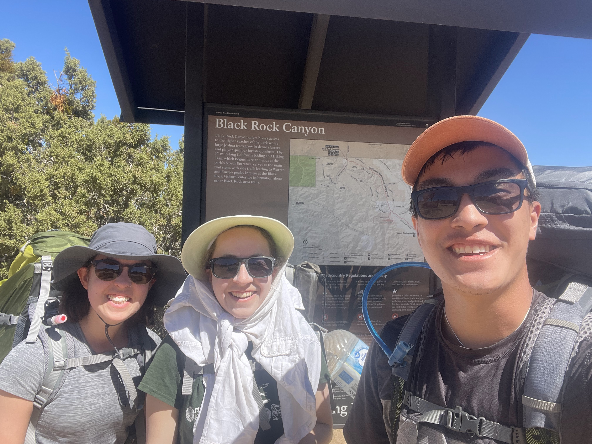
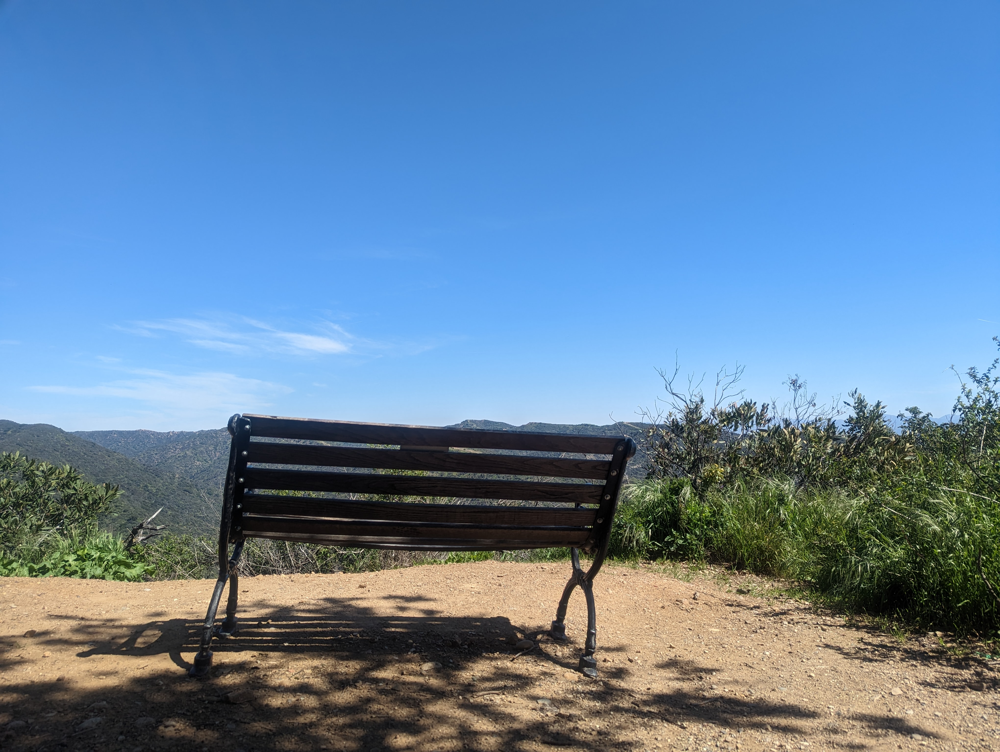
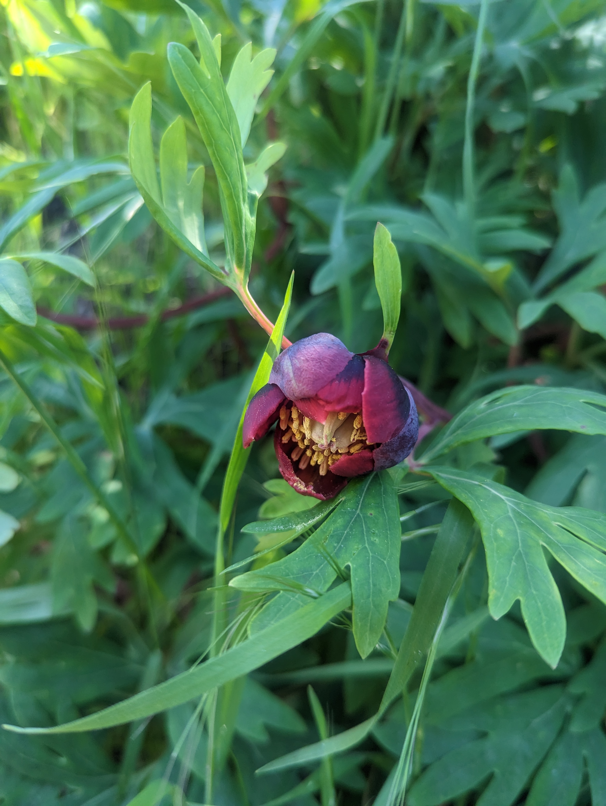
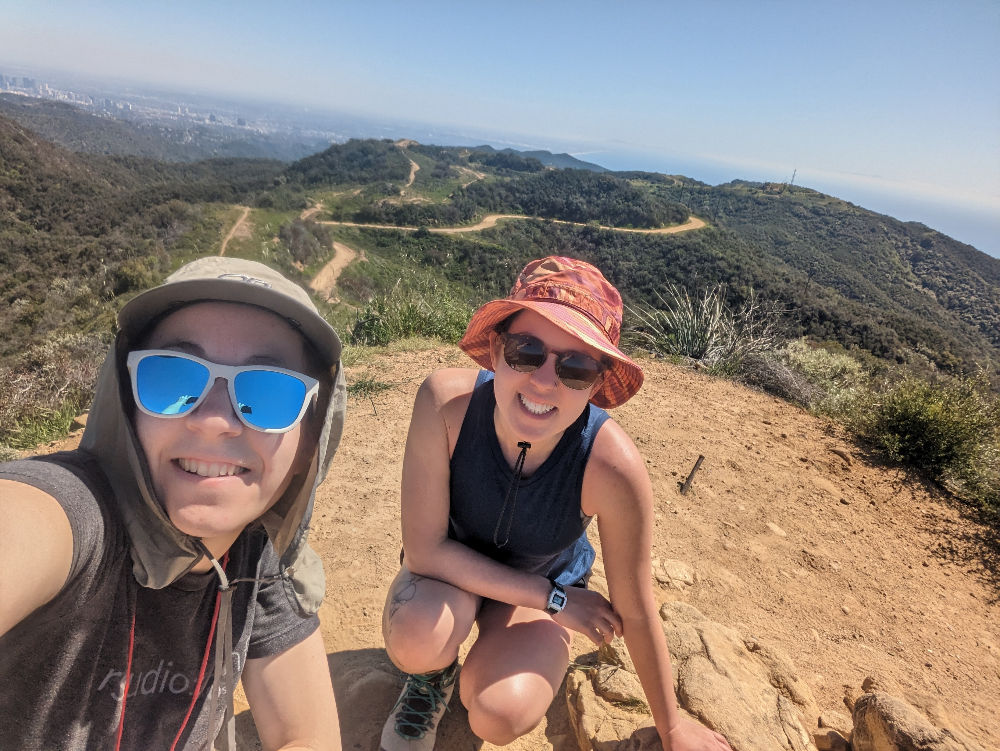
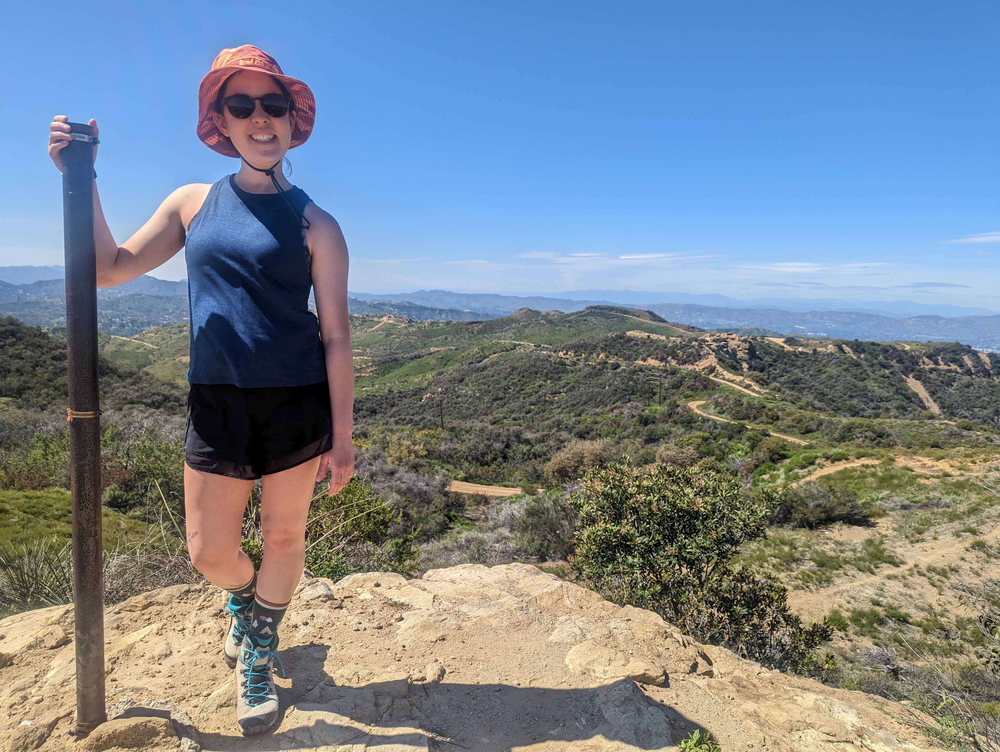
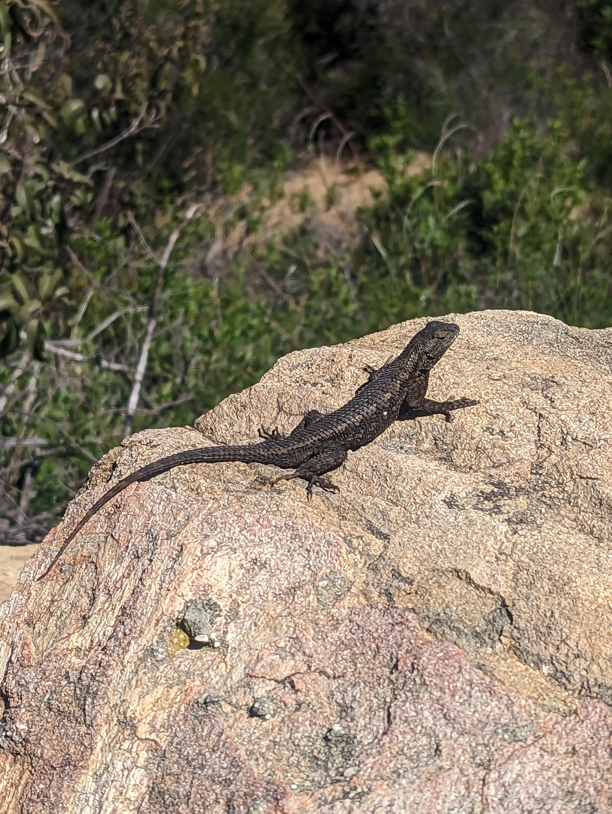
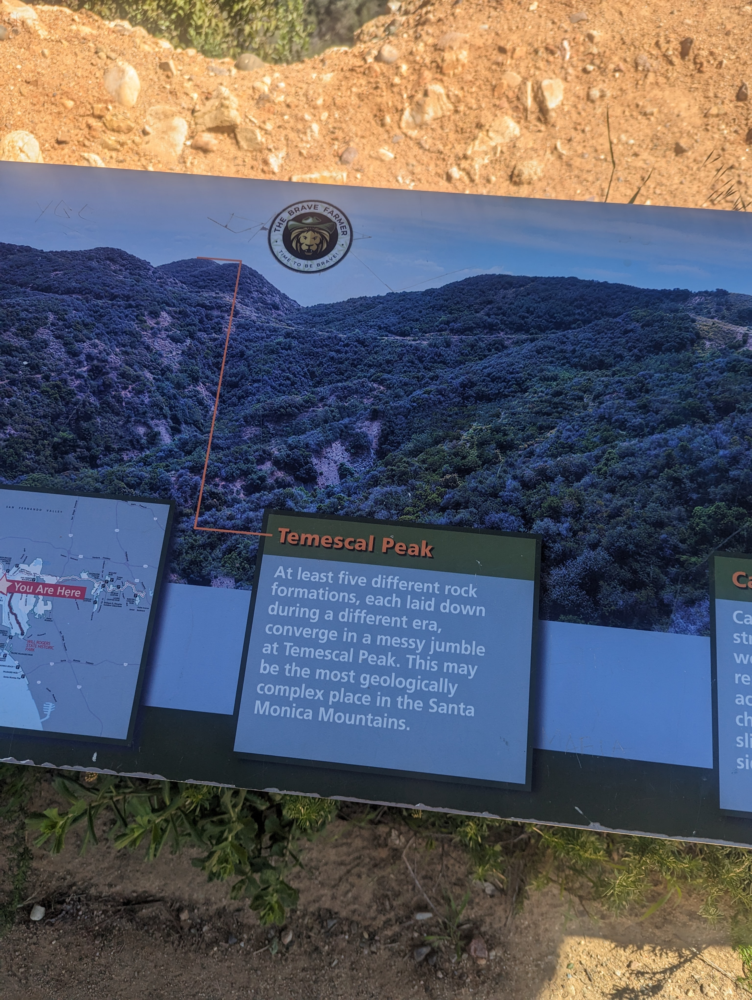

## Introduction

For most of my life, March has been a dreary month. Thoroughly sick of winter, I have waited in frustration through rainstorm after rainstorm for the weather to finally clear enough to make going outside pleasurable again.

In Southern California, it turns out, winter and spring are prime time for hiking and backpacking. There's not much snow or rain, and temperatures are still cool enough in the desert to be comfortable.

Accordingly, I took last year's spring break as an opportunity for a grueling three-day trek in Joshua Tree National Park, with friends Ashley and Brandon. I wish I had written a trip report. To make a long story short: we carried enormous amounts of water 40 miles across the desert in 3 days, doing the western half of the California Riding and Hiking Trail as an out-and-back route. Our longest day was 20 miles, farther than I had ever hiked in a single day, with or without a heavy pack. We weren't at all prepared for how strenuous it would be. Luckily, the weather cooperated perfectly, gracing us with temperatures no lower than 40 (at night) and no higher than 75 (during the day), with lovely breezes. So despite a multitude of blisters and some extremely sore legs, we made it out, treated ourselves to milkshakes, and patted ourselves on the back. Somewhere along the way, we also said things like "Holy shit, we're never doing that again" and "That was too many miles" and "That was unpleasant."



## Trip planning

Tragically, Brandon has since moved across the country to UConn. So as this year's spring break approached, Ashley and I started making plans for another backpacking trip. Less intense, we thought. Maybe somewhere a little farther afield. We had our sights on Zion, Death Valley, the Channel Islands, maybe Big Sur or part of the PCT.

Unfortunately, the winter of 2022-2023 has brought record-breaking storms to Southern CA. All the areas around Big Sur were closed for trail maintenance. Zion, which has borderline weather in March in the best of years, was way too snowy for us to plan a trip with any confidence. Death Valley was a possibility, but we didn't relish the prospect of once again lugging gallons of water across a desert. The Channel Islands were, predictably, totally booked up. One possible PCT section was snowy, and another was both boring (apparently) and lacking in water (see: Death Valley.)

Discouraged, and too busy with the end of the quarter to put a lot of time into trip-planning, we began to wonder if this trip would happen after all.

Two weeks before the break, I told my advisor, Noa, about a [day hike loop](https://www.alltrails.com/trail/us/california/backbone-trail-loop?search=true) that I had done that weekend that included part of the Backbone Trail. It happened that her family had also hiked part of the Backbone on the same day.

"The Backbone Trail comes up a lot," I observed. "It seems to be part of most of the hikes I do from AllTrails. How far does it go?"

I don't know why I hadn't wondered this before.

"All the way through the Santa Monica Mountains," Noa told me.

I said, "I wonder if it can be thru-hiked?"

I've never thru-hiked any trail, nor has the concept particularly appealed to me. I know people who have hiked the Appalachian Trail (2000+ miles) and the Pacific Crest Trail (2600+ miles). But I like showers and real food, and carrying a heavy weight for months on end seems like it would take all the fun out of hiking. And yet. The Backbone Trail is only 67 miles long. Not all that much longer than the 40 miles we had done in Joshua Tree. This seemed... attainable, in the amount of time we had.

I'll say it up front: we did **not** end up thru-hiking the Backbone Trail. Almost immediately after I started researching it, I was discouraged to read that:

> There are only a few campgrounds on and near the Background Trail. We recommend day hiking in section *(sic)* rather than attempting a multi-day backpacking trip. -[National Park Service](https://www.nps.gov/samo/planyourvisit/backbonetrail.htm)

Apparently, the NPS eventually plans to create some backcountry camping sites with permits available. But for now, there are just a few places where you're allowed to camp, one of which is now closed.

I did find a couple people who had completed a Backbone Trail thru-hike. The plan I eventually developed was based heavily on [this trip report](http://www.firstchurchofthemasochist.com/2020/03/thru-hiking-santa-monica-mountains.html), by Matthew Hengst. I also made heavy use of Halle Homel's [article](https://thetrek.co/backbone-trail-a-los-angeles-thru-hike/) on the BBT, as well as her [argument](https://thetrek.co/why-you-should-thru-hike-the-backbone-trail-westbound/) for hiking it from East to West.

(As I'm writing this, I see that Shawnté Salabert has also **just** published [this](https://www.treelinereview.com/where-to-go/santa-monica-mountains-backbone-trail) incredibly impressive account of an Eastbound thru-hike.)

Instead of trying to contend with AirBnB's, illegal backcountry camping, or incredibly long marathon-worthy days, I decided that we'd do just a partial thru-hike: just under 40 miles out of 67. 3 days. I used my new favorite software, CalTopo, to chart out elevation profiles and a route for a three-day itinerary. 10 miles the first day, 15 the second day, 13 the third day. I really wasn't sure we could do it. That middle day, especially, had me worried. 15 miles is a **lot** for us, and the terrain would be significantly more rugged than we had experienced in Joshua Tree. There would be no opportunity to stop early. We'd have to keep going to reach Malibu Creek State Park Campground, 2-3 miles off the trail proper, where we would make a pre-paid (and relatively expensive) campsite reservation.


Ashley (pictured above) is an incredible hiking buddy. The Joshua Tree 40-miler was only her second backpacking trip ever. In the year since, we had done a few miles in Mojave and several solid day hikes, and now she was completely game for another hastily-planned trek of insane proportions. (To be fair, Ashley has also done such unfathomable things as running a marathon in the desert at Burning Man. She's kind of impressive.) Anyway, she was undeterred by the Day 2 forced march. She also reminded me that we'd never be very far from civilization. We could always bail and catch a ride home.

## Gear and packing

So, we decided to do it. First stop: REI. Ashley has a bit of an REI problem, and it's rubbing off on me. Conveniently, though, we each had two member discount coupons to use. She bought socks and a new tent. I bought a cookware set and... also a tent (We don't need to talk about what happened to the last one.)

### Packing list

After much hemming and hawing about the weather, here is the packing list I settled on.

```         
<details>
    <summary>Packing list:</summary>

    <p>Clothes (including what I wore on day 1)

5 pairs underwear (I do not compromise on underwear during backpacking trips, for the sake of my own sanity)

2 sports bras (see above)

3 pairs wool socks

Tank top

T-shirt

Thermal long-sleeved shirt

Lightweight quarter-zip long-sleeved shirt with a high neck, for sun protection

Sun hat with ear and neck flaps

Sunglasses

Hiking pants

Athletic shorts

Cozy warm sweatpants (for pajamas, or extra warmth on the trail)

Rain jacket

Light fleece jacket

Heavier fleece

Puffy jacket

Food

Trader Joe's dried mangoes

Carrots from the farmer's market

2 small cucumbers

2 apples

1 large bag of beef jerky

8 packets of instant oatmeal

6 Clif bars (3 chocolate chip, 3 chocolate mint)

1 cup red lentils, mixed with 1/2 cup alphabet pasta. Also, a small baggie of mixed spices: cumin, coriander, curry powder, garam masala, cayenne pepper, ginger, salt, black pepper, and nutritional yeast.

1 bag Trader Joe's dried peas

Half a gallon of trail mix: raisins, almonds, roasted chickpeas, M&Ms, cereal.

Gear and Other

Compass

Printed topo maps, in a plastic bag

Swiss army knife

Cookware set

Tent, with rain fly

Sleeping pad

Sleeping bag

Bowl and spoon

Small camp towel

WhisperLite stove, fuel bottle, and lighter

Personal toiletries

Poop trowel

First aid kit

Garbage bags (for waterproofing)

Water-resistant stuff sacks (I have two Sea to Summit Ultra-Sil dry bags, 20L and… 2L, I think?)

3 water bottles: 2 1L Nalgenes and 1 1.5L SmartWater bottle.</p>
</details>
```

### Gear reflections

Reflecting on the gear: I was mostly happy. The hat, first aid kit, trowel, rain jacket, and one of the fleeces were new purchases, and they all turned out great. I also recently got a [new sleeping pad](https://klymit.com/products/static-v2-sleeping-pad), after suffering through countless nights on a really uncomfortable foam one that I found in the common room of my freshman year dorm in college. This was its second trip, and I continue to be extremely happy with it.

I definitely packed too much clothing. This is always a tradeoff for me: being able to wear clean(ish) clothes really helps with my psyche, but of course then it's heavy. I should have skipped the tank top and possibly also the shorts. I also could have done with fewer pairs of underwear. I **definitely** could have brought fewer warm layers. The nights weren't as cold as I had feared, so my light fleece and puffy jacket ended up being used mostly as a pillow. But hypothermia is no joke, so I'm glad I played it safe.

The other thing we brought was too much food. Way too much food. Pounds and pounds of extra food. I ended up eating about a tenth of the jerky, and the two of us together barely accomplished half of the trail mix. Ashley carried an entire bag of baby carrots that we never broke into. We would come to regret those carrots.

## Day 1

### Will Rogers

My roommate, Kat, dropped us off at Will Rogers State Park around 9am on Tuesday, March 28th. We filled our water bottles, distributed our gear, and made sure our packs were ready to go. I had been wearing pants but changed into shorts; the sun was warm already. We slathered on some sunscreen. Several people in the parking lot eyed our packs curiously. A convoy of seven or so cyclists rolled past, and one woman swung over to ask us if we were "training." Nope, not training, just having fun. She rode away.

The very first section of the trail was narrow and switchback-y, and overflowing with wildflowers. It was much warmer than I had anticipated. We wound around to the west of Inspiration Point and came to a junction with a map, which I scrutinized. I had brought along my compass, which I'm still learning how to use. The plan, since we'd be near civilization most of the time, was to use the compass first and primarily, and check myself with my phone's GPS when possible. Less than half a mile in, I hadn't expected to already not know exactly where we were, and the compass wasn't coming naturally to me yet. I tried for a few minutes to make sense of the several branching trails in front of us. We couldn't possibly be lost, but I couldn't seem to make the posted map match my topo. Eventually I caved and looked at my phone's GPS. And back at the map. And back at the GPS. The GPS matched where I had thought we must be based on the compass alone, but the "you are here" on the posted map disagreed. I'm still convinced it's wrong. I shrugged and we walked on.

A few severe switchbacks after another tenth of a mile confirmed that my navigation had been right. We stopped at an overlook, where a woman pointed to a bush and told us there were already snakes out, that she had seen one. A little further on, we crossed a bridge over a gorge, stopping to chat with an older couple. They also asked us if we were "training." We were increasingly confused. Training for what? "Well, why do you have these big packs?" Aha. Everyone apparently thought we were day-hiking, with extra weight for the heck of it. We clarified our camping plans. Then we had a good laugh at the idea of carrying all of this out of anything other than immediate necessity.

Another mile of our "training hike" brought us to a juncture of three trails. One shot off to the east, while ours stayed flat and just north of west, and a center option headed up a ridge slightly more northward. I gave Ashley a little compass tutorial. A refresher on how to read contour lines and identify peaks confirmed that the left and center trails would take us to the same juncture, but the one would skirt the edge of a small ridge while the other hit several peaks along the way.

We continued for another mile along the lower trail, winding in and out of the shade. The vegetation was so lush that at times we felt like we were in a jungle, not a desert. We could see the sea. I asked about ticks. Ashley wasn't sure, but we agreed to check at camp that night (We forgot. I recommend taking this more seriously than we did).


At 11:15, we stopped for a snack break at the top of a hill, under a large oak. We munched on carrots and fruit and watched a dense trail of ants make its way up the trunk. There was a bench, but we sat on the ground in the shade instead. I am sure the view was lovely, but I was tired and wanted to keep sitting.

(Actually, I did a pretty bad job of taking pictures on this hike. I was trying to preserve phone charge as much as possible, since we would need to call a ride on Day 3. Next time, I'd bring a more serious battery pack. Documenting more would have been nice, and I'm sure it would have weighed less than the carrots.)




For the next three miles, we climbed a bit and headed mostly due north, along a bit of a ridge. The slope dropped away to our left, and in a few places the trail had partially fallen apart with the recent rains. We could infer the presence of a creek far below. A large alligator lizard stretched itself across the trail at one point, sunning. (Unfortunately, it left before I could get a closer picture).


The trail bent to the west and started winding through some really gorgeous blooming Ceanothus. Unfortunately, this is also when the poison oak started showing up, shiny and pale green in its fresh abundance. We stopped for lunch in a carefully-selected, un-poison-oaky shady spot. I sat on what turned out to be thistles, but luckily they were tender enough that any prickling was minor. We ate cheese quesadillas that Ashley had thrown together that morning. Also trail mix, carrots (mine, not hers, which remained unopened), dates, and a granola bar. At our first snack break (just under 3 miles from the start), we had been a little worried about our pace. But we had made good time to lunch, reaching 5.75 miles around 12:50.





### Temescal Peak

A short while later, we came out on top of a ridge with several trails winding away below us. We could see the city in the distance. (This is the drawback of hiking so near to LA). A peak to our right was probably Temescal Peak, but since we weren't quite sure, we continued on until the trail intersected with a fire road, at which point I knew exactly where we were. We dropped our packs and ran (yes, ran! I felt bouncy and free without the extra load) 0.1 miles back to a spur trail junction we had passed, which we followed up to the top of the peak.

On top of Temescal Peak, around 2pm, we took selfies. We also met a large, dark western fence lizard (*Sceloporus occidentalis*), who did some push-ups and then came boldly over to our rock.







We came down from the peak. It was just after 2pm, and we had already done 7 miles out of our 10 for the day. From 423' elevation at the parking lot, we had reached 2105', or highest point for Day 1. It would be mostly down from here on out.

### Hub Junction

We followed the fire road to an overlook at the Hub Junction, where we each used the pit toilet. We sat a bit under a shade shelter, where we read about the geology of the peak we had just descended.



At the Hub Junction, we also chatted with an older couple day-hiking from Trippett Ranch. They each had hiking poles and cool hip belts to hold water bottles. They confirmed that of the three trail options, we wanted the most uphill one (of course). This confirmed what my compass had told me, which was gratifying. While the trail hadn't been hard to follow, it also hadn't been clearly signposted as the Backbone Trail, and the sheer number of junctions and intersections in Will Rogers and Topanga State Parks had made things confusing.

Up we went, and then down, down down. A man coming in the opposite direction warned us about a rattlesnake, but we turned onto the trail toward Musch soon after. The next mile or so was relatively gentle switchbacks, through fields of flowers that seemed to change on each slope. California poppies, lupines, lots of different yellow flowers that I didn't recognize, and blue dicks, which I spent the entire next day trying to remember the name of (it would finally come to me at the end of Day 2). In among the switchbacks were several creek crossings. I was 95% sure that Musch would have running water, but the sites I had found hadn't been completely clear. At least now I knew we could head back to the stream in a pinch.

### Musch Trail Camp

Around 4pm, we crossed a meadow for the final stretch in to camp. A man lay on a rock, basking in the sun. Around us was grass, surrounded by trees, and bordered to the south by houses that we could only slightly see.

The camp was small and located right next to the trail. 8 sites, all close together in a row, were separated by picnic tables and large stumps. There was a bathroom, with two stalls with flush toilets, lights, and toilet paper, and two outdoor sinks with running water.

We chose Site 8, at the end farthest from the trail, under a large oak tree that several acorn woodpeckers were busy excavating (much to my delight). The day's 10 miles were behind us, and we felt calm and content. The sun was warm, and we still had several hours of daylight. A few day hikers milled around, but none stayed long, and we had the site mostly to ourselves.

### Amy

Ashley began setting up the tent. In all our preparation, we had forgotten to bring cash to pay the campsite fee. I asked a few passing hikers if they had any, but nobody did, so I took a few essentials in my sweatshirt pocket and prepared to hike a mile down to the parking lot to pay with a credit card. Just before I set out on the trail, I met Amy. She was coming out of a grassy field on a trail I hadn't noticed before, no more than a little deer track. She had long, straight, dark blonde hair. Her lips pouted outward slightly in that very familiar way of wealthy LA women. I don't remember her shirt, but she wore flowing linen pants and flip flops.

Amy seemed delighted to see me. We talked for a while about how nice the day was. She lived nearby, just down the road in the houses we had glimpsed through the trees. She hadn't been taking as much advantage of the trails as she wanted to, she said. Hence the little walk up, in flip flops, just to take a look around.

I told her about our backpacking trip, and she was floored. "So many miles!" I finally thought to ask if she had any cash, for the campsite. She didn't. "The ranger doesn't usually check, though. He lives up there, and if anything, he'll come by in the morning."

I thanked her. "I'd feel bad not paying, though, and it's only another mile. So much easier without a heavy pack on!" But Amy absolutely wouldn't hear of it. She had cash at home, and she lived just six houses down. A whole *mile* to the parking lot? And then a *mile* back? And yes, she had Venmo, and no, she wouldn't let me pay her back, it was no problem at all, really, and she was so impressed and so happy to see us and...

It's not like I was relishing the thought of an additional two miles of hiking. And she insisted so much that it started to feel like I was doing her a favor.

We walked down the road toward her house, not down the trail she had come up (I'm not sure why). We chatted, and I told her about our hiking plans and our Joshua Tree adventure the previous year. "No way!" She and her partner had gotten lost in Joshua Tree once, 20-some miles from their car, and had flagged down a ranger for help. (I think I'm remembering that story correctly?) It sounded like less of a backpacking trip than an accidental day-hike detour, but I didn't ask too many questions.

Amy's house had empty alkaline water jugs outside the front gate, which was covered by a wooden arch and some vines. The front path led into the kitchen of a gorgeous house, all natural materials, airy windows, wooden floors, and light. I could see through to the back and out the windows, which looked out on a steeply sloping backyard, somewhat terraced and containing several fruit trees (as well as another arch, with more vines). An elderly dog, cow-spotted and built like a tank, with prominent nipples, waddled huffily over to us from where she had been resting on the living room floor, tail wagging. (I'm embarrassed that I don't remember her name.) Her collar was leather, probably handmade and studded with 25 or 30 circular turquoise cabochons. Amy invited me in while she went to get the cash. I hesitated because of my muddy boots, but she insisted that the floor was filthy anyway (it wasn't), so I walked through to the back porch and sat for a few minutes on a chair next to the dog, who followed me out. We looked down the sloping backyard together. For a few moments, I contemplated life as a Topanga homeowner. Then Amy reappeared with the cash, and I thanked her profusely.

It was going to rain that night. Amy was extremely concerned for our well-being and offered her guest house for us to stay in if we changed our minds ("Just come down here and knock on the door, I'm *serious*, I'd be *happy* to have you.") Her partner was sleeping there currently, she added, but she could kick him out. Dinner, too, was generously offered, but I demurred, painting a tantalizing picture of the Annie's mac and cheese I was looking forward to. Before I left, I was obliged to meet the other elderly dog, Jasmine. She lived in the guest house, and came out excitedly (as quickly as she could) to greet Amy. Same turquoise-studded collar. Same huffing noises. A very sweet animal. There were apparently bunnies somewhere too. Far from overstaying my welcome, though, I was getting the sense that if I didn't head back to camp soon, I'd end up adopted. So I said my goodbyes, got introduced to a neighbor on the way out, and jogged part of the way back up the hill to Ashley. Who was very surprised to see me back so soon. I told the tale as I cooked mac and cheese over the stove, two boxes each. She organized our clothes and belongings.


### Evening

Cozy pasta and sweatshirts rounded out our evening. I insisted we use the last of the daylight to do some stretching in the meadow, which we did until it got abruptly cold just before sundown. Coyotes started yipping from the meadow almost as soon as we got back to camp. Dogs from the houses below joined in, lower-pitched. I took a detailed sponge bath at the sinks, wincing in the chilly breeze as the Dr. Bronner's soap made my skin feel even colder. In bed, I wrote a little, and we listened to the canine chorus. Then I stuck my head out of the tent and saw eyes looking back at me from the trail, maybe 30 meters away. I yelped. The eyes blinked, turned, turned back, blinked again. Human eyes don't shine like that, and they're not so low to the ground. It was probably a raccoon. A coyote. A bobcat. I made Ashley come with me to the bathroom one last time. I finished first and stepped out, and *fuck*, there was a coyote *right there*, 10 feet away, on the road by the sinks. Same eyes. I was more startled than anything, cradled by the concrete bathroom walls. I don't remember if Ashley poked her head out in time to see the animal before it trotted up the road toward the ranger's house.

Back in the tent, we heard an owl. We talked a little about how eerie it was that the campsite was so wild, yet so close to civilization. I wasn't sure I liked it. A little uncanny. I fell asleep pretty quickly and only woke a few hours later when the rain started, then slept intermittently but deeply through the pattering all night.

## Day 2

### GRFP

In the half light of the early morning, a caterpillar inched its way over the tent exterior, enjoying a little shelter from the rain. Its sucker-like back and front feet made tiny circles on the tent fabric. It was still pouring. Ashley was still asleep. I kind of had to pee, but I was also comfortably dry. My shoes, in the vestibule outside, were sitting in a half-inch puddle. Thank goodness we had brought the packs into the tent.

Against my better judgment, I took out my phone and turned off airplane mode. I had wanted to disconnect on this trip, but unfortunately, I had cell service.

A few texts came in. And then another one.

> Michael: Congrats on the GRFP!

What?

Michael is a friend of mine from union organizing. We don't usually text much, except to coordinate card-signing walkthroughs. As far as I know, he's not much of a prankster.

I opened my email. Nothing. I hadn't expected GRFP results until April. What was happening?

> Me: what???
>
> Michael: You got the nsf grfp! (Apparently, my friend saw your name on the list, I didn't look)

And then the emails loaded. And there it was. Three years of research funding. No more teaching. Freedom to pursue new projects. A much-needed affirmation of my worth as a scientist. Ashley wasn't even awake yet.

[more about how I felt here]

### Out from Musch

We had meant to get an early start to our extremely long day, but by 8am the rain was only starting to taper. By the time we got packed and ready, it was 9:30. We took the trail out of Musch in the direction I would have gone to pay the campsite fee if not for Amy's intervention. It was immediately clear that this was going to be hard. We slipped at every step, the soles of our shoes eating into the trail and leaving diagonal slash-mark tracks. The views across the valley and over the dripping trees were beautiful, and we crossed several babbling streams. Everything was lush and green to a surreal degree. A little less than a mile in, we forded a puddle that ate up the whole width of the trail. From there, the trail turned to a dirt track through a field, and it sloped gently upward to a small road intersection.

A woman stood there in a rain poncho, watching us approach. She and I made a little small talk while Ashley came up behind me, and I explained our adventure. She was there for an unspecified photo shoot (and sure enough, when we reached the Trippet Ranch parking lot a few minutes later, we found it full of tents and people and vans full of equipment).

There is a water spigot at the junction of the Backbone Trail and that road north of Trippet, around (34.09511501549349, -118.58690568890553), in case anyone was wondering. I didn't test it.

Day 3
